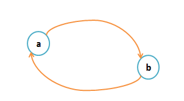

### &#x23;复杂网络导论

学习复杂网络，能帮助我们更深入的理解现实世界中各种复杂系统的内在结构和运行规律，如社交网络、生物网络、互联网等。掌握复杂网络知识，可以培养分析和解决复杂问题的能力，为未来从事科学研究、数据分析、人工智能等领域打下坚实基础，同时也能更好地理解社会现象和自然规律。

首先我们来理解一个非常有趣且富有启发性的概念——六度分离理论（Six Degrees of Separation），它在社会网络研究中占据重要地位。

## 学习导入：六度分离理论

* 六度分离理论指出：在地球上任意两个人之间，最多通过六个人的中间介绍，就可以建立起联系。 这一理论强调了社会网络中人与人之间高度的相互连接性。
* 六度分离理论最早可以追溯到20世纪60年代，由美国心理学家斯坦利·米尔格拉姆（Stanley Milgram）通过一系列实验提出。具体的：米尔格拉姆让参与者将一封信传递给一个特定的目标人物，但只能通过他们认识的人来传递。实验结果表明，平均只需要通过大约六个人，信就能到达目标人物手中。
* &#x20;理论的核心观点：（1）高度连接性：社会网络中的人与人之间通过少量的中间人就可以相互联系，这表明社会网络具有高度的连接性。（2）小世界现象：六度分离理论是“小世界现象”的一个具体体现，即在大规模网络中，任意两个节点之间的最短路径通常很短。
* 六度分离理论的科学依据是社会网络分析，通过社会网络分析工具（如networkx），可以计算网络中任意两个节点之间的最短路径长度。在许多实际的社会网络中，平均路径长度确实很短。
* Python示例：以下是一个简单的Python代码示例，用于计算一个社会网络中任意两个节点之间的最短路径长度。

  ```
  import networkx as nx
  import matplotlib.pyplot as plt

  # 创建一个社会网络图
  G = nx.erdos_renyi_graph(20, 0.1)  # 随机生成一个包含20个节点的图，边的概率为0.1

  # 绘制社会网络图
  pos = nx.spring_layout(G)
  nx.draw(G, pos, with_labels=True, node_color='lightblue', edge_color='gray', node_size=500, font_size=10)
  plt.title("社会网络示例")
  plt.show()

  # 计算任意两个节点之间的最短路径长度
  shortest_paths = dict(nx.all_pairs_shortest_path_length(G))
  for source in shortest_paths:
      for target in shortest_paths[source]:
          if source != target:
              print(f"节点{source}到节点{target}的最短路径长度为: {shortest_paths[source][target]}")
  ```

六度分离理论是一个非常有趣且富有启发性的概念，它揭示了社会网络中人与人之间高度的相互连接性。这一理论不仅在学术研究中具有重要意义，也在现实生活中有着广泛的应用。通过理解六度分离理论，我们可以更好地认识社会网络的结构和特性，以及信息和关系在其中的传播方式。需注意的是，社会网络是动态变化的，新的联系不断产生，旧的联系可能消失。因此，六度分离理论在实际应用中需要考虑网络的动态性。

## 1.1 系统与网络

### 1.1.1 系统

* 定义：系统是由多个相互关联的元素组成的整体，这些元素通过相互作用实现特定的功能。
* Python操作笔记：可以用类来表示一个系统，其中元素为类的属性，相互作用为类的方法。
* 具体代码如下：

  ```
  class System:
      def __init__(self, elements):
          self.elements = elements

      def interact(self):
          # 模拟元素之间的相互作用
          for element in self.elements:
              print(f"Element {element} is interacting.")
  ```

### 1.1.2 网络

* 定义：网络是一种特殊的系统，由节点（节点）和边（连接节点的线）组成，用于表示实体之间的关系。
* Python操作笔记：使用networkx库创建一个简单的网络。
* 具体代码如下：

  ```
  import networkx as nx
  import matplotlib.pyplot as plt

  G = nx.Graph()  # 创建无向图
  G.add_nodes_from([1, 2, 3, 4])  # 添加节点
  G.add_edges_from([(1, 2), (2, 3), (3, 4), (4, 1)])  # 添加边

  nx.draw(G, with_labels=True, node_color='lightblue', edge_color='gray')
  plt.show()
  ```

## 1.2 图论与网络科学

### 1.2.1 图论的萌芽

* 背景：图论起源于18世纪的七桥问题，由欧拉提出。
* Python操作笔记：用networkx模拟七桥问题。
* 具体代码如下：

  ```
  G = nx.Graph()
  G.add_nodes_from(["A", "B", "C", "D"])
  G.add_edges_from([("A", "B"), ("A", "C"), ("A", "D"), ("B", "C"), ("B", "D"), ("C", "D")])

  nx.draw(G, with_labels=True, node_color='lightblue', edge_color='gray')
  plt.show()
  ```

### 1.2.2 随机图的提出

* 定义：随机图是通过随机生成边的图，用于模拟复杂网络的特性。
* Python操作笔记：生成一个随机图。
* 具体代码如下：

  ```
  G = nx.gnp_random_graph(10, 0.3)  # 10个节点，边的概率为0.3
  nx.draw(G, with_labels=True, node_color='lightblue', edge_color='gray')
  plt.show()
  ```

### 1.2.3 网络的小世界性与幂律分布

* 小世界性：网络中大部分节点之间的路径较短，但节点的连接具有一定的局部性。
* 幂律分布：网络中节点的度分布服从幂律分布，即少数节点拥有大量连接。
* Python操作笔记：生成小世界网络和幂律分布网络。
* 具体代码如下：

  ```
  # 小世界网络
  G_small_world = nx.watts_strogatz_graph(10, 4, 0.3)
  nx.draw(G_small_world, with_labels=True, node_color='lightblue', edge_color='gray')
  plt.show()

  # 幂律分布网络
  G_power_law = nx.barabasi_albert_graph(10, 3)
  nx.draw(G_power_law, with_labels=True, node_color='lightblue', edge_color='gray')
  plt.show()
  ```

### 1.2.4 网络科学的快速发展

* 背景：网络科学在21世纪初迅速发展，广泛应用于社会网络、生物网络、互联网等领域。
* Python操作笔记：分析一个网络的度分布。
* 具体代码如下：

  ```
  G = nx.barabasi_albert_graph(100, 3)
  degree_sequence = sorted([d for n, d in G.degree()], reverse=True)
  plt.hist(degree_sequence, bins=20, alpha=0.7, color='blue', edgecolor='black')
  plt.xlabel("Degree")
  plt.ylabel("Frequency")
  plt.title("Degree Distribution")
  plt.show()
  ```

## 1.3 网络主要分类与数据格式

### 1.3.1 网络主要分类

* **基础概念：**

  * 通常用 **G** 来表示网络，网络的基本元素是 **节点 V** 和 **边 E**：

    ```
    G = (V, E)
    ```

  ##### 有向图


  * 如果网络中的边是有方向的，则称为**有向图**。
  * 
  * 表示为：

    ```
    G = (V, E)
    顶点集合：V = {a, b}
    边集合：E = {<a, b>, <b, a>}
    ```
  * **注意**：

    * 边集合中，`<a, b>` 用尖括号表示，因为是有方向的。
    * `<a, b>` 与 `<b, a>` 是两条不同的边。

  ##### 无向图

  * 如果网络中的边是无方向的，则称为**无向图**。
  * 
  * 表示为：

    ```
    G = (V, E)
    顶点集合：V = {a, b}
    边集合：E = {(a, b)}
    ```
  * **注意**：

    * 边用圆括号表示，因为是无方向的。
    * `(a, b)` 与 `(b, a)` 是同一条边。
    *

    **具体分类如下：**

    #### （1）无向网络与有向网络

    ##### 无向网络


    * **定义**：网络中的边没有方向性，连接是双向的。
    * **表示**：

      * 边用圆括号表示，例如 `(A, B)`。
      * `(A, B)` 和 `(B, A)` 是同一条边。
    * **示例**：

      * 社交网络中的友谊关系（如果A是B的朋友，那么B也是A的朋友）。
    * **特点**：

      * 对称性：邻接矩阵是对称的。

    ##### 有向网络

    * **定义**：网络中的边具有方向性，连接是单向的。
    * **表示**：

      * 边用尖括号表示，例如 `<A, B>`。
      * `<A, B>` 和 `<B, A>` 是两条不同的边。
    * **示例**：

      * 网页链接网络（网页A指向网页B，但网页B不一定指向网页A）。
    * **特点**：

      * 非对称性：邻接矩阵通常不对称。

    #### （2）无权网络与加权网络

    ##### 无权网络

    * **定义**：网络中的边没有权重，仅表示节点之间是否存在连接。
    * **表示**：

      * 边的权重默认为1。
    * **示例**：

      * 简单的社交网络（只记录两个人是否是朋友，不记录亲密程度）。
    * **特点**：

      * 邻接矩阵中的元素为0或1。

    ##### 加权网络

    * **定义**：网络中的边具有权重，表示连接的强度或成本。
    * **表示**：

      * 边附带一个权重值，例如 `(A, B, 3)`。
    * **示例**：

      * 交通网络（边的权重可以表示距离或时间）。
    * **特点**：

      * 邻接矩阵中的元素为任意实数。

    #### （3）符号网络

    * **定义**：网络中的边带有符号（正或负），表示关系的性质（如合作或对抗）。
    * **表示**：

      * 边附带一个符号值，例如 `(A, B, +)` 或 `(A, B, -)`。
    * **示例**：

      * 社交网络中的正负关系（朋友或敌人）。
    * **特点**：

      * 可以用于分析复杂的社会动态。

    #### （4）时序网络

    * **定义**：网络中的边随时间变化，节点和边的存在具有时间属性。
    * **表示**：

      * 边附带时间戳，例如 `(A, B, t)`。
    * **示例**：

      * 通信网络（消息发送的时间）。
    * **特点**：

      * 动态性：网络结构随时间演化。

    #### （5）异质网络

    * **定义**：网络中包含多种类型的节点和边。
    * **表示**：

      * 节点和边具有类型标签，例如 `(A, type1)` 和 `(B, type2)`。
    * **示例**：

      * 学术网络（节点可以是作者、论文、会议，边可以是撰写、引用、参与等关系）。
    * **特点**：

      * 复杂性：需要处理多种类型的节点和边。

    #### （6）高阶网络

    * **定义**：网络中的连接不仅限于两个节点之间，还可以涉及多个节点（如超边）。
    * **表示**：

      * 使用超图（Hypergraph）表示，例如 `{A, B, C}` 表示A、B、C三个节点之间的高阶关系。
    * **示例**：

      * 合作网络（多个作者共同撰写一篇论文）。
    * **特点**：

      * 能够捕捉复杂的群体关系。

    #### （7）总结


    | 网络类型 | 特点                               | 示例                 |
    | -------- | ---------------------------------- | -------------------- |
    | 无向网络 | 边无方向，对称性                   | 社交网络中的友谊关系 |
    | 有向网络 | 边有方向，非对称性                 | 网页链接网络         |
    | 无权网络 | 边无权重，仅表示连接               | 简单的社交网络       |
    | 加权网络 | 边有权重，表示强度或成本           | 交通网络             |
    | 符号网络 | 边带符号，表示关系的性质           | 社交网络中的正负关系 |
    | 时序网络 | 边随时间变化，动态性               | 通信网络             |
    | 异质网络 | 包含多种类型的节点和边             | 学术网络             |
    | 高阶网络 | 连接涉及多个节点，捕捉复杂群体关系 | 合作网络             |

    ### 1.3.2 网络的统计特征

    #### (1)度

    * **定义**：与某个节点 **i** 相连接的其他节点的数目，称为该节点的度，表示为 **kᵢ**。度越大，节点越重要。
    * **网络的平均度**：网络中所有节点的度的平均值。

    #### (2)聚类系数

    * **定义**：

      * 节点 **i** 的度为 **kᵢ**，即该节点有 **kᵢ** 个邻居。
      * 聚类系数 **Cᵢ** 定义为这些邻居之间实际存在的边数 **Eᵢ** 与最大可能边数 **kᵢ(kᵢ-1)/2** 之比：

        ```
        Cᵢ = 2 * Eᵢ / (kᵢ * (kᵢ - 1))
        ```
      * 它反映了节点 **i** 与邻居之间关系的紧密程度。
    * **网络的平均聚类系数**：网络中所有节点聚类系数的平均值。
    * **示例**：

      * 下图节点 **a** 的度为 3，聚类系数为 **1/3**。
      * 
      * 下图节点 **a** 的聚类系数为 **1**。
      * 

    #### (3)最短路径

    * **定义**：两个节点 **(m, n)** 之间边数最少的路径称为最短路径。
    * **距离**：最短路径的长度称为这两个节点的距离 **d(m, n)**。

    #### (4)平均路径长度（Average Path Length）

    * **定义**：网络中所有节点对之间距离的平均值。
    * **计算公式**：

      ```
      L = (2 / (N * (N - 1))) * Σ d(i, j)
      ```

      其中，**N** 为节点总数。
    * **示例**：

      * 下图中的距离：
      * 

        ```
        d(a, b) = 1; d(a, d) = 1; d(a, b) = 1;
        d(b, c) = 2; d(b, d) = 1; d(c, d) = 2
        ```
      * 平均路径长度：

        ```
        L = (8 * 2) / (4 * 3) = 16 / 12 = 1.33
        ```
    * **小世界效应**：许多复杂网络的平均路径长度非常小。

    #### (5)介数

    * **定义**：

      * **点介数**：网络中通过某节点的最短路径的条数。
      * **边介数**：网络中通过某边的最短路径的条数。
    * **意义**：

      * 介数越大，说明经过该节点（或边）的最短路径越多。
      * 该节点（或边）在信息传播中的作用和影响力越大，但也容易发生阻塞。
    * **网络的平均介数**：网络中所有节点（或边）的介数的平均值。

### 1.3.3 网络数据文件格式

网络数据可以以多种文件格式存储，常见的格式包括 GEXF、Net、CSV等。

#### （1）GEXF&#x20;

* **全称**：Graph Exchange XML Format。
* **特点**：

  * 基于 XML 的格式，适合存储复杂的网络数据。
  * 支持节点、边、属性、动态数据等。
* **适用场景**：

  * 适用于需要存储丰富信息（如节点属性、时间序列）的网络。

##### 文件结构示例

```xml
<gexf xmlns="http://www.gexf.net/1.2draft" version="1.2">
  <graph mode="static" defaultedgetype="undirected">
    <nodes>
      <node id="1" label="Node A" />
      <node id="2" label="Node B" />
    </nodes>
    <edges>
      <edge id="1" source="1" target="2" weight="1.0" />
    </edges>
  </graph>
</gexf>
```

##### 优点

* 可扩展性强，支持复杂数据结构。
* 兼容多种网络分析工具（如 Gephi）。

##### 缺点

* 文件体积较大，解析速度较慢。

#### (2)Net 格式（Pajek 格式）

* **特点**：

  * 一种简单的文本格式，常用于 Pajek 软件。
  * 支持节点、边、分区、向量等。
* **适用场景**：

  * 适用于中小型网络数据的存储和分析。

##### 文件结构示例

```plaintext
*Vertices 2
1 "Node A"
2 "Node B"
*Edges
1 2 1.0
```

##### 优点

* 结构简单，易于阅读和编辑。
* 文件体积较小，解析速度快。

##### 缺点

* 功能相对有限，不支持复杂属性。

#### (3) CSV 格式

* **全称**：Comma-Separated Values。
* **特点**：

  * 以纯文本形式存储表格数据，用逗号分隔字段。
  * 通常用于存储节点列表和边列表。
* **适用场景**：

  * 适用于需要与其他工具（如 Excel、Python）交互的网络数据。

##### 文件结构示例

* **节点列表**：

  ```csv
  Id,Label
  1,Node A
  2,Node B
  ```
* **边列表**：

  ```csv
  Source,Target,Weight
  1,2,1.0
  ```

##### 优点

* 通用性强，易于导入和导出。
* 支持多种编程语言和工具。

##### 缺点

* 缺乏标准化，不同工具可能需要不同的 CSV 结构。

#### （4） VNA 格式

* **全称**：Visual Network Analysis。
* **特点**：

  * 一种基于 XML 的格式，专为网络可视化设计。
  * 支持节点、边、属性、布局等。
* **适用场景**：

  * 适用于需要可视化分析的网络数据。

##### 文件结构示例

```xml
<network>
  <nodes>
    <node id="1" label="Node A" />
    <node id="2" label="Node B" />
  </nodes>
  <edges>
    <edge source="1" target="2" weight="1.0" />
  </edges>
</network>
```

##### 优点

* 支持丰富的可视化属性。
* 适合与可视化工具（如 Cytoscape）集成。

##### 缺点

* 文件体积较大，解析速度较慢。

##### （5）总结


| 格式 | 特点                         | 适用场景                     | 优点                   | 缺点                     |
| ---- | ---------------------------- | ---------------------------- | ---------------------- | ------------------------ |
| GEXF | 基于 XML，支持复杂数据       | 复杂网络（如动态网络）       | 可扩展性强，兼容性好   | 文件体积大，解析速度慢   |
| Net  | 简单文本格式，适合中小型网络 | 中小型网络（如 Pajek 分析）  | 结构简单，文件体积小   | 功能有限，不支持复杂属性 |
| CSV  | 纯文本表格格式，通用性强     | 数据交互（如 Excel、Python） | 通用性强，易于导入导出 | 缺乏标准化               |
| VNA  | 基于 XML，专为可视化设计     | 网络可视化（如 Cytoscape）   | 支持丰富的可视化属性   | 文件体积大，解析速度慢   |

通过以上内容，可以更好地理解不同网络数据文件格式的特点和适用场景，从而根据需求选择合适的格式。

* 边列表：每行表示一条边，格式为节点1 节点2。
* 邻接矩阵：矩阵表示节点之间的连接关系。
* GML格式：一种通用的网络数据格式，支持节点和边的属性。

## 1.4 网络数据的存储方式

### 1.4.1 邻接矩阵

* 定义：用矩阵表示节点之间的连接关系，矩阵的元素表示节点之间的边。
* Python示例：

  ```
  import numpy as np

  adj_matrix = np.array([
      [0, 1, 0, 1],
      [1, 0, 1, 0],
      [0, 1, 0, 1],
      [1, 0, 1, 0]
  ])
  G = nx.from_numpy_matrix(adj_matrix)
  nx.draw(G, with_labels=True, node_color='lightblue', edge_color='gray')
  plt.show()
  ```

### 1.4.2 邻接表

* 定义：用列表表示每个节点的邻居。
* Python示例：

  ```
  adj_list = {
      0: [1, 3],
      1: [0, 2],
      2: [1, 3],
      3: [0, 2]
  }
  G = nx.Graph(adj_list)
  nx.draw(G, with_labels=True, node_color='lightblue', edge_color='gray')
  plt.show()
  ```

### 1.4.3 三元组

* 定义：用三元组(节点1, 节点2, 权重)表示加权网络。
* Python示例：

  ```
  edges = [(0, 1, 2.0), (1, 2, 3.0), (2, 3, 1.0), (3, 0, 4.0)]
  G = nx.Graph()
  G.add_weighted_edges_from(edges)
  nx.draw(G, with_labels=True, node_color='lightblue', edge_color='gray')
  labels = nx.get_edge_attributes(G, 'weight')
  nx.draw_networkx_edge_labels(G, pos=nx.spring_layout(G), edge_labels=labels)
  plt.show()
  ```

### 1.4.4 星形表示法

* 定义：以某个节点为中心，表示其与其他节点的连接关系。
* Python示例：

  ```
  G = nx.star_graph(5)  # 以节点0为中心的星形图
  nx.draw(G, with_labels=True, node_color='lightblue', edge_color='gray')
  plt.show()
  ```

## 1.5 常用网络分析工具

### 1.5.1 编程类网络数据分析工具

编程类网络数据分析工具主要有python、R、MATLAB，其他编程分析工具有Java，C++，Julia。

### 1.5.2 网络数据分析与可视化软件

* Gephi：用于网络可视化和分析的开源软件。
* NodeXL：用于社会网络分析的Excel插件。
* Pajek：用于大型网络分析的软件。
* Cytoscape：用于生物网络分析和可视化的软件。
* 其他软件：Ucinet、Netdraw、NetMiner、Citespace

## 1.6 现实世界中的网络

### 1.6.1 电力网络

#### 定义

电力网络是用于传输和分配电力的基础设施网络，由发电站、变电站、输电线路和配电线路组成。

#### 特点

* 节点：发电站、变电站、用户端。
* 边：输电线路和配电线路。
* 目标：高效、可靠地传输电力，确保供电的稳定性和安全性。

#### &#x20;示例

假设有一个简单的电力网络，包含3个发电站和2个变电站，用networkx表示：

Python示例

```
import networkx as nx
import matplotlib.pyplot as plt

# 创建电力网络图
G = nx.Graph()

# 添加节点
G.add_node("发电站1")
G.add_node("发电站2")
G.add_node("发电站3")
G.add_node("变电站1")
G.add_node("变电站2")

# 添加边
G.add_edges_from([
    ("发电站1", "变电站1"),
    ("发电站2", "变电站1"),
    ("发电站3", "变电站2"),
    ("变电站1", "变电站2")
])

# 绘制电力网络图
pos = nx.spring_layout(G)
nx.draw(G, pos, with_labels=True, node_color='lightblue', edge_color='gray', node_size=1000, font_size=10)
plt.title("简单电力网络示例")
plt.show()
```

### 1.6.2 互联网与万维网

#### 定义

互联网是一个全球性的计算机网络，将世界各地的计算机连接在一起，实现信息共享和通信。万维网（WWW）是基于互联网的信息系统，通过网页和超链接组织信息。

#### 特点

* 节点：计算机、服务器、路由器。
* 边：网络连接（有线或无线）。
* 目标：实现全球范围内的信息共享和通信。

#### 示例

假设有一个简单的互联网拓扑结构，包含4个节点（计算机和路由器），用networkx表示：

Python示例

```
# 创建互联网拓扑图
G = nx.Graph()

# 添加节点
G.add_node("计算机1")
G.add_node("计算机2")
G.add_node("路由器1")
G.add_node("路由器2")

# 添加边
G.add_edges_from([
    ("计算机1", "路由器1"),
    ("计算机2", "路由器1"),
    ("路由器1", "路由器2")
])

# 绘制互联网拓扑图
pos = nx.spring_layout(G)
nx.draw(G, pos, with_labels=True, node_color='lightgreen', edge_color='gray', node_size=1000, font_size=10)
plt.title("简单互联网拓扑示例")
plt.show()
```

### 1.6.3 社会网络

#### 定义

社会网络是由人或组织（节点）以及它们之间的关系（边）组成的网络，用于研究社会结构和人际关系。

#### 特点

* 节点：人、组织、群体。
* 边：人际关系（如朋友、同事、亲属）。
* 目标：研究社会结构、传播路径、群体行为等。

#### 示例

假设有一个简单的社会网络，包含5个人，用networkx表示：

Python示例

```
# 创建社会网络图
G = nx.Graph()

# 添加节点
G.add_node("Alice")
G.add_node("Bob")
G.add_node("Charlie")
G.add_node("Diana")
G.add_node("Eve")

# 添加边
G.add_edges_from([
    ("Alice", "Bob"),
    ("Alice", "Charlie"),
    ("Bob", "Diana"),
    ("Charlie", "Eve"),
    ("Diana", "Eve")
])

# 绘制社会网络图
pos = nx.spring_layout(G)
nx.draw(G, pos, with_labels=True, node_color='lightcoral', edge_color='gray', node_size=1000, font_size=10)
plt.title("简单社会网络示例")
plt.show()
```

### 1.6.4 生物网络

#### 定义

生物网络是用于描述生物系统中各组成部分（如基因、蛋白质、细胞）之间相互作用的网络。

#### 特点

* 节点：基因、蛋白质、细胞等。
* 边：生物分子之间的相互作用（如蛋白质-蛋白质相互作用、基因调控）。
* 目标：研究生物系统的功能、调控机制和疾病发生机制。

#### 示例

假设有一个简单的蛋白质相互作用网络，包含4个蛋白质，用networkx表示：

Python示例

```
# 创建蛋白质相互作用网络图
G = nx.Graph()

# 添加节点
G.add_node("蛋白质A")
G.add_node("蛋白质B")
G.add_node("蛋白质C")
G.add_node("蛋白质D")

# 添加边
G.add_edges_from([
    ("蛋白质A", "蛋白质B"),
    ("蛋白质B", "蛋白质C"),
    ("蛋白质C", "蛋白质D"),
    ("蛋白质D", "蛋白质A")
])

# 绘制蛋白质相互作用网络图
pos = nx.spring_layout(G)
nx.draw(G, pos, with_labels=True, node_color='lightgoldenrodyellow', edge_color='gray', node_size=1000, font_size=10)
plt.title("简单蛋白质相互作用网络示例")
plt.show()
```

## 1.7 复杂网络章节学习总结

通过学习复杂网络章节的知识，现以一个以“城市交通网络”为背景建立杂网络模型，具体如下：

### &#x23; 城市交通网络模型

### 1. 7.1 背景

城市交通网络是日常生活中常见的复杂网络系统，它由道路、交叉口、交通枢纽等组成，用于描述城市中车辆和行人的流动情况。通过建立城市交通网络模型，可以更好地理解交通流量、优化交通规划、缓解拥堵等问题。

### 1.7.2 节点的定义

在城市交通网络中，节点可以代表以下几种实体：

* 交叉口：道路的交汇点，车辆和行人在此处转换方向或继续前行。
* 交通枢纽：如地铁站、公交站、火车站等，是乘客换乘的重要场所。
* 重要地标：如学校、医院、购物中心等，是交通流量的主要目的地。

### 1.7.3 边的定义

在城市交通网络中，边可以代表以下几种关系：

* 道路连接：连接两个交叉口或交通枢纽的道路，表示车辆和行人的通行路径。
* 交通流量：边的权重可以表示道路的通行能力或实际交通流量，用于分析交通拥堵情况。
* 换乘关系：在交通枢纽之间，边可以表示不同交通方式之间的换乘关系。

### 1.7.4 城市交通网络模型示例

以下是一个简单的城市交通网络模型，包含几个节点和边，用networkx库实现。

Python示例

```
import networkx as nx
import matplotlib.pyplot as plt

# 创建城市交通网络图
G = nx.Graph()

# 添加节点（交叉口和交通枢纽）
G.add_node("交叉口A", type="交叉口")
G.add_node("交叉口B", type="交叉口")
G.add_node("地铁站C", type="地铁站")
G.add_node("医院D", type="医院")
G.add_node("购物中心E", type="购物中心")

# 添加边（道路连接和换乘关系）
G.add_edge("交叉口A", "交叉口B", weight=5, type="道路")
G.add_edge("交叉口A", "地铁站C", weight=3, type="道路")
G.add_edge("地铁站C", "医院D", weight=2, type="地铁")
G.add_edge("医院D", "购物中心E", weight=4, type="道路")

# 绘制城市交通网络图
pos = nx.spring_layout(G)
nx.draw(G, pos, with_labels=True, node_color='lightblue', edge_color='gray', node_size=1000, font_size=10)

# 添加节点类型标签
node_labels = nx.get_node_attributes(G, 'type')
nx.draw_networkx_labels(G, pos, labels=node_labels, font_color='red', font_size=8)

# 添加边权重和类型标签
edge_labels = nx.get_edge_attributes(G, 'weight')
nx.draw_networkx_edge_labels(G, pos, edge_labels=edge_labels, label_pos=0.3)
edge_types = nx.get_edge_attributes(G, 'type')
nx.draw_networkx_edge_labels(G, pos, edge_labels=edge_types, label_pos=0.7)

plt.title("城市交通网络模型")
plt.show()
```

### 1.7.5 节点和边的具体意义

* 节点：

  * 交叉口A：道路交汇点，车辆和行人在此转换方向。
  * 地铁站C：交通枢纽，乘客在此换乘地铁。
  * 医院D：重要地标，交通流量的主要目的地之一。
* 边：

  * 交叉口A到交叉口B：道路连接，权重为5，表示道路长度或通行能力。
  * 交叉口A到地铁站C：道路连接，权重为3，表示从交叉口到地铁站的距离。
  * 地铁站C到医院D：地铁连接，权重为2，表示地铁线路的长度。
  * 医院D到购物中心E：道路连接，权重为4，表示从医院到购物中心的道路长度。

### 1.7.6模型的应用

通过这个城市交通网络模型，可以进行以下分析：

* 交通流量分析：通过边的权重计算交通流量，找出拥堵路段。
* 路径规划：计算从一个节点到另一个节点的最短路径，为车辆和行人提供导航。
* 交通枢纽优化：分析交通枢纽的连接情况，优化换乘设施。

### 1.7.7总结

通过建立城市交通网络模型，我们可以更好地理解城市交通系统的结构和功能。节点和边的定义清晰地描述了交通网络中的实体和关系，为交通规划和优化提供了有力的工具。
