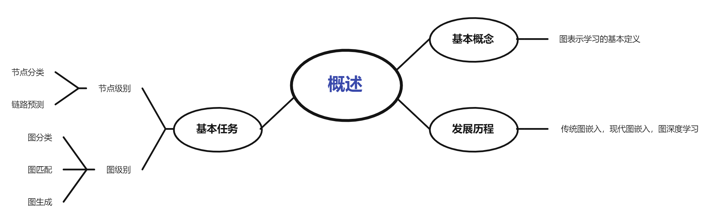
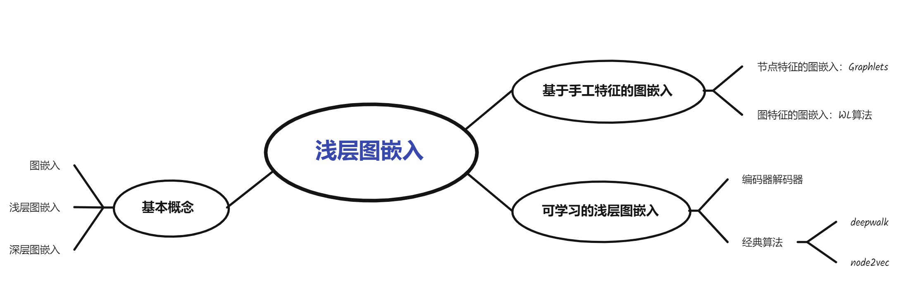

# 图表示学习概述

## 基本概念

**表示学习：**表示学习技术将**抽象的，计算机不可直接运算的数据**通过相关方法转化为数值形式，并通过数值间关系还原其原始含义。

**图表示学习**：是一种表示学习的技术，侧重于**网络结构**的表示，旨在将网络节点及其关系更加直观，高效的投影到向量空间.

**定义:** 图表示学习(Graph Representation Learning,GRL)又名图嵌入(Graph Embedding)、网络表示学习(Network Representation Learning)，旨在将图中的信息和结构表示成低维、实值、稠密的向量形式并在向量空间中具有推理的能力，进而可将得到的向量表示应用于后续的任务，如**节点分类、链接预测、聚类和可视化**等。

| **维度**       | **表示学习**                | **图表示学习**                     |
| -------------- | --------------------------- | ---------------------------------- |
| **数据类型**   | 通用（图像、文本、音频等）  | 专注于图结构数据                   |
| **核心目标**   | 自动学习有效的特征表示      | 将图的结构和特征嵌入到向量空间     |
| **输入结构**   | 向量、矩阵                  | 图（节点、边、拓扑结构）           |
| **技术方法**   | 自编码器、PCA、深度神经网络 | 图嵌入、GNN、随机游走、矩阵分解    |
| **应用场景**   | 分类、回归、生成等任务      | 节点分类、链接预测、图分类等图任务 |
| **模型复杂性** | 中等                        | 较高，需处理图的邻接关系和拓扑信息 |

## 发展历程

三个阶段:**传统图嵌入,现代图嵌入和图深度学习**

| **维度**         | **传统图嵌入**                           | **现代图嵌入**                     | **图深度学习**                         |
| ---------------- | ---------------------------------------- | ---------------------------------- | -------------------------------------- |
| **时间阶段**     | 图论与矩阵分解方法的应用阶段             | 随机游走与优化方法的快速发展阶段   | 深度神经网络与图结构的结合阶段         |
| **代表方法**     | 谱嵌入、MDS、PageRank                    | DeepWalk、Node2Vec、LINE、GraRep   | GCN、GAT、GraphSAGE、GraphGAN          |
| **核心思想**     | 基于拉普拉斯矩阵或邻接矩阵，提取全局信息 | 利用随机游走和优化方法获取节点表示 | 通过递归聚合节点邻居特征学习非线性表示 |
| **特征捕捉能力** | 全局结构为主，局部信息较弱               | 同时考虑局部和全局结构，较为平衡   | 结合拓扑与节点特征，能捕捉复杂关系     |
| **计算复杂度**   | 高，受限于矩阵分解的规模                 | 中等，支持大规模图嵌入             | 高，特别是深度模型的训练过程复杂       |
| **适应性**       | 静态图，适合小规模简单图                 | 静态图，适合大规模和加权图         | 动态图、异构图、多模态图               |
| **关键挑战**     | 扩展性差，难以处理非线性关系             | 随机游走策略固定，泛化性受限       | 模型训练成本高，可能出现过平滑问题     |
| **主要应用**     | 图聚类、图切割、信息检索                 | 节点分类、社区检测                 | 链接预测、动态图分析、推荐系统         |

# 图表示学习相关任务

图表示学习主要应用于图结构数据的分析与处理，根据任务的不同，可以分为**基于节点的任务**和**基于图的任务**。

## 1. 基于节点的任务
基于节点的任务关注图中的单个节点，旨在对节点属性或关系进行预测。

### 1.1 节点分类
**定义**：节点分类任务是根据节点的特征和图的拓扑结构，预测每个节点的类别标签。
- **输入**：
  - 节点的特征向量。
  - 图的边连接信息。
- **输出**：每个节点的类别标签。
- **典型应用**：
  - 社交网络中的用户分类（如兴趣标签预测）。
  - 知识图谱中的实体分类。
- **常用方法**：
  - 基于图神经网络（如 GCN, GAT）对节点的邻居信息进行聚合。

### 1.2 链路预测
**定义**：链路预测任务是根据图的现有结构，预测未连接节点之间是否应该建立边。
- **输入**：
  - 图的部分边信息。
  - 节点的特征（可选）。
- **输出**：节点对之间的连接概率或连接预测。
- **典型应用**：
  - 推荐系统中的好友推荐。
  - 生物网络中的蛋白质相互作用预测。
- **常用方法**：
  - 嵌入节点后计算相似度（如余弦相似度）。
  - 使用图神经网络学习边表示。

## 2. 基于图的任务
基于图的任务关注整个图，旨在对图的整体属性或生成结构进行预测。

### 2.1 图分类
**定义**：图分类任务是对整个图进行分类，预测其类别标签。
- **输入**：
  - 多个图的节点特征和边信息。
- **输出**：每个图的类别标签。
- **典型应用**：
  - 化学分子分类（如毒性、功能预测）。
  - 社交网络的类型分析。
- **常用方法**：
  - 使用图池化（Graph Pooling）层对整个图的信息进行汇总。
  - 图卷积网络（GCN）和图注意力网络（GAT）。

### 2.2 图生成
**定义**：图生成任务旨在生成新的图结构，满足某种特定分布或属性。
- **输入**：种子节点或初始图（可选）。
- **输出**：新生成的图，包括节点和边。
- **典型应用**：
  - 新分子生成（如药物设计）。
  - 社交网络模拟。
- **常用方法**：
  - 使用生成对抗网络（GraphGAN）。
  - 变分自编码器（GraphVAE）。

### 2.3 图匹配
**定义**：图匹配任务是比较两个图之间的相似性，或寻找两个图之间的映射关系。
- **输入**：两张图的节点和边信息。
- **输出**：图的相似度或节点之间的匹配关系。
- **典型应用**：
  - 图像特征匹配。
  - 网络入侵检测中的拓扑比较。
- **常用方法**：
  - 使用图嵌入方法计算图之间的向量相似性。
  - 图编辑距离（GED）。

### 总结和思考

该小节描述了三个部分，第一个部分是图表示学习的基本概念，第二个部分是图表示学习的发展历程，第三个部分是图表示学习的相关任务。

**疑问**

​	图表示学习中的词向量，请问图嵌入向量中具体是描述节点还是链接或者是其他的？是不是针对不同任务，向量的表示也不一样?

答案：

在图表示学习中，**图嵌入向量**（Graph Embedding）主要是用来描述**节点**、**边**或**整个图**的，具体取决于任务的需求。图嵌入的目标是将图结构中的信息（如节点、边或子图）映射到一个低维向量空间中，同时保留图的结构和语义信息。

# 浅层图嵌入

## 基本概念
图嵌入的核心目标是将图中的节点、边或子图从**原图域**（高维、稀疏的图结构）映射到**嵌入域**（低维、稠密的向量空间）。这个过程中，需要尽量保留原图域中的信息，包括：

1. **结构信息**：
   - 节点之间的邻居关系、路径长度、社区结构等。
   - 例如，两个节点在原图中距离较近，它们的嵌入向量在低维空间中也应该接近。

2. **语义信息**：
   - 节点的属性、边的类型、图的全局特征等。
   - 例如，在知识图谱中，嵌入向量需要反映实体和关系的语义。

通过这种映射，图嵌入可以将复杂的图结构转换为机器学习模型易于处理的形式，从而支持各种下游任务，如节点分类、链接预测、图分类等。

**浅层图嵌入技术**
浅层图嵌入技术通常基于简单的数学模型或优化目标，直接学习节点或边的嵌入向量。这些方法的特点是模型结构简单、计算效率高，但表达能力有限。

- **典型方法**：
  - **DeepWalk**：通过随机游走生成节点序列，然后使用 Word2Vec 学习节点嵌入。
  - **Node2Vec**：在 DeepWalk 的基础上，引入有偏随机游走，更好地捕捉局部和全局结构。
  - **矩阵分解方法**：如 Laplacian Eigenmaps，通过分解图的邻接矩阵或拉普拉斯矩阵得到节点嵌入。

- **优点**：
  - 计算效率高，适合处理大规模图数据。
  - 实现简单，易于理解和应用。

- **缺点**：
  - 表达能力有限，难以捕捉复杂的图结构和高阶语义信息。
  
  - 通常需要为每个节点单独学习嵌入，无法泛化到未见过的节点。
  

**深层图嵌入技术**
    深层图嵌入技术基于深度学习模型，通过多层神经网络学习节点或图的嵌入向量。这些方法的特点是模型结构复杂、表达能力强大，但计算成本较高。

- **典型方法**：
  - **GCN（图卷积网络）**：通过聚合邻居节点的信息，生成节点嵌入。
  - **GAT（图注意力网络）**：在 GCN 的基础上引入注意力机制，更好地捕捉邻居节点的重要性。
  - **GraphSAGE**：通过采样邻居节点并聚合信息，生成节点嵌入。

- **优点**：
  - 表达能力强大，能够捕捉复杂的图结构和高阶语义信息。
  - 可以泛化到未见过的节点或图，适合动态图或大规模图数据。

- **缺点**：
  - 计算成本较高，训练过程复杂。
  - 需要大量的标注数据和计算资源。

## 我的思考

图嵌入的核心在于如何将复杂的图结构转换为低维向量，同时保留尽可能多的信息。浅层方法适合处理大规模数据，但表达能力有限；深层方法虽然强大，但计算成本较高。在实际应用中，选择哪种技术需要根据任务需求和数据特点来决定。

例如，如果任务是节点分类，且数据规模较大，可以选择浅层方法（如 Node2Vec）；如果任务是图分类，且需要捕捉复杂的图结构，深层方法（如 GCN）可能更合适。

## 基于手工特征的图嵌入

### 面向节点特征和图特征的图嵌入

 1. **面向节点特征的图嵌入**

**核心思想**
面向节点特征的图嵌入主要关注如何利用节点的局部结构信息生成嵌入向量。一种常见的方法是使用 **Graphlets** 生成 **Graphlet Degree Vector (GDV)**，用于描述节点的局部拓扑结构。

 Graphlets 和 GDV
- **Graphlets**：小型子图，用于描述节点的局部结构。例如，3个节点可以组成4种不同的 Graphlets（三角形、星形等）。
- **GDV**：Graphlet Degree Vector，是一个向量，表示节点在不同 Graphlets 中的出现次数。例如，GDV 可以描述一个节点参与了多少个三角形、星形等结构。

 大致流程
1. **提取 Graphlets**：从图中提取所有可能的 Graphlets。
2. **计算 GDV**：对于每个节点，统计其在不同 Graphlets 中的出现次数，生成 GDV。
3. **嵌入生成**：将 GDV 作为节点的嵌入向量，用于后续任务（如节点分类、链接预测）。

### 我的理解
- GDV 是一种基于局部结构的节点嵌入方法，适合捕捉节点的微观特征。
- 它的优点是直观且易于计算，但缺点是只能捕捉局部信息，无法反映全局结构。

---

2. **面向图特征的图嵌入**

 **核心思想**
面向图特征的图嵌入主要关注如何生成整个图的嵌入向量。一种经典的方法是使用 **Weisfeiler-Lehman (WL) 算法**，通过迭代聚合节点信息，生成图的全局表示。

 **WL 算法**
- **WL 算法**：一种图同构测试算法，通过迭代地聚合节点及其邻居的信息，生成图的特征表示。
- **核心思想**：通过不断更新节点的标签（基于邻居信息），最终生成图的全局特征。

大致流程
1. **初始化**：为每个节点分配一个初始标签（如节点的度或属性）。
2. **迭代更新**：
   - 对于每个节点，将其当前标签与邻居节点的标签进行聚合，生成新的标签。
   - 重复多次，直到标签不再变化或达到预设的迭代次数。
3. **生成图嵌入**：
   - 将所有节点的最终标签进行汇总（如统计标签的频率），生成图的嵌入向量。

### 我的理解
- WL 算法是一种基于全局结构的图嵌入方法，适合捕捉图的宏观特征。
- 它的优点是能够反映图的全局结构，但缺点是计算复杂度较高，且对节点属性不敏感。

---

### 总结

- **面向节点特征的图嵌入**（如 GDV）：
  - 关注节点的局部结构，适合捕捉微观特征。
  - 优点是计算简单，缺点是只能反映局部信息。
- **面向图特征的图嵌入**（如 WL 算法）：
  - 关注整个图的全局结构，适合捕捉宏观特征。
  - 优点是能够反映全局结构，缺点是计算复杂度较高。

### 可学习的浅层嵌入

 **编码解码框架与图嵌入方法**

 1. **编码解码框架**

 **核心思想**
编码解码框架是图嵌入的一种通用范式，分为两个阶段：

1. **编码（Encoder）**：将图中的节点或图结构映射到低维向量空间。
2. **解码（Decoder）**：从低维向量空间中还原图的结构信息（如节点之间的连接关系）。

我的理解
- 编码解码框架的核心是通过学习一个低维表示，使得解码后的图结构尽可能接近原始图。
- 这种框架可以灵活地应用于节点级别嵌入和图级别嵌入。

---

2. **节点级别嵌入**

DeepWalk
 基本概念
- DeepWalk 是一种基于随机游走的节点嵌入方法，灵感来自自然语言处理中的 Word2Vec。
- 通过随机游走生成节点序列，然后将这些序列视为“句子”。

流程
1. **随机游走**：从每个节点出发，进行多次随机游走，生成节点序列。
2. **训练 Skip-Gram 模型**：将节点序列作为输入，使用 Skip-Gram 模型学习节点嵌入。
3. **得到嵌入向量**：每个节点被映射到一个低维向量。

**Node2Vec**
基本概念

- Node2Vec 是 DeepWalk 的改进版本，通过引入有偏随机游走（BFS 和 DFS 的结合），更好地捕捉局部和全局结构。

流程
1. **有偏随机游走**：通过调整游走策略（BFS 偏向局部，DFS 偏向全局），生成节点序列。
2. **训练 Skip-Gram 模型**：与 DeepWalk 类似，使用 Skip-Gram 模型学习节点嵌入。
3. **得到嵌入向量**：每个节点被映射到一个低维向量。

**浅层嵌入方法的局限性**

1. 网络发生变化时，需要重新训练所有嵌入向量
- 浅层嵌入方法（如 DeepWalk、Node2Vec）通常为每个节点单独学习嵌入。
- 当图结构发生变化（如新增节点或边）时，需要重新训练整个模型，计算成本较高。

2. 无法捕获网络结构相似性
- 浅层嵌入方法主要关注节点的局部结构，难以捕捉全局结构相似性。
- 例如，两个结构相似的子图可能被映射到完全不同的嵌入空间中。

3. 无法利用附加信息
- 浅层嵌入方法通常只利用图的结构信息，无法有效利用节点的属性或边的权重等附加信息。
- 例如，在社交网络中，用户的年龄、兴趣等属性信息可能对嵌入学习非常重要。

#### 总结

- **编码解码框架**：提供了一种通用的图嵌入范式，分为编码和解码两个阶段。（类似于一种降维的模型）
- **节点级别嵌入**：
  - DeepWalk 和 Node2Vec 是基于随机游走的经典方法，适合捕捉局部结构。
  - Node2Vec 通过调整游走策略，能够更好地平衡局部和全局信息。
- **图级别嵌入**：通过聚合节点嵌入生成整个图的嵌入，适用于图分类等任务。
- **浅层嵌入方法的局限性**：
  - 无法适应动态图，难以捕捉全局结构相似性，且无法利用附加信息。

**小节思维导图**

# 图神经网路
##	图神经网络简介

### 核心概念
图神经网络（Graph Neural Networks, GNNs）是一类专门用于处理图结构数据的深度学习模型。它的核心目标是学习图中节点、边或整个图的特征表示，并将这些表示用于后续任务，如节点分类、图分类、链接预测等。

### 主流框架
- **GCN（图卷积网络）**：基于谱图理论的经典方法。
- **GraphSAGE**：通过采样邻居节点进行特征聚合，适合大规模图。
- **图注意力网络（GAT）**：引入注意力机制，动态调整邻居节点的重要性。

## 图信号处理
### 图滤波
图滤波是图信号处理的核心操作，目的是对图信号进行平滑或增强。主要分为两类：
1. **基于谱的图滤波**：
   - 利用图的拉普拉斯矩阵进行滤波。
   - 核心思想是将图信号转换到频域，进行滤波后再转换回空域。
   - 适合处理规则的图结构，但计算复杂度较高。
2. **基于空间的图滤波**：
   - 直接在空域中对邻居节点的特征进行聚合。
   - 核心思想是通过邻居节点的特征加权求和，生成新的节点表示。
   - 计算效率高，适合大规模图。

### 图池化
图池化用于将图的结构信息压缩到更低维的表示中，常用于图分类任务。
- **核心思想**：通过聚合节点特征（如求和、平均或最大值）生成子图的表示。
- **常用方法**：DiffPool、TopK Pooling。
- **意义**：图池化可以帮助捕捉图的全局结构信息。

## 图神经网络的基本框架

###  排列不变性和排列等效性
- **排列不变性**：图神经网络的输出不应受节点排列顺序的影响。
- **排列等效性**：图神经网络应对同构的图生成相同的表示。
- **意义**：这两个性质保证了图神经网络对图结构的鲁棒性。

### 图神经网络的基本架构
图神经网络的核心操作可以概括为两个步骤：
1. **聚合（Aggregation）**：
   - 将邻居节点的特征聚合到当前节点。
   - 常用方法：求和、平均、最大值、注意力加权。
2. **组合（Combination）**：
   - 将聚合后的邻居特征与当前节点特征结合，生成新的节点表示。
   - 常用方法：全连接层、非线性激活函数。

---

## 主流的图神经网络

### 图卷积神经网络（GCN）
- **核心思想**：
  - 基于谱图理论，利用拉普拉斯矩阵进行图卷积。
  - 通过一阶近似简化计算，适合处理中小规模图数据。
- **流程**：
  1. 计算图的拉普拉斯矩阵。
  2. 通过卷积操作聚合邻居节点的特征。
  3. 使用非线性激活函数生成新的节点表示。
- **我的思考**：
  - GCN 是图神经网络的经典方法，计算效率高，易于实现。
  - 但它对大规模图数据的扩展性较差，且无法直接处理动态图。

###  GraphSAGE
- **核心思想**：
  - 通过采样邻居节点进行特征聚合，适合处理大规模图数据。
  - 引入了邻居采样机制，避免了全图计算。
- **流程**：
  1. 对每个节点采样固定数量的邻居节点。
  2. 聚合邻居节点的特征。
  3. 将聚合后的特征与当前节点特征结合，生成新的节点表示。
- **我的思考**：
  - GraphSAGE 通过采样机制解决了大规模图的计算问题，适合动态图。
  - 但采样可能导致信息丢失，尤其是在邻居节点数量较少的情况下。

###  图注意力网络（GAT）
- **核心思想**：
  - 引入注意力机制，动态调整邻居节点的重要性。
  - 通过计算注意力权重，实现更灵活的特征聚合。
- **流程**：
  1. 计算当前节点与邻居节点之间的注意力权重。
  2. 根据注意力权重加权聚合邻居节点的特征。
  3. 将聚合后的特征与当前节点特征结合，生成新的节点表示。
- **我的思考**：
  - GAT 能够捕捉节点之间的复杂关系，适合异构图。
  - 但计算复杂度较高，尤其是在节点度数较大的情况下。

## 总结与思考

### 总结
- **图神经网络的核心**：通过聚合和组合操作学习节点的特征表示。
- **主流方法**：
  - GCN 基于谱图理论，适合中小规模图。
  - GraphSAGE 通过采样邻居节点，适合大规模图。
  - GAT 引入注意力机制，能够捕捉复杂关系。
- **图池化**：用于压缩图结构信息，常用于图分类任务。

### 我的思考
- 图神经网络的优势在于能够直接处理图结构数据，捕捉节点之间的关系。
- 不同方法各有特点：
  - GCN 简单高效，但扩展性有限。
  - GraphSAGE 适合大规模图，但采样可能丢失信息。
  - GAT 表达能力强，但计算成本较高。

