# 时序网络

[TOC]

**时序网络：**网络不是一成不变的，去年你的朋友圈中活跃的人，在今年不一定活跃。时序网络，是考虑了时间维度的网络模型，其边会随着时间的变化出现或者消失。由此对时序网络的分析，多是探究其拓扑结构[^①]，即节点间交互关系随时间变化对网络结构和功能的影响效果，广泛应用于社交网络、交通网络、信息网络等。

**探究时序网络交互关系的变化：**若忽视节点间连接的时间顺序，对时序网络进行静态化处理，将影响对网络链路的预测准确性；由此，探究时序网络交互关系的变化有助于更准确地刻画复杂系统的动态交互，识别关键节点以维护网络稳定性，并为传染病预防、电网故障检测等实际应用提供理论支持。

| 特性           | 静态网络（Static Network）               | 时序网络（Temporal Network）                         |
| -------------- | ---------------------------------------- | ---------------------------------------------------- |
| **时间维度**   | 不考虑时间，网络结构固定不变             | 考虑时间，网络结构随时间变化                         |
| **边的存在**   | 边一旦存在，就一直存在                   | 边可能仅在特定的时间段内存在                         |
| **交互事件**   | 没有具体的交互时间，只表示连接的存在     | 记录具体的交互时间和顺序                             |
| **分析重点**   | 网络的整体结构、中心度、聚集系数等       | 交互的动态特性、传播路径、信息或病原体的传播速度     |
| **数据需求**   | 只需知道节点之间是否存在连接             | 需要记录每个交互的具体发生时间和持续时间             |
| **应用领域**   | 社交网络分析、组织结构研究、无向图算法等 | 传染病建模、通信网络、社交互动、交通流等             |
| **模型复杂度** | 相对简单，适合大规模网络                 | 更加复杂，但能提供更精确的动态行为描述               |
| **计算效率**   | 通常计算效率较高，因为不需要处理时间信息 | 计算效率较低，因为需要处理额外的时间序列数据         |
| **可视化**     | 简单的节点-边图                          | 复杂的动画或时间轴图表，可以显示随时间变化的网络状态 |
| **预测能力**   | 适用于预测基于长期稳定关系的现象         | 适用于预测短期动态行为，如突发新闻的扩散、病毒传播   |

[^①]:拓扑结构(Topology)，指的是网络中节点之间的连接方式和排列形式。它描述了网络的几何形状、节点之间的连接关系以及网络的整体结构特征，拓扑结构可以包括节点的度分布(节点的连接数量)、节点之间的距离关系、网络的聚集程度等信息。在网络建模中，拓扑结构的分析和研究可以帮助我们理解网络的性质、预测网络的行为，并揭示出网络中的重要节点和关键路径。

# 1.掌握时序网络的建模方法

## 1.1时序网络建模

### 1.1.1标签图

**标签图**（如图1）将相邻节点间发生交互的所有时刻及时长（也可以省略时长信息）标记在它们的连边上，以此来表示网络中事件发生的时间信息。

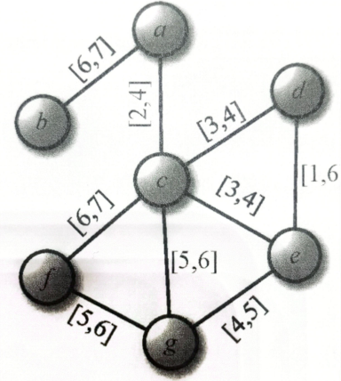

​													图1 时序网络标签图

| 优点                                                         | 缺点                                                         |
| ------------------------------------------------------------ | ------------------------------------------------------------ |
| 可以直接地表示节点间的交互事件的发生时刻和突出网络的拓扑结构； | 但作为一个时间聚合后的结果图，节点间的时序距离、时序可达、网络的连通性以及事件的阵发性等含有时间维度的属性并没有被直观地展示出来。 |

### 1.1.2时线图

* **不考虑交互时长的时线图。**
	时序网络中的每个节点对应图中的一根水平线，水平线从左至右表示时间由先至后，每个点参与交互事件的时刻用黑色小圆标记在各自的水平线上。黑色小圆之间的每一根垂直连线表示一个事件，两端的黑色小圆表示事件发生的时间点，它们所在的水平线对应参与事件的节点。

	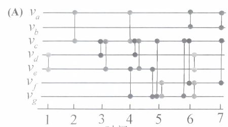

​												图2 不考虑交互时长的时线图

+ **考虑交互时长的时线图。**
	每个发生交互的节点对对应图中的一根空心矩形水平线，水平线从左至右表示时间由先至后，节点间发生交互的时间用水平线上的一段灰色矩形表示。

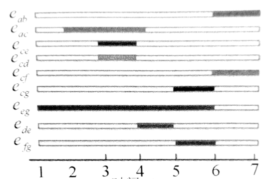

​												图3 考虑交互时长的时线图	

|          | 不考虑交互时长的时线图                                     | 考虑交互时长的时线图                                         |
| -------- | :--------------------------------------------------------- | ------------------------------------------------------------ |
| **优点** | 直观地展示节点对交互的先后顺序、节点对之间的反复交互行为； | 直观地表现事件发生的时刻、时长，可以观察节点间的可达性、连通性，如果网络规模足够小，也可以直接从个体层面观察事件是否有阵发性。 |

| 缺点 | 多用于节点数量较少的网络，而针对规模较大、交互频繁的网络，时线图将特别复杂，难以满足大部分真实时序网络的可视化要求 |
| ---- | ------------------------------------------------------------ |

### 1.1.3快照序列

**快照序列**，也称为切片网络，把发生在同一离散时间步的接触分组到一个图中，将时间网络呈现为图的时间序列，即将时序网络的观察期**[t~1~,t~1~+T)**分成**M**个时间窗口，每个时间窗口的长度**Δt=T/M**，可以得到**M**个连续、等长且不重叠的时间窗口**{[t~1~,t~1~+Δt),[t~2~,t~2~+Δt),…,[t~n~,t~n~+Δt)}**，其中**t~i~=t~1~+(i−1)Δt)**。如果网络中的任意一个节点对在对应的时间窗口处至少有一次交互，则在该时间窗口下的网络中为对应节点对添加一条边。所有这些连边构成边集**E~m~**，则图**G~m~=(N,E~m~)**就是时序网络**G**在时间窗口**[t~m~,t~m~+Δt]**的快照。快照序列**G~1~,G~2~,…,G~M~**中的元素分别是时序网络**G**在各个时间窗口的快照。时间窗口的长度**Δt**被称为是时序网络**G**的时间分辨率。

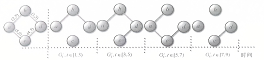

​										图4 无向时序网络及对应快照网络（Δt=2）

| 优点 | 实时性、高效性、可扩展性、快速备份、低存储成本、高效恢复和数据一致性。 |
| ---- | ------------------------------------------------------------ |
| 缺点 | 数据冗余、系统效率下降以及难以处理时空对象间的时态关系。     |

### 1.1.4时间顺序图

时间顺序图，是将时序网络G^t^表示为具有有向流的静态网络的建模方法。

​								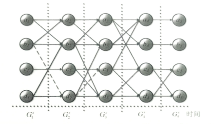
​											图5 时间顺序图

### 1.1.5多层网络

多层网络，将时序网络G^t^按照快照序列方式分割为网络序列{G~1~^t^,G~2~^t^,…,G~M~^t^}，网络G~i~^t^中节点之间的连边为层内连边，通过时序关系连接不同层节点，构成多层网络。
假设时序网络G^t^包含N个节点，时间分辨率为Δt=1，则G^t^可表示为T层网络，如图6所示。

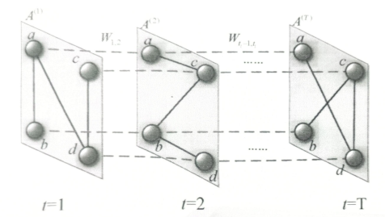

​													图6 多层网络表示

## 2.1时序网络指标

### 2.1.1时序路径

**时序路径，**是指在一系列离散的时间点上，从一个节点到另一个节点的路径，这些路径在不同的时间点上可能有不同的连接状态。

- **时间序列**：图中的 G~1~^t^,G~2~^t^G~3~^t^,G~4~^t^,G~5~^t^ 表示在不同时间点 t*t* 的网络快照。

- **节点和边**：每个圆圈代表一个节点，线条代表节点之间的连接或交互关系。

	- **时序路径**：在这些快照中，从一个节点到另一个节点的路径，如果这些节点在连续的时间点上都有连接，那么这些连接就构成了一个时序路径；例如，如果节点 a*a* 在时间点 t1*t*1 与节点 b*b* 有连接，节点 b*b* 在时间点 t2*t*2 与节点 c*c* 有连接，那么 a*a* 到 c*c* 就构成了一个时序路径，即使在 t1*t*1 和 t2*t*2 之间 a*a* 和 c*c* 之间没有直接连接。

		

		​									图7 时间顺序图建模方式下的时序路径

### 2.1.2时序距离和时序效率

- **时序距离，**是指在时序网络中，从一个节点到另一个节点的最短时序路径的长度。这个长度可以是时间间隔的总和，也可以是路径上经过的事件数。

	+ 时序网络的时序直径: *D=max~ij~λ~ij~(t)*
	+ 时序网络的平均时序距离:<img src="data:image/png;base64,iVBORw0KGgoAAAANSUhEUgAAAUYAAABFCAIAAAC5Vti9AAAAAXNSR0IArs4c6QAAAARnQU1BAACxjwv8YQUAAAAJcEhZcwAAFiUAABYlAUlSJPAAAA5VSURBVHhe7Z1/WFRVGsfPrA1j28K2bgPPLkEUBagLCiJS+GhTKmLIErlSmautyhOUNfQ0lLA9Uf6ole0R3QKfQF0DChVcCmUMklFWMIkfQRHMCEKgTwJCOdbCzOTD3nPvAe7M3GFmLgPee+d8/oBzzp2BO2fO9573vPd9zxWNjIwADAYjFH6FfmMwGEGAJY3BCAosacytpCN3sUgkWpzbgeqYSYMlbTuGvrrcdfc/gocfhstgSdvGYGPuutneC7d81KFHLRgMJ8GStspw56nUBwP+8smdYXMkqAmD4SxY0tb49pA8776stvbS97cnhaI2DIazYElbY07iJwWbg2ehGgbDcbCk+U5vcfxMkcPAvmfegyXNdzxitr8nG1vkR2Sr9SN2otdqlIpg7CcQCFjSvEfst7moNElKVaoTl+2qNVBlWxG7PrBy97H3IlAVw2+wpIXArOXbj8i9qHJP+poU1SBVtgPf1VtjURHDa7CkhcEs2e6i9FFRZ27Ybr+oPRbFyFARw2ewpIWCOCz18xy0qO7JjNp05ApZtB0fn3mohOEzWNLCQey3Yf+op0xXsmF9rsa+RbVsz8jIuc2+qIbhKVjSQoLuKdOpXnjusJ2ixggALGlbMfQ1V9URv+uqmvs4LBSap0yn2rJmbzMWtZOBJW2VrsKnAwLudnPxiMvTEVVdXpyHq/v9AQFPF3ZRL+AYdE/Z14poNu5vDI/BkraKz5MftbVd1qK4DJLhvva2to+e9EGv4BrGnjI27m9OYuirK3gx8u5ni6+hBkYaMkJC4nad6hxGdacDS1qQ0D1lPZlR8hMOEjXMSou8200kmun+50PTuVA39FWkzPaO+zRoZ8MHT9yFGhkJUdQUJ/z05jz3lfsandM+QfOOnVTK0dsh8krUiuEUA+WjMWVAIjvYjlonwc/VbyxNPH5paGSo4e1AIFGcRe2ToD0HBq1F5Ex8dgOVci/gJa8cQHXr6NWEmSKR5dgfHst7WEp6RN97NJ4cK+uP9zpfr/EFUgoUDh7eTRn+VoVoC7ZI+nJhrAQEZjTZefrkFc0r/YKzDU+2hrfY/a4/EL8kic9Gu4upJgznoHnKdKotfzvgOFP5jjsntH4diOF89tYSsOkfCUFM4+xKwSqR6PEjvahKZ9byl3dF9KS/fNjJcstYr6U16hri59pHF2BBcxm6p6w6cVlalZYsThrve6Yp1Ez7WfbOfukrm5a5oQYjrpwpUAL/iNkeqG6Mb1RiFKhOza9FdeeAraS1mhqio8Ie8mPsaQx3MPKUZTzzhkPc34PnykpRcWrRVh3NA2Bl+FzzmcNw4+KxbclKAB6dNxs1meK5MCYM9H9c1YzqTgFbSbfVnwJAuirED9Ux3IUeU9aTGf96xWRFPajaviGzB1Wmlq+qjjLOHB25i13c/Nbm9RPlrBUu1P4Nfz1haoP4+T8EgLqsnpsRBFMDS0lrGsqIzly5IADVraNKprrdCnhXjSmBFlPWn7Xa/pQOOtMoaNDVUacDINT3XlQfw3fzOcpHB/wzmpBfaOTDaDOb0XtuBAA1rd2o6gywkzQLsxvmBNgAThuYIuiespIvNGSBDZSgI7Kzk1DDlHLzJtxj2eU2RodNb2u1eiKzewyd4SYqOQPsJH0LzG40i2NIUKfYhTjs1Q+Tf0cUvOQxbH1blKADM7Ieua0JzLvHGzXfEgzNVSUAxC5h9IQbox36CZWcAFaStt/snjxoFseQoE6xC4Pm33/f8wMh6MOvy9hteKqteocQtFd67ktBM4iq+eTZdegRS7eUHE9jzTHC7Lbk7TbC7fbfoJITwEbSrLzdeC19a9FWpS1LrAaBGSd2sxb0jmcyerwU+clhlubF7tYaG0VmIzNmuBA/B35muPXW0VzRDyQxYUGozszNX5wuE42NpEkvpKnZfaVg1cxkleX+w2vpW8mg6g1CjhJZTtFLNtipTFCCliYdeG2J5Sv5kt3DI22vTCwyu/DxDZUAoL58FdXH0bZWVQMQtcAf1ZkxfPc1MfvIgszcawKGhaQ1357VmZrdgxW7kpU47oSjDJ6QR2USgs7O2ezH7htCl4TYf6UuH5/iu/poFrZm/yLSzHq+grqsG/r+u+tBN5HIbWU+srtIq5xoSIUxSrYyf8laAGprNGbTdP/VS8RPH3fKIhhUpTybz3CnqrXpNDH7LJ3L1Zy5KQHNjrZzOT+KeFtYthrVR4aunM+AoQyxhVdRC0fR936Zv3WF58aiftTAbfqLNnqu2Jr/5SRj6MkEBmJcJ5XbnvRgAgoVp+8RDmOzpWk1+qGW7CeSTpEdOnA8npgQD3aSx/tLkhWVAwOl6yVAmn6BbKJeAd+EqhCrMd5XC2MBkMgrTTuh8yDc/BCeEvG1ZkTOJf4bOkKD/Ovj/985sFPS3xx7ytIe7o4I4p869L3lCl+J19qcySpkOiEGa87Tvq6+iaXdbE9ar86GmrEri8mE62Wb4FdukgDRnhfpCiTSpduUl4aoFigyU/lcL10/LnN4HzlwbwtVRlhP27heKZcCyaay66g+ykDNzqVS4sSIc9ha3ILOwZiWvYFcH5dTAO88ydQYIDH+smgHzNL+LCbnjSeJmkwEtOzRsRE5dQxdUm4Ld2VOUrU/sXCc62cVcHqdlnQkUr1J5Sb/iPxWqA+mr0kLlFeaKNO6pNlnYkETwQkzsXh4c2joy7eQT8RkJFAHpElKk4l4oiExmiRqpml0IGIf8wTgMPTd5YSayTOwlHdOzrSS2MLLqG4rlL08XUnDF9KlTFe/swoJ9T2158gYPoItkmZzWcP50rxCnR0mkSvkhNFlMhSIA+YrJ2JyYDTcEPryJCBTKIiBZapp4sDU+gcou1oaviFpBRnWZXkrCdL4lJpNcRNCTlIO2vvABhj7ngCuhSWKSnVOZCTTmdgmaaKvuksTbV04ETaPIljiGrm3gfVig8/wUNLQwpMdbIF2HojKp133SRGamn6kPWjik6FDrO8IO52MFjZ+FRyjNCeg47le9uLSbeXkKpky8yfYHYa8LtlxgXGAT8xO4EcgumuoJXvjW+dvoEYInL0Dg8MjmSdMWyUNsc29Wb87OPjxnWMrfOeDh5ImxgicDkhXqJGm4eAxHfWkosH6UkvzG/wr8D3wvUaahgemzVdqVdLU5WqCz2GEA3xidnO5aC2xfHANRxepcchp2uKqwR5JY2yCXYz3rQRGo0YE3AM8Fq+JAkBZcGY0q6ir5Wy/WeiSpeQ8BIwTls6/1wMEr0iQgv4PTtaNBsuo65XTHPI6IeL7gomxf7TqK1SfABQn5pVexDZOjA2eTxzRjoxoz+9a7kW/9W3QlB66qFAeiPdEDZiphneShtGolHA9H15H17ThYp3KLC3HYnIeAoYikMIVhz5mpGkYT8OpDR58fRcCoKvrsJb5OxYn9nmqxbjNqUezf9HzFcM3vi7YmKB5tWo6Ly0Y3kkaTrtIuMaahlH8Zmk5EybnEYqvL1Mj4Rprurfxs1oubvCgvzlxmuBonNh7+zewiBOrfdNdJEpWodok+F9HXW3Wau/VObenncJ6nmb4Junm2k91Y8Kla5rR7LaC9huVaky4Rpq2wezuyF1MRkBawxESGUP78wQ7zhs0uWvW5OmkSaVFrAI/ezu/6kfFSfLrqFz4/IIz++LmzERNmOmCZ5KGWe804SJNF53rZTS7rQHTvseFO6rp8kabzG5yXw0b2OPIpza73WFRIgbN4edeUOm85Ee20+Kw7cDw7RdKAPw9f4/qGH7CL0nDUSeJWjAuXErTJYVnzhGLYlnoA6Zz0wTJeVR6XsSS2WPCRZp+X6ki1uuSpXM4ZXYbfoFLCItAn9gWQtDsfWKGutMFOgDuuvMO1IDhJ/ySdGu9UhcVPocmXM/wuAhC03nvnlH7r1pglnBjOTmPUEFrVbV0eRAtmVMc+ug6Cej/+N39tWDtkvmolRt0dtQBIHnIjzH3dLI+McONi/9JjN8JzW6XGXB3Awx/4ZWkO2pL1GP5dAhf2UZC0ydPnmQ2uy0m5wFD/emjwM/YzBQvjkmUAPXJk6NOM85AbTvBnB5M+cTI3ff90V6ZduLi5hd3gNohcJ6PUyUiChAeSXq48di+agC+v2b8eGdK04DJ7CZwW/hYLABHT9cbvYcQdN+JQ9k6cO37H4z8TZSmielwOs3u4cYLp+Hv0xcaLTm/yOsPiH3yYTP3H/KJoRoGw5voMSrMiIS2zSsJeci0cQzG5DxaopVJRJa+EgaP2ximNUmqd/j7+8IEwXFcPf39/XdUoxeMQuY3Msd40/rFEUxpCCwDOHrM4fAxbcNeWCbncQZ9U0Ygm0wsPoAl7XB4dhOLFZ7xB5TyHxXRKbx8dPqgKiVa8aMcx1RibMMZJE3uS19dGl0aNT8+t854Jc5pDH11ufHzo4gzr2Ydg1WVMlPk/mYtqo3R/M+A8X3CMELCOSQNgNgrOqu1+3hMc1pIQvE11MhtrhUnhKQ1xxzvbs2KNkqFsAcyyN08Dk7b3ay24FDE8BwRYXyjIgYz7XTkLr5/SzWxlsa7PTsKZ5mlnRBDxfPkTedF+42fgIUeksBgjWOEAJa0YBEvz2x429/8FrtsD9ywhUvJ4BhHgiUtYMQ3BruYIs5+7O3ET/sXLFjSAgZmooZFBptGnMF0Ffy0f8GCJS1cYCYqQ2Qr+TQpbHYLFixpwUI+f5nB7Ib7wmCzW7hgSQuW7u+aAPjjrN/2VaQkfEylWUHg9g5cSwbHOBAsacHiHbTKV5K1+k/J3z31zlPk3v8QuKua1We4YngMlrRgEYeltg+PDLcXbA4eDybVNlQoQcRjoXbt0YbhE1jSToShry5r5wGw/rU4HKklXLCknQSYp+HivepUSHHDB9F4G14BgyXtJAS90ob34XUKcNoGBiMgAPg/DqCITKyGRk8AAAAASUVORK5CYII=" alt="img" style="zoom:50%;" />

- **时序效率，**衡量时序网络中信息传播或连接效率的指标。它通常定义为网络中所有节点对之间时序距离的倒数的平均值。

	<img src="data:image/png;base64,iVBORw0KGgoAAAANSUhEUgAAAZsAAABdCAIAAAD8PFyyAAAAAXNSR0IArs4c6QAAAARnQU1BAACxjwv8YQUAAAAJcEhZcwAAFiUAABYlAUlSJPAAABJNSURBVHhe7Z0PVBTXvccvz+Dak0Ja2yXvPQ7GuCnrn0rEIFHXYtdEDYlNSTT6jKL40LyAScVzxKipT4gQE00bolE4AbEqViXUmAcRA8JGXkEhqIEoCAWlKjawgdY1qcvu8/Dmzlz2/8LOMDu7M/P7nKM7d3YZhrsz37m/+/tzA/r7+xEAAIAk+BfyCgAAIH5A0QAAkA6gaAAASAdQNAAApAMoGgAA0gEUDQAA6QCKBgCAdABFAwBAOoCiSQrd+gCfMCuvnZwBAPgUUDRJMSJQQbYAQJaAokmKmE2lKWFkmxCWUtnTzy/3eptLUyNBOwE/BBRNWozW7jyTq7UVm5tZK7frekmDH0b9ePwzO2sb7X8PAPgDoGhSIzB8dZH9QO1mVuyivFYzafFFYPjKrIzJpAEAfgIomgQZrU0vSLXVtD7dmqc38jxQozQtYukbsWQbAPwDUDT2GK+f3jIjeL2ONP2R4JhM7xufCIVOf1FDNn2Gubs+b9ljc8DZCtCAorHCfLN8y4yQcbE7zt8le/wVYYxPVXScmmz6gt5LecsmjJm25o/tJrIHkDugaJ5CjwUmPPHft6fOcPAm+ivYS5BtO4bygvE5dnw02RIYeqA8/qVPfxQ9EfwTgBVQNA8xnMnccC1B13nuD3s3LST7/J7A8MR8R+NzydZyHjUteMEhHM/x59UqskMgmg6kHB6372pb8d7tyVFkHwCAonlMcOwHX7w9NyyQNMWCs/Gp3/crL3g+hWZi0qdHVkeOJi0AGAAUTfI4hah5x/MJAP4AKJoMoAZqhw/GedP4BAA/ARRNHoQu2S9F4xMAHABFkwtgfAJyABRNPrgMUUspAU0DJAQomqwYrd160E7T+g4vAuMTkBCgaDIDjE9A0oCiyQ4wPgEJA4rGFuOl2gr8WlF7yUjvECHUQK1kl20lINEan+buxqp66rW+qrEbbGeAgi5KCnhAdYZarVLaRnWhoFC1Wp1RTT4gLkwt9vlRXql26z2uH12qVocGkVOnUShVavXSo9fJJySN6UbZtrdKviEtt5zPWJjbYiINeRBA/SMXBCA3enXrp8zJuklaFIr44tuHFkBukZ/Te+7t1cXTctLnhgyZlNe0e9qbD5/8ZEkoaUsfsDpljLOXADyf7MFFWVZNDRkVEBD88y1ed7GYb5YkryzT5r3tgZxRTHzuv/SZf2oiLTnAUdEGXUXtyZxW8jHAzwkMX5nzIXg+h0PH8eTt/1x7uvNu14m4th3bP+0g+70BJWdJiyteOrhthsfjaFV0nGnfqUbSkgOM8ckaU1fhEvzjccdsbHlmpzKtlrQBUdBTaef5pIzPuGO3yHuA59wpjkcopZK0+If6nlRa1tNiprJk+7tU4nC1OgNDfvpv1ItaM+FhZgcmMGTq0xr00sxI0gZEgbPxeXJlPBifrAl+8Cdkyxu0H1j0656sotXhjLFpPvfbkICQ9Dq6MRiBD4xE+rvfkZb04TyP1tpSQ/3/1OMTmCZBtfrP/Xvniq2ImOzBIWpF8WB8DpNQtdcK+rYfWLPuodwdFq+Nuf6zj/TomSfGkzYwAFdFM7TWUI8HbdTPQL2kwegFWU5ht4nHO0kDGBpza1VhA9nmmc7jG5K+zcgc8Fgab5//XWqmHkXPDA9m9gxCR4eXTspP4apoVy+cRkg5e9JY0m7aHTH+PTnNP0oPF8bnnlJYYclDzK0HX31N10davGKuy0stXf5uwkS6pVsf8IPQGZurqc26JDXjixvs1rvRXKOYGS5w0XQfwlHRWi+e0iPLoNfYlPPaxq8dLVCXDOoktTILFivzAU75USNHjCBbwKB4Uc+Q4cxHO4wbEp8mwzHt+8QHgeKL75DZ8KsbIpg3nWms+5++xTFTSEsOkD5hB9Oj9mhy28i7gJjpOUE7sRFSsPeryRQm/UKZnL1Dw7+v886pRIVj+EBtmhKh6OwW0hwE6pOKxFMDyicHuCka3aOKlEpyweObQJF6lml4FeZeAxhIp/CJJTeKhwgO+hwlBfnD7GG6TBFf3FOZ4pnMsALfa8lldo+Wluxoz4Kk7lSmKJVv1sjqucTJ6mRsztjpE4lbYPSkX0bHPiHEUrTkrAEa0in80avb+PQabDyFpZTuH3bmDDlLCUH+MDvaCyh7E8UdZPyQgQ842elVG0d5FGbhmo4rZ/WayHG2DriuS59TR/PAz9leuDVbsydphqy8d1wUjfFzRs+PtISihb9a+8kSm8A098A8mv/Sq9u+ks7yDEstSNdCdqcntB9Yk6RD2uz33Op/R3t93zDCLO7fN6FpKtuJfXPT+VKEtNqfD+Hn7C1Jf82Qkf6ifFI6abgo2ldVhZRVMntiOGkzNO2OGLWxijTcguc1PUDwFW1lj7k1b1Es1jOFNvdMZszQUQEA0bM+TVbOcveX69hVlf39hxbw16HNF0r7bMMMXNNbvjX51odF6yLkFl7FQdFam85SdomD/6S35J2NX8vLpyIlLL46hfbDnJUkLB0YFOoZgPUsLO33idYOa+3sIVsU5vK1tMVhSXQ2Nh1Z9tiogFGPbakyMHuwSUrxTMEtpu3ED4OUqOd78mmans4WyioKZfITqJNYllbzT3rbCn48JY08aEkwkBVkUOQ5twpiqR+znQE1dX25C08ni8TbSZ1uwevzQhOK9GSHf6MvSgid93rBl13em9+1JHYqk8vEUyGNPfeulWa+EBm58wJpu8TD/iYuFLseq0xBKLbglqmrLPW5PZfxHtPFHWqr0+yr9xNyW+414FqblkxL+hPUDzEtFzTsUqt3NZAG5mzqwO+9d+1E4qT5+Y4eaW75n1KBpaJd/nhppE0Mph1iyFDHF5tKEbY415sCwTeUBOe+rApSJRXf8MZJW/TMmxUfKTHZPA8XaFQon3e6BYXg3pXc+UGKyNTSa/fIHrd40t9XPsAlgB0cwnfOblYpUNCkBOvlheXHMU+c0iiryt0pjh8ivIL6VZM/uEIaFKaWYwmTcKnLoEkvZFU5Xsc9F3c975se9hNE65DCz0MGaxQJjfUNpM23r2dK37uu7lsuB/MC+LafHuQ6osntuQ8PayXbybsavHYbfF+9bXbSCUpL7l3cMVmgQB9b6L+SXXwdP/2NxcspoMNUmaIYMGgoi2dI0+bWsbgoj74c6nm9ed5vvPPcEw3idbEP1DNyUiHyhmb3FfunMXVhKNzdt6wPxjemG2WUmNFn4C5G09SSreG50I81+kwwKwXf4wJPT5hq08LoeDHS9hAe+vubY3Gu9Pt6vpb5mu9UpkSm1Q7d8W35C9/Q3SUNd+hP/3YDfmrIHBEHDeHCT9rUVI2zClFvOA31TTVvKpH78T27g/EKY+Qop69Mnkdbf+6jznHAJFKmVPIUAm4xNxXafMEkpi1XI7Ci0RO/dnabLfS7br7f4fa322sHR81q8xsqU6annpVTPL8QcMzr9AeaGyoUUQuWx6lR35GKeptqXtfb6+2i5TCGz7Mz9UprdpwjrA7GK4YzmRuuJeg6z/1h76aFZJ8bgmctfkWpz9pd2kV2DAdr9FlKadEqwYJlxjzyONkSiMaj20tR7BsLmTxvRzq/OFLqUOXPynD7+8ZfGxD699EPdZdvfOWozXIO6JHxGnR5T8IW9PYmiJPhG6Js4gOP6PHzj87Isk31wG84eikcU3sdYXUwr8HM2g2WGUg/9Qf5OzzFOn0m8AJQ9LhQyDEatnKRvbNwAJOhtTCe+r4dk4xsGF5/m2ozVQqkUL2ce9Ghj/F1FuaJvQmwRbRjNHNj1UnllEcfRpHzXlEi/UefWQZWLRdKnWK06aBg9+Wk2B3MhwSOi6QM48Kqr0ibG9ZKEZrsMzsFzA6wjAsFo+PCqRbnwqQU7XmzRgaHLz6sp7b3zRtJx40FrCixDfyiGF5/B0ZvaTP2G9uOrI606+Ne3dGPp+af2RINcX/8I1pFo8xERmoCo56zUyEcAOyoXXQmCopSPUrajrA6mE9RqaYh1FffPoz1OSzJmwptbr5NcKjXEV7P6Opg1KNs8iNOfyWutuw0gHMO7eehvwcwl699MqfVePuL9BezIk4Ur4I4Zq8gVkXDz14iNfYqhNN4lc9Otc/QwslxCI18wM01xO5gfoDp/n2yxRqLrCjiiwSNKWd+sSY7G9txfNFe8ExwwJjEU25r7d43U9LtIn2cpqu52vUAzpFh9LeVvzT/b11SVNRrDXMKi0DOvIZIFc1wWaezSI2dCnEwE4d1MMp6YSyWIVivIz/AB4bvjWSLHZbkTewOyBJyqWFGzybv2jfngQb0+CNjyO5h0q7L+fwuuplfzmk5RTzXgFBczNCpj1z7246Jv2ns7zdcPrHuFx6ttAlwQ6SKhouCW6VmQIXKLnEyE4d1MNp68YD3teQH+CD4wVFkiw3W6bOwtCIhp8+QoeodSs/C0vLWReDRktvBMltU2lfnB6Gw/5zLaRR9qeZjx9XM3MCtvwFfIE5Fa28s12tiJlikhqjQ3lJda02dU1UQhEaMGEn9b5/wa4HtwXyK+f+w/cwF2+kzYSelDVUZy3fdDEstWO/2t3YcmBMQ8MJxxygJQ8mKwRe0Vi0/bei/sf9ZtxVzRgQqEPr2H9+Tpi34e0eK56PdFrTGcO9vwDeIUtEMzVXVyrkRNjFUgVFPLVMg/dHf5dQ5VgXBjFVFURd2y61vSNsW1gfzKTg8DnFYCcM6fabNzhW0JAOjZ8rk/YOFXuEJfBejpY6rdc5lq1gxZsJM6ou/3sU4emzB3ztCQxUq5drfgK8Qo6KZL1QUWsqpEAJnPZ+kQC2ffTYwxW/PlJjFCNXVtDoP0jgczIcwxTbZ1gu2Tp8pk4sFjKal6NVto/RMEbdny1yrldvR7TgYi9lpdLX8R8SGq/3GnTGkxYWxTzxL9VVFQzNpW9F/c436f2wIo6LUCHZVgbNDk1t/Az5EfIpm7i45kN2Hvv3b3+1maxkVop6nLh/pwdOei0OosOKCw7Oa08G8hPFSbQV+rai95G4empZfFPcfv2STwmAzfZZyfLuNsHgfMjLUZL1rV0m1+utrZmNTzqK1n3+LUGvOk7TrZG253Xcz4HFxNkXZERGzVIlaTtY51URmZiK+bGk1m7vr33v5dbTiWacaipz6G/AtZOJaNNhUw3AI5aZLGriN76Zz9BzzOrkejF+qM9RqlRIrqIWgULVanVFNPjAAXhaIbZ6hJXnTa8U16HU8XKU60KeL3RB2sfFth+cHIYVy9mZLXR969Snn0iZ0vL7raH9W4ExSV3mdPTWZs3GvU+fy+p9cFiLg0t+AjxFxpjpbBqu9IQZMuFQgy1oQNsno3iquMbDS4WDJW4ODS1G4yDTDCWiDJCh5DtfaGxz6G/A5MlI0cn8LnMjIFxzO3Zq86c37ki6pOpwCxrQkOisXPUrmqeiJz+qjAYIjK0WjLu0bxUmirGG7OEzBsoatQMnodCIRBXdFY0rrOJXTxAfmweYcoOfiB2xq2LLvb8A/kJmiYagLVvrrDFinz8K8WYKLrjpHw9k8xNNwLmxOuioiHzanDXyuMwD4KTJUNBkgwPQZxtRREMcMA4cxjYa9M9HZLfeuZCe8dc5Sp5V2CwhQCB2QGiLNggLcY40+8+JSdca/X/1i9/JfLD+Jo0Io1PYRfSwIn7U4qC4pSlugemvT9B+SnXSG0pBrUgKAEwGUqpFNQApQejY/gs52EhRNbhufq0Y37Y6YtPGpyrvvawXMbgCkAIzRJIUleVNoxv0rmU/jAeP1j9/J+HpyxqpZIGcAW0DRJIQleVN4fvIgL9lidGr6Dx5P/+7NqjPrhq7yAwCOgNUpIXTrA+ZkkW1hUabVdm+jUwcAwKeAogEAIB3A6gQAQDqAogEAIB1A0eSOm/KxACBKQNHkjpvysQAgSsAzAACAdIAxmoxxUz4WAMQLKJqMCX+1lC4fG/UziGUFJAIomqwx/KPbVUK4Wbd+VMCKEpeLAQKAPwPzaHLGULLioV8FlZn2zoVBGiANYIwmZ/Bq8o42J51aOfi6vwDgt4CiyZjWi6f0TjZn8IL9ZcnCrusHALwBiiZjOlvq0KMP/8jYlLNq+/nvyE5q961mWHQXECmgaDLGdflYw2WdTjnlUQi5BcQIeAYAB+rSQ55sz79zaAEvFc8AQFBgjAbY03HlrD56ZjjIGSBKQNEAO8x/qdeBWwAQLaBogB14ESZwCwCiBebRACvm7k8SxyxFRbcPLRhNdgGAqIAxGsDQdfyFgJGPbf3uXV0WyBkgWmCMBgCAVEDo/wEBgNTXwAEFbQAAAABJRU5ErkJggg==" alt="img" style="zoom:80%;" />

	* 时序效率越高，意味着网络中节点间的平均时序距离越短，信息传播或连接的效率越高。

### 2.1.3拓扑重复率与时序相关系数

+ 拓扑重复率，是指在两个特定相邻时间片段上，节点与其邻居节点之间连边持续存在的概率。它反映了节点在不同时间点上与相同邻居节点保持连接的倾向。

	![](data:image/png;base64,iVBORw0KGgoAAAANSUhEUgAAAdEAAABACAIAAADK7NqeAAAAAXNSR0IArs4c6QAAAARnQU1BAACxjwv8YQUAAAAJcEhZcwAAFiUAABYlAUlSJPAAABlGSURBVHhe7Z0NVBNX2scvb42h3YX12AZ7Sqm6uFJFoVIKIhYbtWLqF1qLraxWFtSiqy+6gKt2t2gXbIWtaM8WWlDaFa1StLZQg4qk8FYoyIfgByYVpAqtgFCN7QLJ9vjOvbn5mkxCZpJATO7vHCX3zuRm5mbmn2fufZ7nuty/fx8QCAQCYVD4H/yXQCAQCLaHaC6BQCAMHkRzCQQ7QNlZc2hj+JPRx27jiiGnLi0gYElq8fU+XCZYCaK5BO6UJ7m6GGPx0Q68F2EAlJ1nkiY8teRLv5S6j15+DFcOOQGJFcfW/LzD32PuvvoeXEewAkRzCdwJWZwgoP6I8trua+ktT6IqfUInjFLtRDBNjyQpcM6RBeILR2MDPXi40i5wHTs3tbzmPUVSyNIcmRJXEiyFaC6BO7zAeWsofRW/e+wKrqFwnTr7FQBm+U/AZYIp2o/GiDJGpBXtFo7ENVqUlW96uHjsqMbFIYE3PragMObS6tmp1UR1rQPRXIIF8EKWvzkZgIv/OFypvSN5w4YDYeAf7Mpks1OUlZkbToCYd9f4MfSWsuarj7rA3GefxuWhYuSLm1NDbyZv/qQZVxAsgmguwSImvrxFBEDXR1/VaEVXuOd+afQYXCAYR34qM6VLkBAz2x1XaOn74dt/JqZ0gaBp4w03DjbeojgROLctb0gtboeBaC7BMjxfiIKim76/RI5rzALP07vD6Tb3J8O3FVd9vm7corw2vNlu6btenLokwAPOHbp6BETnfP31vrlPbqvAW9khL88/CMDcqb50I1eyyeVhz5Ct56iX1XE+sItcXJ5Ob1RtHAo8n1sYBLo+LR/CQ3Ag8MQHgcCVuydj+NSVpD+TZhKF9EC4G+BPSRTL5Ir793sv7wuF16IguQrvYKd0lyZ684FXZHZley91Fh3idXAKEUQcuYV3YEdZItVvQZlSXNTnbuEKqukVhXdxeYgpjaeORnjgOi4SuEPsXIKluAuXrgSA7+Y6DFcMgLx8++w/nRoRLy7ZPfcPbpSN5zox/I9BVAtRYVPwLnZJc+5SUVrbtOySvNipT7gCwPOYFfEKVR86L5CTi0Zrc00/AIHeY3FZn6u1xZQg28PIAuIpX+pnsaLpBi4SuEM0l2AhPZKta/4tzKz75GXzlKe98J20m0C0K0Fnpr5dWk0ZylMncp9366k/tHH+rA8bcJErDR/Omr/xUE2n4Ry9sjJ3i6RfkJDy+njNUd74nvo8wYt+3rjMjl9/VVD/Dx/GeNKyupNdQPBSwHhctgv6lb/iVwTuEM0lWIJSlrN0UeGr4oI3JlKWHxPyopUuLsFZMlwEV469K6aemdct8MQVFDJpBWXThU/RF+3W3JlMoRX0BuFBHF0WtrX3jYKza/1xFVf8154teAOkzVyQS3NIlZfsT+8CPkmRIVqJVLbUnwPglWk06xxGijB4eDWmP+3isv6MeR5XHfWnqAaG3meBhrz3Z/yKwJlB0dwBbBDjtgXBrlHeLIqbvdP/i2om51I1rVerAX/GRLW91nFRcpF6HA+boPPM3FyeV81g091oqmAKraA1CJSNe5cmjv4gP1ZP9dsPveQyM7cVl9jgOjEq70DIWzSH1KvVX/ZTpvizfrhMofzm5H4AIsJofl5oyMBQLeU3GqVmu9Apr3xL/TAJhZMGZWRB2VmTEz1pbs7AvmDuD/8WvyJwB4/r2gyF9Eikb3j25V5cZqb3ch611wGpApcJ9k93abyXV+QRve9M0ZA22fRM2LVsOF0WX4qLFN2n0UwU19mitjyR4fQdPA6LpuQMWkVzSKHZ13ARXtiZ8Ex80hpwBWuuHxAaO++GNB+rTinCo9ftcw29LeKtM7w9BXz9kzNEmhlE+94IHLGxnctsg8D4GtekclyCMNsWBLsFjSk0/L0kb5l2dLPvh+Kk+YkXtSZec8505OZkOD7Q/YvasaxH8k5Ow1i65SvLCkbvpD2KMzTYLM4UC18J1Rmo6Phi7TjPoMSLoCuZsRGz8Jz9egTVMs3yu33nF/xKKftkRz4YTbd8z6xHn6g38kEh2YSqaQMOY7wDKamTtt3CZR2626UAjPd8FBWovo5KrviP9vRXFt2spwxTd+iutiizUa7s/L/UF6D7mvuk6KOsgnSvFGS3LclvajsahyuMofz+InXsQj/m+T4CK7D22gZGG+R+d+EKPpN/DfPeBPsDmrj4+jFA74tVnF5HNwVrU6i3CtaJOxSUkXV846q9daWwJihTqug4v3fhmhNdaLfu48uYfJPoDUKPKkN7UFEazx/AbhuQqmSBrg16qyAS2oL7qAc2eJyrNhY2HImkTnfdaQV1GnFz9lxAuynqdvkAfmIZKuiAzES6SWvcHQx5kQnWne6GfRSjfQLsPb+TMoC9fFftPQ/7r27XZFias/F4Czws5LrGaDcbtXMxcLvJ/rK24e3M2FRz4XMk7bap3RPk6YbuTRV63om3jkRYeqcQbM/lvdSdbgz97w9+o1CWcBHRXbd3IXyWdfOcs/X0DWrT3bKt3rgsprRDBXzwZrjH6Q3CS8zwkoEKYalA0FtW3Cjc6EtdunzBlFXZdd1UzbWD4eoyVEAVUC0Z7Amo4IaeuOhs+PGlev0DUUiPrIIfBtx8F2eUaxrHQzPahtCIh0ZlkYYz3kCWai76WCK51sGWmstsg6Dvj+k6o6DZFoQHHGRvcooYQPJBE2sKgwYZNZdJ6VkDW56ccQmXzAWqPUOUA2yMSbLulsYLAD/mpNmXPBI/7QkjzdWKqZ50ol2ZMeixATQX/cqa2E5ggy3Hc7tutWjGpLTIm8rPGXPFfNRzPGi51YVLdOwvrTMrnDAHdFOtuJ9bUkcYEcAwyW9Wg8rG8hN0dwLViOr0rBrVyKfruKhjzT31OVHj4ChoSGolc4JY998YcYAzRkfTOamuTwUGXfNMjl/uwoT3I8D+LR81Wn8ewzv2G3yTG9i538Sy8SjuKXon6aJX8nuvc3NDJtAYfP9ceDcZuGLqIP+FSZTsM60zK5wvB3Rr7Ukpt6SOMCJAMMOXnifHsEHB478HNbJ2XFLR1HAWCJ4Zq3eFCXdf3hcEatIP3H6tuPNOXfIjh6OmLD/7zJ6mex3HI+q3b//CwKusu10Gfv84iu01G6T2omd9cFHDhfJ8YyFlnsv2i+PvJM5PktjnNQEnS5fmT8su2RZklpcbYUAs01zlve+KU5cEqzKVwFnUccFL1h+s+w/ezAS6m0yF1zDZFvab1pkVTpYDWvldjYRjUkcYlzZ21Ii+K1nRb3+rccNnaNB9Qlhof4VMz7/gTmcrkHfe7aOei/Ytmn/gO1TJ4z/MA/4J8YvHugLXKcGzQH/MlgTqYuJ5+IUFAsWv9ACr1stlXfq+FGaA4tKeGPk7ykBY8+lNXEld81fK+hmsX8xI4e5zhfMLRc8syxnQR73vpx+ph7zbP/6E7BJl5+0fqT8/3la9ra+lRQo3dt1jd20p7128dB6AmvK6H/TNnb7rxUnBfpuH764siNW6pxAsBT9tcKC7ImWqTqIShVz2yWK+7qQyHJOjT+GicTqjI3zM47ltRyL4YHJag2Xjc/YDckj1Sq5ylPMxBvw2Oc67tBVEugHgNlU1yaaGsUFDbxeF9IBqks53VZ7WL1xv5Ff3WVtvgxpuPjSKqhRvPuB7L1dNsmHQ8PJAo9qKjvN5G+Z4ripQuW0wg4ZvEfDgdQZsYVG70XDklTa2oEX7JjWaN9funjJlcYp2VpNgJbhqrkKaLaSuLmG2nks8dVPo3hMMVzPyAw/NlKocbLZI9K4wuNHgelFUbDcxzYC2cryxDYA3GrcpH5agu8XwznAs4MSLkblSbhhpUFGV7OUVX6ojcoyw0dy7ZYleVvtRRGnXHP3LJpgPN82FlzmgFPfAABcSg7XQXbpV5XEzI0XXBwbCaFsgw1iwvYL5+keSay1XByS5FsQVsQB9lLV+KuyR3pb8FQJrPpyYahCmhhQIM03GOiLHWUFSOdxH0ZG/DIBl+ej6Qy6veAOi93J2uKe1YiIp83VXKOCvKBzoJ4HgNHDSXKQYZj0dm2mDQJhtCyS5RkS1t72Sup5pPr4cUchl8J623MXITJCP/ODo+2Cj+srojqUWYE6D6NF83swsVWSCIZrncMq61byGxqfm4Vpl9l7ImjlvQ57W3dYSUBwBZVxsODZA5DvBqeCiuSqfeDOflsyxQUzYFkbTOhsORHHXMM1NqIuVjGdjoOMnOaAJBGeDg99C48kPYGaoVUKz3PV446MLL+12y1pqMq/Y0qyH/1FXGG0wOWo8rbNwj6ERfDVBJ/adBciTEVklOqr97/k2zelkRg5odXj9QGyS4DcQCAS7h73mIh9J4BMRZLaHNM8jMGpfkfHcpv5rzxbti2J0AjOZ1tmqqfShN/ugrxBuOge0rlO7KfbA9FQEAuGBgLXmIh/JQRcnRqyZSh95sxvmQrU1tswBja1gAuEBAV+4jg5rzUVu3yBo8ugh95G2air9+orPKOOdU5iqJdgyBzS2ggmEBwR84To6HOPQeMMewq9sy0MPDaf+12Zb1cGqqfSbG890Af7CIJbjwc05OYxjqX3Xi7e94JFkapz11/8OGCxExnMJBMeDteaqVNAAqA/6uaGNrArFDhNpnWG6E8AQk88FlIOEKVCeNWiZk4BJwZG7yrpMiao5OaDJeC6B4Hiw1twxvjMEANR8K9M1PXuKdvz5nH4gvJFVodjyTFgkANUVep+mgjmVvklUhuPKIoPGYAY06tQ8VCMLPZKk6DwuK2lR4i355PiTf6+4Vvkeg/eZLjAPi7V+MQgEwoMD+7GFoNj3I/j9+9e+VYwyYvT9dPXzdUFLD/bTBGRMdKk1/K3cn5sXAUD+2VoDo/EhHmUBy+pbeqgn+c/jlhTMXv7cI0hUN+UgaZ2eI1E9m0+nra3HkCxSZbyfl8qUlJ2avnwDWPnSGJT+b3pODkoCuEmCl1cZ4DnefU5i6tyxAycAbK4+IQWC9SK4xhSBQHAm8PMpKxQ3TqcsngLTiEDcPH2CFq/LKJSp3WTR+ikU1ogPu280rTNzKn1N8HxpvOavJrkHcsH1SqnFRR26K1JmwPPRjxqCcQvwzbBR/FfdpgH6ISIoykLzuQbYVw5olAicQLAD8CXp0NjmJI2tCsUNNnnFKLFTSV1pvErTNBVoLVi+d6JZgcgqDNpQV6i5lp3NrKsmNRetB2dHecWqkgWOGYVMINghHP0WBoB3r6fVKlNSCOukdb78r9UlsZXVu4UjccXQYH85oBvLPwWvhXGL4CMQCCyxjeY2Vn/Zb2otCLawSetsDN/4quKNU4ZUcO0yB3Rr7cnWqLApuERBc1FzXk80kx1Beski8PQIhj7l4tjYRHONrAplCTyv+R803Ti+sHF7wBq7Xw+t74emehkAZ6tqdDP216VNe/mjEalNnUMt/XrIL0kkkbOeNfgF0AyM6HiitebOxDeJIRa7BdofGl89NFLECOkljsB0KQimuRFHB5+6NUFzaIOR+tsAfHPEl6q+ydDsUnUF3oENBm2oK0xNfTHcnpw+fLCA82e0r0p1CoxHrUriqZ/NWNGaCyttnIZtSGHqEdJL1gHdVHYznTwo2MLONbIq1CCALZM9QtXP6DexQnUF3oENBm2oK0wl92GIY7DrkIX68kOB8wLNHQTyfCGKUo6u9P0lWhdn3uhpC4OslWnIISC9RDCFLTT3Kb+XvPkfLJi06fvX3nnNC1cS7BE4f/ain/lraHsu2BDDB/373y/UWWr3oWE8K48kPeCQXiKYwBaaywvadq3vft+1Q7F2NG5JYKC5+oT+/NmAuM+OSRAAID70tVZOKNu+b3cYLhAoSC8RjGMbvwXCA0FHzVfnmObPTMELnLcGysm7x67gGjb0XS9OXRLg4eoCF+YPiM75+ut9c5/cVoG3Og6klwhGIZrrvMjPf3UiYt5zLEcYeSHL35wMwMV/HK5k6bXXI0maNEGUxVv3JVy/+96l1Ee2CYX/e+o5f/PHNh4YSC8RjEE013m5Wlscav78mZaJs1f7A+D6CJ+Vgdycu1SU1jYtuyQvduoTrpQqecyKeIWq53QIGOXNM6mvhm3+ykLnwYYPZ83feIiz5zczDtdLnLj91eawV1OLr8PULAQVRHOdlsbyT0eyWGFJjVKW8+fEnvjTNYkBuIaJxvSnXXSTeyorc7dI+gUJKa9rg0GQf4uANoWHvFsXH+3ARTXyopUuLsFZMlyE9FTuCBOdeW7f2ffmPYarOOK/9mzBGyBt5oJcmbVk18a9ZCxTKr1Ba/YSJx6b997Zfc9XLQ+0LIjUoSCa66zA+TPWSdrhk+/szcMzS3a/yLR8nQb5jUYp0EnuKS/Zn94FfJIiQ7TvUrbUnwPglWn6U3g3miqY1utovVoN9Kb9e4riw8vWfKF/HMrKNz1ck8pxiQ2uE6PyDoS8NTu12hqqa/NeMpIpld6gtXuJEzyP598q+Nt3i2KO6nhxODXYiZTgZNw6EmHEQ9+4t393XZrQTZhtuCL+gFQlC+htqrKZcQydUVRsF+gHHUBQ8iALgnFgMIMorw2XtLCLiXD0XuIE86FQkJgIgpPAfv4MJueZcXjGKb1UET1FK13pAwE4lF7vyfeXO13UneX7FC7C1vb/LaNf36KVZQWjd+qvN6LJbKDzOcpv8tPlq+bomIOgLiP4yTELDvaDE68+DvfWH4cwD8/Zr0eIM8WWxP7bvpeUZ9ajd9JP0LBBG/USJ3ghC9eD9PxvrDV28yBDNNexUd77rjh1wbjFh/Sf65S1Z/NZTcvAp+Wd/l+UvBWicblW3ruYtXTpwTH0gQDhHmlmENPioLfv/IJfKWWf7MgHo+FySDqDG+PfEB9fRr1fb70R6NgqgcHkusID12Wipa0LiK8qey8U8ONLVbZU1Rscwg9GjX1GcK68yXBREjMZjF7ivZiBMqXS4ysMG7RVL3Fj9NOh/eLaJlxyZojmOi4d5W+FjA3ZsudIUfOJTZl6Pkv15YfGmD9/Bo03UcbNmxkzH0W2lIrh7n5xkn4BQxrIOx3XaWGuE6dH8oH0RNmVPrhi3L41/3p8y1rP7wFQ/FfZd/3zdeEZcDFpyvq+08m0YFFPzw/6q/vDdZnUKylpQIvaiaZO1BNsljzqOZ5pHRGzGLReMpYpld6gzXqJE6M8xgBpezcuOTNEcx2XUZPWHrt26fhn78bwadH/srqT5qfMlYvj/FZL+nGJBp8hjA0uoix4KUDXghq1ML1go2/jRt8RHsFbLjz/z73z/QIXhLuBDxZ4TtvZ/aeD6/3hXjDHmcF0ESVmcIXniDC/AWTiam0xsEYCUfkvXBybBq+XjGVKZWiQAWv1EiN9P3ybEzVupvHMjPLen/ErJ4ZorgMz8gno4uku2rx7Mujfv+VjdUxUR/2pavOXB3UX5fShB1Em+vYI6VKILCl68zyv+Xsvyan9O+tyVSHh3n8sVpcD8aw61AP6yAIFfEZmcGWgQf2O0CUHjwRvKr5yKHqSu4uLe0hadc/NM9tCqNeu46KOMnuGuf9m4PXsDBm8XjKSKZWxQQOs0kvwHfSEwf9pEW8LX7Qt9/CZZgWuYsD94d/iV04M0VwnYOIfU1fwtTFR3OLPzOZCeT63BFpIDwxHFlprT0r1RhbgEIAPaGjVW5pZLquoBqFPj8ZFhHdsiXg1APszSnzere/uOB5RnxQWtOvn1RJ5b13yI4dfz6nEO2robpeB3z8OvQdsDedeUjaWn2AaWTBs0Ga9xMQjI/z//MWpj5OWG7OzOzpbgQ9eptu5IZrrDIwMj0sQgK70zFM91E3Ldv6MHbIrZf3cEmi1S6vB2FEj+q5kRb/9reYZVPldjYRu/U54VsSvaLyua4D1dLUB0PXTXdXI51+/VgVdufJ/A8CKv8RRNiLPwy8sEAT+9S+Lx7oC1ynBs0C/8le0k5bWy2VdoWETbPVrpAP3XjKSKZWhQVv1EjOqhyrjSGvFfNGzur+czgrRXKeAFxK3RwT6D27Lu8Jy/owtcNyC41J446dHulXHBQrzvHf+darmGbS+4jODeTXe9MgE90Nna3TkZMyiv231bYzzcXsquum1g2+/oBN0NXwY/cHeCO3nPpOI4kS26hodLOgl5kypTA1auZe0qxGNW30OZKgXwzBvXR1l5emP3RMip5v5TTg2eMSJ4OigNeuBYHvmLh9BchWuZELl7a+Bye3fOHdPxvCt6uIOl6XXuDbp0HYkwpzAA+hyrz4DeGKaQ9PdoOJuWaKX3mrMJjvCvnrJWIPW7yUI3MXICeu9W8u1A0K3iCM60SYoFEKDNbvC/iGa6zxA+YIwSZhVUHSc3xUK+CsKzV/O3jS9LfkrBMaW2e8uTfT2jj/dYepcuqHDryi3Fe7Te36nD/DZeb6Xeq3oyNdugPRezg73DD/AIXiMNVbvJZMNWrWXMEY1VyGv1L5bjaLjdKKvb2KptU73gYdorhOBoj5ttFRdQxr1XMsXzNhw7LLuDceZu4UrqEN1812cUW5cL3pbxCnLnt9U1IXLdNTWFLSjNJYVpRYaI1VlYF3ImjlvQ955k7pkHazdS2Y1aKVe0sKouZq9Mao3dRVten5ZihimpSRgXKh/uJMIDo+yeod38Jm/XzO9phuBQLAdRHMJBAJhsADg/wFKM+hqMoZh7gAAAABJRU5ErkJggg==)

+ **节点 v~i~的平均拓扑重复率 C~I~^(t)^，**是其在整个时间长度上重复率的平均值，计算公式为：

![img](data:image/png;base64,iVBORw0KGgoAAAANSUhEUgAAAXUAAABLCAIAAAAAmID2AAAAAXNSR0IArs4c6QAAAARnQU1BAACxjwv8YQUAAAAJcEhZcwAAFiUAABYlAUlSJPAAABGoSURBVHhe7Z0PVFNXnscvazHMjlAXDe1ZhFKxRETBPxituNrYWkSRg45KHeuxFnQHRts4Z7FVpzu0FDsrnVO624ptUOsIViwydmBEaSVjtmBFBKEKJhVRBIegsBo7C0n2HPfd925CIC+QvPx95Pc5R5N785fc977v3t+/6/P48WMEAADgBP6B3AIAADga0BcAAJwF6AuvuHV4iQ/DDjnpotGrDixk67cCfXddwebpywpaSRsAHAfoC68I23y2MgMJhULUeOsW6cPqcvB1aZ0AoRm5jfskpNMK+tvO7H4hcvbybV9c+4l0AYAjAX3hGe23GyVSaRyqaWknPai18Fcfzk1P1iJxRlK0L+m0guYSWcfqEy0dxemkAwAcDOgLv9C0KFSLX1r4nED749/UdE/r4S05sbIX0SkkXD47gu6ykmmv7k2LDbJBkADARkBfeIX+8rkTy+ZMDY1cgFruYH3pLP63nBjZ2xOuV2gFGxbNYp4FAB4C6AuvaFAUJayYGxAWFoOUbWp9b/muzH/Of0eiuXxaiRLmTxuYi7QWEHuvOQvBlAu4CtAXPqGqPx0YF/kUQqFRcajx8sfSX6L92UsDNVflchS3IpZ6wEB42nePLfBdWjh5EgA4GdAXHqFuONuYJI6m7oWHz0XVu36LjuUlBtKLJiRKFoNsAJ4G6Atv0N+uOHIqJmSiHjeCRWJB8pEPKHVBvX8tKdKiJ8f50c+yFf2jH65eQqhOUX+3n3QBgMMgk2bA0zmfKWBGTFpFemhuyOKYbhQnu0H6rKVKSl5qxPb3AIBhgPxGAACcBayP7AdH2G+YsgTcMgAwBNAX++htKNgQGTp3y7FWHekBAMAA6AtncPbO81PXfj1ePI1YRgAAGAToC1eaD0uPTt5//UbZp9kZsaQPAABTQF+4Mi3966K0WYGkBQCAOaAv/EN9MsWPxPo7AEgXAJwH6Av/eCop+xOJ0eQTl6/UMbEG1qPTqCoyZ4HVCHA2oC88xDciraQsQ8g0qtNf2ltLx/Raj6//c8v2ffWJITIPAJwE6As/CVyaXSwNYe7fyVqzU97L3LeB8JXbk8ldAHAOLtGX3oaiNxJf/KyRNIfS+NmLiW8U1XXbeBH2cgIl+0qyDAqTtynbdoV5al6SDcU0bWP4Ib//l98semXvmTbIeBr1kBW509Apj6+Lipdd6yNtdvquFVLPOmS7JcETYFKA3JG6o1PKjIYYQfLxDtJtNTgByfHf26oh16kVWfOjMqt6SBsYlThZX3SNuTNCMs8/JE2CrmaPUJB5nrQIuotZISFZF3moMO7TF3wumyiMROYBAs0+5B2FCUhyqI20CB3Hk/05qCLAH5yrL/ioSigcegD1lG0UoOTjXaRphP3Zno879YWip9Jg6vUEhWEdRKw5SJh1kTSN4AuNcE8NL2etgDU4VV/wiTfkonX5I3GwPzkbMOJ8JXmEout4Mv8qBOjUpZRcUuf2xlK1m06UniqDqZfeosSdp6v5kHed2houNHWFZ1SafMGLWUKBtAoEZrTiTH15WLaR7aKFD0ELxxR1tKGNZUOm1p5K25frRaJBYokEwnCRaP2XQ5YBLgAvLsl3QCFS9xk12IdcVyUVWLhw4EuKKLeRtIDRhjP9R/e6bqKI4AmkZUDToqgeXIt6gAnBEehm1z3S8nDCXjl2/XqHhvyQNP3dN65fP/ZKGHmG6/AV7/7WYIjh5kxyDOxD3nK5QitcGs1Wv/OpoDCk7OwhLTP03XVFb8RP2nzyPungFfdPbp4U792eUdfHv1y/fAaJ42eZ1KIejObv4LXkgG/EpgOGqN47eQnScjcpDAvqlmolWrvA8uYpmj627SP13d/sjAxd/efonPrPfzGRdPKKib/4vD4n+vQrUyIzyu94p8bYpy/6Rz+e2bt63qQAJpXFL2jKvNW/Plr/v+RhNlT1p+8NuxFYwM+5FZL1ekyjerVH16w57JS8ov6731MziilBJAMqYNLU+Nf2VQ7sVWuOvklxCiUvGmZnyYCfjSP3BuiV74x9+fjKiivFfN4DzjcoNq2o9uuV5SvjuIRA8h879KX3wt5FwRHJJVPelXfqqEW2RvX5wo7aP51TP/GPzBOET09GdapOpkHQqGpqUdzUZ0hzCD2dKjT5aYM3BLAVk6herTx9S4HKsRdNvap4w/TJz+9Sry288oBaDvZ1yt8MVFYeuaozpJGzDXlL4zkknPks+4RV3X0LicwWVKizODUhb3xu+T7JKEhQD5Ts+zY/NC8htXjwD+MVMIYDm2HiLob6Qy9mCU2te9iSO8Ss13ZIwqTk9d0sTX/5Lfk90k+DH+Sd/8jTMDX1csl9tAjjpRpiPcb2WdNQA5Yhx4XJBRmVfTr1pY+TVhxUkW4G6kFzWz92WyNB6ml2Qz/2gLOFN3CB/iQWH4TDeVglpT5IWsUT34XD4KYvzDEskBwaQQtYgiF6qnZF+WNPy+IcxRB/Ll/jXzwN05g780g3jnQcT6bec+S3Mx9EnfJQEnZQ+0e9Vjgkppc9/gU7oZDFsBhaXhzkcqLlxTUeS+ajHCSL/IGTvtBDjKwJtqWDcq3zlz48n8nT+F3PY5DCOMJdzZwdVqUg2DDkNw5JWOJ3aXlhP+mpNfiJjXj5PCiGhiN9nRc+wIGRg0KwnIeuMsPSnzWK4aIv1z6eQf1SVi5kqKtXvFCSP2L+kSw+mK/5Rx6JSVSvMKPSToV5eDqVkitrA+GsGnKdujIzijX/iN7oieWkx0svM7ier+ZbPzlsUmQJ+vubpcWMcjjoS2OuiBoMG+wk1MK7cPuKJQeukPZQrhxYsmJ74SXrol/ZDgwWwIxjGtXLJffRBGZGYUuc7QhDfq98x7+k5FTcZFMg2kJncYJCH3wOEoJhJkpOgT50zZKwRje26wsz/hBzyQNMTL2DN320EWbrSBediMw0xcL3xeZkx6yOKHC0uKtWRxhaX7zswmezf1r/Y52cunkxJpJp8w0mbIMvkC/NEV/xW3/c8U/UnRBpUgzTxQVV83ktdSIuiAggHW6DDqUZPpbGenAkFho2FMsZeFn4qM360n4b1wwSz3iGpzFPRFd5AvnSHNGrvvjtR/9DqcuRd+yJI+lU1lL/x4Y/yzTdSEPNV9TUOS7SYvC3DagbzlJ/1rI5U0nbRXhZ+CjH+DrfJ8aQe65GvoNc2ocHquIjjWLPS+nVaIaDotTGPuGaK8qYMWOp/3v+rmGaprQ2fXMPCZLE0aRtD/rm7ysQkkim2zgpkxewHll4j+DN05cNd9Tp/88Lt/i0WV+Y4TejtWChz6+/MQ0XVez08wl6F1/5HIrkI3JpH57v0tiy6byIXvnvXs29I5DISt60dzUxxtfg6zZFI98RNO+AirQwtw4v8fFZVawmTY6EhcdSH6fs6CLtAejMWJQwB7sX7AbnXCLh4ij7c1HxPp4vRM5evu2La2xpVEbaWusQEiyI8KoD02Z9CYtaLESo7nuV6fWlt/zdbdWS2OdMDuRbrXVa188+AYbecmlCHqUu+bK0CLunHaI5ONzp3A/NTJNG3/T5m3maxdNMjRftLTWOWLzMXLQOodqaQQcYDU7Opg7AIOYDeuU7NxcOl/dEQ093p37YRJoD9HQqkTHVW68q2JBVM1zanGWaS2Qdq0+0dBSnkw4L0JkxjlJH/kCu9zZAIjmlFZ3YvdjX21KaHk51uCLKGrAGEl1nf9iLAUO4dn6TRke1NO0XPo7HdW+cFI1KO4lYvOGM5xLnPOjUl3LjmeAZ2t0kldFOpzhZFRMjM+CkYcIZWLxRtE+M/on6bpamktrP+NlxMhl5DQmFGPziKpkFBxDzWovOIboGDsTvWoWuvTJn1SxDUTL/YJF4VUZemcrgvmQiFV3q+gOM6JT5+BxzcJWpnvrC7S8bimnhMlovb3pfdsEYVKPMF9OPOMZzTCfrsOQf9dTkLMZHnUC4ePtJY/ieMeWJOsMNtwZNoENcBOtKzM9qnfL4azhRBflHrcobyFTBKoFfjN+U3OL3ZJzmQxgiPMPqCx2hCPlHDkJX/4HIw0MVTY8Y1pgnukowxn/+rnP2RKdZBXVFlv0yXGL5+mclOMuC+s6uT7ToKU1xYPAYPUe2stQnNZLMmV4lZc5vYwc9hv42hYWbvYehwwCn+Qtdf9jOIEd+wtF/NAK+j3pvefhSMzzt20vvkS94t8dsra+RZ79+VEvdEaQWn927JJjpdQ69DQUbIkPnbjnWaq+DwWjU/Xa32MXxA5oH3Y4xl9IEpxyskD7ITLSraMr9v+z693El18o222+Csote+c7EzAfSioMpTj2MPBLn6EtT7Z+1w9Wo8wj8AoRPCjIzqcuOWYFGfe1Hm/Ij4vCcf11ynBPDyrDv4fmpa78eL55GVpt24FCjro1orsrlw9aos5VAyb7qssSyhJkpBVzrS05c8Vn9/sQQd4oLdlunzEyg/pDqUVHKxmacoi+4IKJgsG/BA8EG/QWR88YLEbrUahq3oFcd/M0HU/YlT651dtRq82Hp0cn7r98o+zQ7I5b0cUSvKliz5qhWmFFWstkNHlBc9XSwA9FufEMS97e0lyY17Zm91dPr7+of/XD1EkJ1ivq7JuG5909unb2nKam0vcXNMudGyDrJkdD2Xc+3lOOtMTLP03aYQb4vvPanlv41ODvFZU4xxhxk2T44As4x6loPtu+6x4HI/HDI4O0xupAGG1+txOw9DB3DDQvzHFM4D+Powxn6Qg95RmWfujJzy7F20ulx4FMCiyB9eAz4PbBJEFtHGY+Iy5Jr7dIXtxl1jeAfUZyv7LuW/9p7Fx6RTgBwxvooNHp5uGD/yuk7bq///XpDAq+ngVdHdDDYhGARQo2325leefbrZ1IPbhf30dFQnpDTNyJuNOoaiVi4zr82PVZSGP7e2/PNi3UDXgvRGa/DWPiVieaifek4jkywsQwvMejcfRd62DnPXxg3OteNYek/k9NSAgCswDn+I88He7iYTd7wDl9I26XRMGbd/N8lBpLcfbRu0UzydHbcnmtpYtTl5DJSt13hyWZ2AD/xUn3BHi5DqkxoFDV1uNl1rfQtqeb9vFex84XJFRlxdeTmXEu96sivtsm1IdLi7KWcfJ9MDjHL9iAA4Bi8U1/oE8tQIiv0mRiEqrdJNl3eVUByjbG3FXm4hx2XX9hCqUtWCdfICn3duSItQhPH/5x0AICD8U59wcn5xipovk8GCakVUkD6kR3EPmrd6sit2GvU1T/68U/pKTl4dTR2jLtq+QCjHq/Ul9baU0pjnj+zq75g46F3JGQ1xFQ2E0WHeqzviInUxZs0bhGNJVYe2xgbELH6IPUOFDFhrt+PH/ASvFBf+hu++s9qhP523xB2Hp723eP+P2KzLqa/+cR/naJue+89dFmlVH13k6KOuq1TNI0cC0+MuqQFAJ4MsUF6DSTeE8O2BwJToJ7g/DjMti/Xi0SGsgcMuPiBaP2XlhORTf4CRwBVNADn4UP9IwcaAACAQ/FS/zQAAC4A9AUAAGcB+uL1WLG1BgBwA/TFm7F2aw0A4AboC1/Q3yl/c3qAj9+U3QqNvvu/974Q5OfjE7CssJV65JvduOU3ZcNJmyYh1m6tAQAcAX3hBz99/4f3u/61ri4/plVRcyL3/faVZZ13S1MenT3wye6tH/605Ux3a+GS1mOfKkbcEciEaa/uTYsN4hL+CwBWAfrCD8bNf/uztGl+D9RtqPrYg8Q/bJjh7+s/bgJC1ZdCd3246lk/pNf1IxQ5yVBCGm+oaQHYOxdwFaAvfAJvwCxI/Y+tTOYU3nBUuCc3la7MoG9rqjGtgIuDki3g9XvnAi4D9IVH0BswJyydzeRF0UUk1i6OZRSlQVGkFS2fA6lEgCcB+sIjcNmIgQ2eryhODExYcMq3IEkcTTcwsD4CPADQF/4wWENwBb6BDc06lbUoZvLT/c0H1rz9V+xrtnp9xL61BgA4AtAX3kCvh4ybYuIKfGjZnKlMC8UkZYY3psfG5vq/l/WC1QW2cYHPsQHRb1QjpD26LvhnMLcBHAvkNwIA4BwQ+n9CD5ojMUJ10QAAAABJRU5ErkJggg==)

+ 时序相关系数C^(t)^，是指网络中所有节点平均拓扑重复率的平均值，计算公式为：

	![img](data:image/png;base64,iVBORw0KGgoAAAANSUhEUgAAAPYAAABBCAIAAABtv85SAAAAAXNSR0IArs4c6QAAAARnQU1BAACxjwv8YQUAAAAJcEhZcwAAFiUAABYlAUlSJPAAAAmXSURBVHhe7Z1/VFPnGcdf5mjYOmxnG+lZyilt2qTKoU5pQQuDRXSaOnuio9qzzqNudhOsW9wZrtX9wCJ4jpxW7OkOOJjaA57BkVnPcIsHhAjHIFCkYqU0aUEqsIkUNtNtSPKHu2/uE0xCSO4NN4m59/n8gfd5by65vvnyvs+P972JunPnDkEQ8fIV+BdBRApKHBE5KHFE5KDEHdy+dnbPsrm7jGAiIgIlbh9s2LNs/hPaA21fQgsiKiQtcfvNzopXFiT/7h9LlsVDEyI6pCxx67nCX/VvMQ5fPP6H138AbYjokLLE52oPny9aGR8NJiJO0Bfnw8hfNsZECUZ6RR/8XiSIoMT5EPdiwbsaGRgkrdRsu8MTm9ViyFs89SuQ4IMS50W0alttXa6cNUw5K4o67OwxV6Jjn1p98OS7aWAiwQclzpd5Kwtq9JCAGczP3m0cZ495oFy7UweHSNBBifNnnuZgbb5T5CWbC/iLPC71RQ0cCoN9sKHo5Yxf/u0LsD3oPpL1/Z+f6LzJc8oRByjxQIhO2XOuHJzywRLtT2qGHYfcSUhYBEcCMH5xX4a24bl3Gt9e8zA0ebDoZ42120nx8rXHLBJUOYRBEqdJT/tC3wQmF2xmp8gJkWnK+UeeAjFWtylWc/QzsABb6165LK8ZLMDWnh8fn98erhsNFyGR+FhX1c41y8sug+nJ5bLla3ZWfTASxr4PQOIMY/XOyDNsIqdalu9t9XhrRvYyoqu+AeYUQ1Vaoq0aAksiBF3iNnP1hsRV5T0TYHtnoqeKedXRMA2FE10HkqhOkw50+b7NaYw1OSNP5uri7pDfvq1JL/MYrS8dSlHEwi1RUkrNcIbhRrWOpJV7DPkiJ8gSt3UXJ8XnNd8CE7hnplHTfrVaKXfLUscq1Gr1fhO8wD/0tuFSEq9vGoPmENFdrPYyWn9WnkZk+iZvXdmeLyeb6jw+D3ETXIl7nxhFNo26OuWhFjl1sKa5V7fqNhFv/Uuh6pfYMB7UjEqfodSgeSlNASalqyT10YS1lZPk9MuP0CJ2apkFzhCiWLFZx1wRaVXtaNXmMmfNc7BEqz/DP1EuLJ9cOktSVi2OA3Ma1v/ehiNJMDuJ27/89GzR+tRH5zrWXETFzH8ydf2Oyq7/sWetvS0meWZiAmuxLNG3N7/tMo22b1fBGYa4x78tN7X0WsGMGFxrnpOV2dnHhPsr9d3DXrF0/X1U/sISl371YO79MXAkCWYh8fGLRRkKla72yX3GYUavNqvlj+lDHe83jnz16+wLRm/0E5XiIdaYggqfaJcu9LbA7yGFivTfGAUrknCpeU4ac16tECT/7LeHmQ5Tk+6BAbAcWC2tHSTt6cfA9GBs2EKeeMSZB5IGjrGUP6wD6pkqY4IZeX47GDP4fTTgcYvyXaBXJJVcBSvScI08A1mi5Q6XHmYzKu6B5bWjGvbtJ/pP5Xzv18ZRaHdAT2JGhQvshymbVnFwx6vEzaUpxPVDciPSgyG3yHNaIokP3HqYed30vPhY0xuJscy18szCFo9aA+bFuUJ7ivkM/WX4aGTvmRv0Fe2LIaUlUHqFYw9Thqp1sdzqTrea87C6yY2ew7RQwmG09TIoS2Aadal5ynPrAxI55x52MNaUp1Tq631Xhyd6ylcpwlZcCycBSJyWGzj2v5eJcbbTKFtq90tY/1Jcap4yXTV/v4BHDwMT/YbCjd/ZdcZtxLjLPbBEInzwl7hjHCbq4m6wfeIoWXKbr0U1jbpEnnwXvvDsYcQfvCVuq8+lH1xuPUct2sxHV8k1pX7XqIRqGqU3zxO4kh8Txl3fZK4NwB/n28OIb3jnxa9/3s38TEl6jOPG9WjV1rqrB2PLsrOO0Au90X0kK7vsa/u76raqgr8bHv7ffIAr+WC3HP/NoX8xAn/vt5p50MYVvj2M+AE+Rs7QEDKcrm4k+OLU52LuIcClh+HuYbHBexSfM+c+OHKjryI9akdDCLaUaA7BnfvmwjYlXBByxo2//1HxoExTXvuLZwIZiDn3cMvumKj5+zrAQmaAt8QTEjPlhHS2WVxXkoyf2feaSfPsUzi1Ml2h15YwAi8t3xag28W1hwf6OifJ6uSnwURmAkY9HgxV62Q0jjIM0xByYrz3VI6SaZixZCkhoPATaDrcCfawkASULrBdry9ct9i5lSBWoU5Zl1tSZ5HUQnsv2Myl1IsWYs24nx6GpMuMa30QFwLLiIkANqhz4B7ZuZyYtjPJFxBjhii1b+s6oOZ3f5JFshJnHIAP3qRFRAaP7AV7Qp5r4FENZAuaIdyk3JzndecUMo3ZbYmIaGLmyh+Q6fP0MmI6bnTdxEBPEPmOzavnc40XZx9j8uVKx18nfe3sQaaQsMTp3oHnn9mStYEQ06k2l4f92D//qIO89PxiMP1ht1RkZ1dOynPrareGKlM50msyyzIXzryzB5lCwhL/5NJZeWbiwufW6AgxnDh/V+Mftp4kugyOOW275U8/ftU4Ga+vKVjJt44ZMPYrLaeJNhn8LMQn0pU43eJI93/FpWdr3TQ+0NM8qk5bwMkHsLbsXZFjYmLM2oO8C/WzwFHj/9a8B2427P7pnwehEZkB8MklB92bAYv52P0HzmW8joQctzVQIY8xndjaC5UyIlP+sLxr1vlJ0SNZidOMhFPIbhqnO484pSocj4MJWOD0bQJYaIvwRqqOCs1ITPnbiu++MuWrcHRTXGLMgJIoI9cuR+KDBiIRiUqcZiRchAwar70wYv+000iyFi2AEzNgt7y3/bXZxJj2j9sMhKinPYEDER5pSpwqTKZNvitkVuOnq89f6G4k/taT0RiTJlECjzHtnY0nJgl5+MH7oQEJHtKUeO8lw6T704oUS9enMRqvfOu8Wf1CstsDvDyYWit7bk9KAB4Kfb7V+zkbC6mbct+cOWwbEkzAJ5cUjmUonqHe1NoUn9kUNsYUCIw2Q4EER/HbH558x0TIP79w/+obpWaLQ+M+3BSIMcFCIgPJSbyvYsWSNz5iDmo2ZBy+wraxsBr35aZcbzluFFDgKWrXZ/YiQSKKGcnhEEHEiESThoh0QIkHh4Fjy6Oi1tWMgImED5R4cLje20q4ruVCggr64ojIwVFccCxlqY4vLQnJY2UQv6DEBUe13XBqo8/8OhJKUOJBwPrvm8Tze7yQcIESFx7rVaORx95PJLigxIWHfu8luin3DChxwXF87yW6KfcMKHHBGTZ3kMfjHrz9cdnWgrb/QCMSNlDigqNK3xDbkfOspkr55utLvwGNSNjA0g8iagj5P8lYmlRmSbyAAAAAAElFTkSuQmCC)

	* 当 C^(t)^=1时，意味着所有快照网络具有相同的拓扑配置，时序网络退化为静态网络。

	* 当C^(t)^=0时，表明网络变化极快，节点之间的连边在相邻快照网络中几乎不会持续存在。

### 2.1.4时序中心性指标

|                    | 概念                                                         | 计算公式                                                     |
| ------------------ | ------------------------------------------------------------ | ------------------------------------------------------------ |
| **时序介数中心性** | 衡量的是节点在所有最短时序路径上的出现频率。一个节点的时序介数中心性越高，说明它在网络中的“中介”或“桥梁”作用越重要，对信息流的控制能力越强。 | <img src="data:image/png;base64,iVBORw0KGgoAAAANSUhEUgAAAUwAAAA2CAIAAAAjwjcbAAAAAXNSR0IArs4c6QAAAARnQU1BAACxjwv8YQUAAAAJcEhZcwAAFiUAABYlAUlSJPAAAA+bSURBVHhe7Z0PVFRVHsevW/jYbbG2GtxzkKIzBossuKYhR0satxipUwfM1DRFV22D1nbsHCp1d8M86B7pHKH1LJww2xJbLPxToCBukOyCiYhCkQ0pGIJHoKEcq4E3edh777sz8968P/Pm/7/3OSeb+2Z48+e93/397u9+f/dOGB8fBwoKCqHLz8j/FRQUQhTFyBUUQhzFyBUUQhzFyN1i8MCSyAke44HdF8l5g5fR3rpN2imTJkyYtKCCfJvRLw6+8FB05ITIqZuajMwhBV+iGLlbTH5i6y4NRRpgbqmeHncS2thdmz/Deorg5seWggVFpnUfNuxIBdePneljDs16cei5uoGT2+Mubj90hnmhgi9RjNw9IuLXVlXnqZhGc+7D21rNzGO5RETdu2DHB7vmkmZw84v7X6kryb4nEjeoiJvQoTmvtB1+blpkhHlsBGSlTcNPiWK+fHzb0nkvHvmGtD3EN0denLd0W13vKGmHG8ShKLiBoUEXS35OEKtrMJDDTnC1Mgv+7dzyC6Qd3ND1efDbaPb0kjbiQvlcas3Ra6Q1Pt67RwNAVuVV0kQYWgrSkvLrB/nRUEdRAgB59Y7CpAYdvgSUroH/SnqwCZ3dlYsT9PjEyA3tFesfm192jjTtOVc2/7H1FacFLm7QQJ8qcM/M8T0fKkauL02FppZ/gjQRXSXJyUUdrCt8Ip8CCUUdpAUxVK+I0uwR/AGuVa+w7zNEMBxcYt91sOivzIrKquwnrfDB60ZO6ysXJ2nLu0ykLYypqwK+ao/zQ9qAgdaXWwfnlAt3EvJCIWLkjCNnfxloXer8EzY3zodu2axSbW5x9/qj7oXTdXDx0LsEG142crqjKDmWd3nRb83t6CHIGcYWnAoRM9eUB3GH5SYwMoc/ga6BNOHvotWyfw7s6CGs+Jtu0FG8OwJDQnBVwSlyQArk8slpmA8B4fr1UwUqwWg+pPGukfdXZILMCnuvBgMzSiimEn51MGGot+TgwtnMoSFZHTndV70mjTd+wVE1O/5Gg26xKBv3CSuqpeIAC+idyWnogfeyAaVeVsGNIVHyQ8LVhyZeza5frC2t1Tw1N4Y0Ee3Fs6fEPb53DBxe+ms0NTy7rJs8A0DMwzlZ8C+CeK749ke27ic5uLHGdYtKOp1MtYcGkbfcDoD5pxtoyvyRFWdyPtyhgQfYGL8bAqr0pDjSBMAwoAdx0ZNJi8t3g70gdU78JNKUoLv96HCqdsatVzoObZqXcfjR033n9y2fxuT6CZOj44B+wEBa4QIxdm+AgieBMAsFUiIhE+qJ5fXZgYvbObig59qJfPgLRMVkiGVTcSKNkyxHQbk1vueCbhf5wbqFnGojOWoHeqc/HLlOWuGBNz358NUeEB9zB2lZMJ5vagaZadMiSJvNHTHxoOfqMGkFJxGpm/5jGZxfLs7Z2jiCH4YRk+bt6BsfN/Yfe2P5rGihy/zlmTqgmXWv0FM88O2yYOZvSFOKc03v4zFAV0kyqPy4TTyKmvTzX5JH4YHvxTDoCsOYSjg0gxh/EJMsmIfa9r2gnbL6gJhU4psDq6doX9jXNuTfKDkiPqfMooO7XJypqwk7M5cGRdWcYB317gmg49Il0mKDLFdmsP7FiTF82mkPrUwY2yds5YNDl0ACz/GEOO4Zufn6V3XbFs5GUmVEZPTU2Quf39v+I3laCHyFH70vnjT5TLqFM4gimIeOv5R418KPUgrb33zyTnLQnjuffLO9MOXo0qmJeTWX/WnobB3c2N5Fi94Ofk26BxnQt4J7Jt82+kXZ6q2ffo8PJc7MpFo6e/nXDFkulT6Nc7s0boD32oZG0rIwePZYK3H5KfOeVg2/eaRtdOi/27Zy1XP6M7VU5sxE0goXSNjuAoaWwrQoQM3Ir+02wuEVbex+Jxu6L1vukjWhYQWPm0TVCmJjciwpEx7g4lQud8wm8WpfwtLBhfWMGo/+qsVRcMyetrG+z/qjiMxgYyWg/e2CRul8SQFS16SW6pnGhb1aeGuq0gubOEkBZZ7cKZhJYfubF1oc294Ergaj7CrV06aeg7kZLzcOk+MY9KSAIKS/MosCXL2UFSx45CkeaX3pXJckKZ6FnYNzpXglrEByNPu+8NrRNRT/joC3lUiSzgEX9mgUxZtsmLuXElEh2hCY+TY0bEyC/Ti/lxWbJ0e9L+DInuVwrUGnAipdg58z9WyBDF8UpMDB0JCvVuus2nV68PR22FWvqGZHZMJeXAb0YH1+kqJdlw+yRnjTypCnYRmbvMAZTbwInBLH9y6EWLhvEB8Y+AyOmYfljJozmHpqC5c8uKHmBArQoCNYf8CBHloewzUbHlxSWNvjiXMFIa4YOZqikC20pvV7tCpNqUPterk2Rki7zsx9Co3TLeJI3rCfwCioA2HWnaWDU+XVK2au4GNcMHJmGOxEzATjLper0FA6xZZP4UK3b0efRMyOUWQn1gNYIMpoR7gUILJg5+DCcVCo4FecN3KcOvOV/pd5M7FKYtzdiPQAEGzBsioUvQ8rB+da0khBwVWcnic3f9WGZih/P90nc403btDw34k3C4qjBs8364HknDuEvnGDPPIrEakvv7vhV/BBrO6J6cyhEIORSgQX5KOHOk4bed/XHfDf1OS7ZYkSvYnx9JHDwKHiUVxA51PM3f/6y85voYm/81f7ao0QgXiNoIJ89FDHRcVbxM1o/S7/gvSxQKP5rbTiUVhAZwGLpxzj7jKqxqbND+c2g+SiGl5BloKCt3HayG+6aSJ5xOHi7gcmPH/cKku89PZ8Yh+EyOj7FpacdFrEzbyb4QeBlXw7m/49zK1XtMP8Ewr1pdHsJH26NP9bqyZ/4Aojja8+U3SZ0pRX/TnF7/GPQvjhtJHHJaWrAGj7tJttdyM1W/7UzK4rilt9DM1gWdJztPGz1+OO6jRbG51UlMepZ1EA6PuvkrYNPCAHT82ZQdp8ei+2AUDNiXfHPj3ASI0usxiaeGn52njFxBX8gPPheuraf2RRY2/98dW6K2i0O/rtl4fyUhftZQqAbKCxu+rpeSm4ERF1b1qGS/mm381bDEBrC6dLwXx/nVSkjvbWvaR95ROm0IGFsbulFYDMmWiWzW+Yu3cvQr9NXnXVaj93NgrhC/a0TkL31Rdmz1ARIVdUTEJqdl5xdTd7uhoXp5CVIUwj5xu3aKjYxZUuyLdxiYLQGhMXqpap4SeISlpVLjTFjlYN87fiDUvoFaGbA5DKLXvGjB1nSNt5rGoH4cUlhqtWiS9gEQ54KSnKmJgNdW51r4uaQqxCd167jkob/KtdZxZIkaX+DVuQ0jEKFTK6qTg1nX5NShdFD54uX6aOgnehre4tjPCSkaMCUNuAvLNUQzmuZhFFqgpNGLRIrJ+1ZYzITakxlQDL+kV/IeH6QjEc6KIQAVKB7Ae8Y+RYV866Plhh6ob2zLnrEwBXEy9IK6NML4zBGkC7GjMWzJ4ycodbzKBOWsKMepWAqED2OV4xcvtSf6YizK1aEbqvOlcNh/WC428bKC5bHEv5Ny4jhWdKMYoUuJIxuaSLNN0ElzjI6BECpALZx3jByOlLb8PrR4J12th3bt8aGLh6YGiKC10yYlZVcVaaYBEQGRYl2yYHHF57bJF9HDnKKqcIlApkn+J5I8edqg1KpU7NDp9S3jDPtpl6ajdmxKDFnbR7yUjF1HVgfbqKApR6o23RDGzjIlaJx3YYubEfE9pbh4efv5vBFANRSTt5lY+BU4HsO7yUeAtTwjvb9kPzq+m5B3tMTKU/LraDh5K0pV0mpirYWn8nXVxIYkH5Bb7Yr7BSPribiF1st3kKQU4FcojhonZdQQCLtm1XWY4L2rbWLdG8NUixOjh7/yBpygLJ8XlLmRprVnJ3q3EMEipbNPvoMUJawy9/d/K+8y1SRU4R4+OjAKgeSZGnH0IruloFzqO9h9Zq/55ysKd7v93mKQS1+n4AxtouCq3/HKIoRu4hWNo2l+Srg73n+JtKIGNImJsoukY9D2jhHz0xPr4TOUo2l75sBfYrG0sBrToHvGPV7KvXNiJX7MjsIiIj4Tc3f/1ZKwBzEu/CxyIjkaVd7DxuXPNspuWL3DCPSRU5mXs7YScgb0cFi7QRvnr0yqe7l89adnJJ4/l/WvoaMQKkAtlHEI+u4BYkoe56to1RD8nKHYkCA1HPLEjRoONFyngoK28ki6N1bjxsvzs5lqiJR+MyJr1ZcJNAjvcsxW+eXPw5aYYBiif3AKiSdF3jWGxBlauVpOa2j/dB53bnbbeQA6C7bDaOkFmlfRYswbM9U9c1F1uL/6yRteXVAlG/WKHt/OLmdVPJYxL6n+/42FLWa/mr6C3QgfJhHPmseNs2lwP7N7+xYNezsivwLp05qpcfd+BgHY/vceZ8bF/TWfKMFNIVyKEGMXYFl3E320Ybuw+iSUYIRy/E299XHAHXywJ7YVlBgmgsgPLXFmG46eTf7gZRabwVtQlMctx6GhjjcHcnR2DnK/aJmPy33FkuZqVP5mdiwiEHIQBzendX7QsqFE/uJky2DW9VnDCRcXFOMnFS/MK34Bkg0+NYhXy8/X1FwONwqYr3kZErctbrYsbhvOE8wtzZdBg8NSfl+lefvLF81gZTWc/QyU0PCm5mCAwD3dCGkvCI3Hy5Jjen6+X37LMUdyXOAUDfOyhYeHy25QPYA9hlIph4ZGUNrxoR7ZUGEh6diX6miJkZz1Cg9dhZqUxlgFQg+xRi7AquwF5U3ROw3Sh2UfxZJvb6stAdsZs2OO4Y+zeeY2QcLkHXwGlasfg7RkeOmf56p3TAYhlQoynz9PQCYX8vMU/OfBL7L84c5ftfZrrO+mrGr2dW9NODTQXZdhv0YJhXhJcaRjFydxA2DZfhBJqoxsdBsA4tXEamDRmUdLAOv4Zk+IqmtVEmTXjXIjsc7k6OwVvYCZ1KxAhxrxBbaF+Oyns1WuYfaXFiMtg7rdkIhApkn6MYeYCCXJTk3vvyLJwIT0R1J44tnIxisV1gm/KMGBX3jwLadcHhOqoqpNQe2OMoACqQ/YBi5AEKisNR0NtVuuq1k9fJQStyLZxYqGhE4NjCIay6YSwghVZu6qrY8JbYZhnyEK5Cwx7bflesz3emakva3S8FCIAKZL+gGHmAIrS/r4UGnUwLhyALFYsILpTrHFq4XShw7cRGNYWW4xHWjDoFv56cUb96Sfiv1JMrhCZo3zrH+hC/YWgvsa4MYxo4WaShvGKGAVGB7D8UIw9hTD3vr1A5t6aOHzD11OYm3gxIss4DUbk9Yb/G2wT4H0rsKoQWxpqVtz6+Nyope2tpWZ7IjLZCmKAYuYJCiKMo3hQUQhoA/g8UA0A2MwGgaAAAAABJRU5ErkJggg==" alt="img" style="zoom:150%;" /> |
| **时序接近中心性** | 衡量的是一个节点到所有其他节点的平均时序距离。时序接近中心性高的节点可以更快地与网络中的其他节点建立联系，对信息传播的效率有重要影响。 | ![img](data:image/png;base64,iVBORw0KGgoAAAANSUhEUgAAASEAAABSCAIAAACUvvWXAAAAAXNSR0IArs4c6QAAAARnQU1BAACxjwv8YQUAAAAJcEhZcwAAFiUAABYlAUlSJPAAAA3SSURBVHhe7d1/VFPXHQDw6yy+dh10xzb0nGVQtnSkloIDbbTSo43VWZx2YDl17UqlR9gK1Q57hBW7tngq2oKrsFrwFNRR7VRK1VNaoagwmFFBfgw8FhNFFMVjiDDFWiCZp3s/LiEhLy95L3nkJfl+/tC8SxDEfL33fvO93zfphx9+QAAA0fwI/w4AEAfEGADighjzLH3Du08F3z2JErq+yYRHaXVr6GHK/J0X8aBohrur1z0RtKYOXwI3IvdjwLPa85XMv0VsyXk8xOjfv5wcXV6uN+IBcRh7arJnB9LfQUYtHgPuA/OY59370weQMjKSQJpVa/f14kHK1KgFsSh2QUxwAB5wO1Nfc+kfps1452rMEyF4CLgbxJg0PPB64dZYNHJw9ea6QTw0AQaP5K69kFzXe+IfH7/5HB4D7gYxJhWhKz7MCUGGghVbrLdlYgqKK/zXxoUhok2TgAIxJhkBqtXb02Xocs4bZV14CPgCiDEJmbpw3Ufxttsy4N0gxiRFvuyDgonflgFRQYxJQ7OOmbkCwlc6vy3rKn0Sv4HGDd718iiIMWkYMd3Bj3hsyxQpx/BbMNy2qPEnAE+AGJMe87Zs09c38BDwYhBjUoS3Zds35OnwCPBeEGOSNLotMxjwAPBeEGOed/vGdYSM/7NOceBt2QQZbms8Sv1+tLFtmB4AboS3xSKozyTw1xhHVazFTwHX6j9YoqB/ToGz36m/hkexK3vJbdn4QmH30mxQKhUyq3+oQLlSqdygwU8ALhPvHLRu26yo8tSOb1LCh756+b6lF0rOH0tRmE78Va42VgznzcXPAsDXibZWvH7udEhpSUp4AEJnW6qRMl6lIEcDgsPC42bgoxw2hrurNy6Liclvxdc2WvNjYpZtrO6G9QzwIsx0JpBxUFeVm6CSM4ePECFTqBLSP225jT/MoI5HERm1Ds5ADZ0pWRRIRGdWXRjCI6yGLlRlzw4MXFTY2o9HAJA2F2Ks/3ju7EBEhYVukAwgMt7KEsiFvTK/HT+BcW1vPEJJlTfxJSujtkRNEOoSrW0g0p+O4vdabFU4ng2A5AiNMfp1jsa/0BtzZLKcRnzBuFmZZHvA15qxMScEEUmVbDMT/em2WZL+mnQZCslphCgDkicsxuioICNsh+OUFxl2NlObtSu74xCKLDyDL510viTWUewCIAWCch695Tk5l1FI9vsvUXkMTrrWQwYibsY0fMmiY897VSjuL889iq+dpIhLi0Oadbub8DUAEiUkxr794oMqcg555yWVowO0w237i5rQ9F8+iK9ZdNSUapFyfqQcX5uZDr+Gy8bZuzLJH39WhQx7GjrwNQDSJCDGOg4VnSZDLFntaBLT73shJpt8atPrEVn2TldcbDmkRejp6bYTXcDCj5m+TMrFM8KYIWvhyjkIaQ+1cLVFs+ifxuXJUjh5DMTCP8aYqMDvd3F6cPkBvCK1f7qip/M4QqrIh1hnxLsCppC/sgUgLTSC3JId7+zBl2zUW/A3wO1YisO/DAAC8Y4x07lmak6y+8Ln6Y5phJyy7pqML61Rb16j+LlRXEvSsYNXIsDTHBAH/in7Ot4x1nOpnfzV3szjVh0NewxIGTuNYzdHGhz6Dj9yPzzNAXHgn7KvE5LzINmbedxJ36nRIuJZVRS+tiPonp/gRyxgPwY8jneMTZ5M7ZFsUK0lXjvMvzHg5AACoes3buNLC4Onvj6IkP3iRnKdOe44CAvYjwGP4x1jYRHzZAg1n9RZ9k0a+Gr9Ko165q8s148DbZ+9vujnQfQ8ERSzlVphsgidRiUHu/W20UJvxlSLou2uFE2XTjeRURT1C3wNgCTxXyuqUj6KJ0a2/+nd6qtU+fvwf88eSFcl7hqRzYsYS7EP1K35dUz296/+u4++M8Ktx8LsRELYjMXkRHW0vRNfj7l9gzkDTLdk//2Oc/SFpc72owhZfVURtG4Mpf+XcA9oEOWX8GqJF2NPTW5C9OjJvkC5UpWQXlCpM5f9MmcLi52r2aWKrdiKom425lE3EyFk87JZa/HpYqrx1ZHu11+bYb7bgiy9hn+1/1DviZLn8R8Bt0XxR2Kkzs4URiJi5SHOSnsLdLDwrlekvsjE1CsatcXkN8gg4vdewcN83KzNoNsGQIz5IxFijD6NYnUYxQGuuns7+iuTiImru2cOGTAEnqmhZ2uIMb8kMHfP5btb5EYqLNicqxjo6+PO/wWo1h0pmVOemFiqcyoxadKVJiaWzyk5ss5hwaR7BISn7Cojl7+UkbpVr5Y5931aUqmTR6MU+BkRYiw04ikZ+qyimows061zB9Ln/q7s9Pf4Y3aQL+KKE3lT3oialeWgkcBwd3XWrKg3puSdqKD7GEwU+fLtVXhjNlKXumAj7/sXycNn4kfA3+D5zK36j+fOozIihCw6Ibemx+ml1dCFqtyE6Oi8FnxtoyUvmvwTHbQjEI1l+iMkoxaaHQCniNeXyheZdNvUyjQN/ZiMsv9sUU+lHwNgH8QYP+RecFFUat0I9ZhIqrz66RKIMsBNhP2YT7NKf+xyOk0D/BjEGG9W6Q9BSUYfYeprpsrlXvniOh5gBT0x4fiGIJbpj8j8dsm3xzLqT5Uk05U5gRHZ7sjWGPU1mQoi5PmSU3qHf3l/74kJMSaQZfVHSGa9s0UtntG967lnC8loMOr3JxFIvaMbjwtF/xfDK7Xqzz0xIcYEs6z+8JpUPt2v0sVyE7oclf/s7bc9MSHGXEG/2hiC6oU9oDbDxRgzHn9LZr8clf6ovUptP+2JCTkPV1ikPwxFSxN3esFparlShR8JM/hNca5BtnblgiA8YMXU/PUnBvTMjEfwtTU/7YkJMeaaqeq3y8xJxrRUqafyTbqGcjunZZ0z2FC+C6FnZkew1LENXz35t8xcA1LNCWcNQDLA/bMnJp7PgHCW6Q9nT815xOgO0oW1In3jRrabNFJr0PFYerDTT3M96eJVYB5zXUD4yh2j6Q9NmoB64Ylh0pW9uoqpUBHsYlcz+QfMVNieaqc6pzA3ABm7R8/ZtTb9jpzoielzIMbcwbL64/LhDim+gpgIC0ov3mSecwW4c8dI/jrlLvYTD0wLFrsrRTNRe2JKD8SYm8iXf1g0j/ydUCfPDWWGJISJMJS04z2lXqNS2txcwC2o+4cg2eKYcHxtn5g9MaUHYsxNBg5vfrOejLCt21ZM5Lk253TtpiIsvmwTXcEsUnNMfds3TchuTtEKZ09MnwMx5hZdOxOXFhmIpIqJPTnqnK6dqWl1SF28ebnd+ash6+5Jwettcuodmx+ZZNU2k+mu2X/bsvEfZvr2ZBW5LVM/xrlSdKInps+BGHOdSVdKvohHQjKqCiR40oWOsJHYgm0cN4ujUxm2M9BgT4cWWbXNDFPMJHed2ivX8LWFzpaqEYet+PyzJyZOAQGhjO35keTPUZo1izhbb1HBVJvhUsO88anDMXRWfrSIg/y6L76rsb73PoW6//4ENOyTFpjHXDNQl7Uk8zSKLT6SO9dROm3C4Wy9LH37asvuQobGc72mvsNZS7aeIZ+Db6U4a5sOf5iB7xQwfgEZ9Phv4xEqP9pis+Sju6rr2i4MoOHuA2nLKha8+PiP8YfMupoOapHstTjXSk28Do41IARd5iq0HZzo6BaU41tC3qzPVhAoMCLZfCrF2LpJiYjMevrCgraYDAXbGYvuFclSr2jU7k2OCCS/YGBEQkED64mXieuJKSkQY8Kd30GtwwS2NZUQqnaDpR8m1RKSraJDcN39hPbElBCIMYFGdzre35+K2iOxxBJVJG9v5wTnx/iAGBNE0okOfqi2ziwrRTq5wZbbYBh7KtN4nIPOjCbgHDTgAXcakHT9r7OMNemsndOpBSTrSnGMUX9q9+rfyJMrDHiAlWd7YkoBxBhv0k508EWfm0yvGdLXZKb+swcPMgkPltkNCAC5e55wRUd82S4JVnQIEBq1WEEULX1szaUX3n/B3AeIroviuocpcB70MOUDdzAN9vUWwYNVKcGLz249D/fwdQeYx5xn6ihMTKVqpsreFhBg+n0Jtjd3t1MnyIW687bNPeIHv3rZ9m1kgUx9zUW521HSm8sgwNwCYsxZYxUdeYKmsEtnmT75luzUCdpHBtgKVGZ7j/iLZ5sQMe9Rx6dKHKCKgKeELq6O+aL1E+gy7i7Mtgw4wKQSXUh00LkFjmS4M2oz/K9IwgfAPOaMrp2JcQWXXUl09J7cT01j9987WtRor06QgmsFbcwv0KQ+jB+b799OrR0pCfv0zACQGhxrwC6XKzqGek/kM+0+rLLh9uoEWZCTIEefG/otLpb+NEAaYB5zACc6ELpcMP9+esLg7R75E5lMr5qZ4RanJANuDVx0Jj/O7MG2qPGlrYGBqwg9PX0avgQSAzHGCSc6RNHR9OWIalG0+b7ZjNGlH21NHXn5cKrGYolIs8or0geQ4+dG+cK7dT4JYoxT+5cFl/FDd5j+0Fg7HX2nRsuSClSkHMNLDHKJGPE2lUW0ZZVXpA4gK2OnjYtVIBkQY5yoroFu9PFC82Rj6mg4yLlSZJaIjt8FvthySAsrRSmDGPOQnkvtCP1s6n19h7P+uMdmrnQ2wMhYPddcZ91zA0gMxJiHsNcJMrpKtzoXYKS245877FQDPArqFb3bt3+Pish6uvbWFjVMZFIF85gXG+7+/P0NpyM3vPIkBJiEQYx5J7oI+J7p6797q+HInyFtL2mwVgRATAj9H3r88CUVtAm2AAAAAElFTkSuQmCC) |
| **传播矩阵**       | 描述信息或影响在网络中传播的模式。它是一个时间依赖的矩阵，记录了在不同时间点上节点之间的连接状态，从而可以分析信息传播的动态过程。 | ![img](data:image/png;base64,iVBORw0KGgoAAAANSUhEUgAAASIAAABJCAIAAAAWmLzMAAAAAXNSR0IArs4c6QAAAARnQU1BAACxjwv8YQUAAAAJcEhZcwAAFiUAABYlAUlSJPAAAAz9SURBVHhe7Z0LVBNnFse/VGPYY8nptk2wFVhb0AgILgXRGkuJrQqtWuy20D3UKge1lVVED1ChVsGjoQXqA/FRAS0WbGWV4uIKgiUaeSiGIlhBKBEPiAtEORrbCpn2sPOShySQhAzmcX/nkOTOJEMyM/+Ze+/3ffdj9fT0IAAAmOQp+hkAAMYAmQEA45iZzLCWU+umcVlWjjFSJdZxQezDt2KxuL6ZcnxNUQxhWTkGnZDT7waA0cGsZPbrxa+2tX0sk+2fLpeWZSdua16U13o7J/DBmQMpMauSfl1Z0CHPnCs/uld6k/4AAIwKZiWzp2dt/HqFs9W99iZUevTewq+CXK3Z1k8/h1DpZfvopCUvWSFM1YWQk+1E+gMAMCqYYWwmrylScEK+XOXGJqwmuQzxPksMmUJYWFNNGRJ5TibXAMBoYX4yU9ZJS5HfvFe4lNVQVoHef92TElaVNKtb8JbHJNIAgNHC/GR2vbIACYRONpR1RZrdd/tq+Om0grPYy400AGDUMDuZDZRSTcV/unmvu9C3r9b6CjT95QldtQfe23juV2oZADCPucmMdBL9PASU1V5XWo98PaZSFpq+ONKherWnZ6L11lifp+mFAMA40NkKABjHDDONAGBsgMwAgHFAZgDAOCAzAGAckBkAMI5JykyynsUYc9Kg/z5gaExSZqL4zrr86FnWtGkgOO6ROVea85c50DYAGArTdBqt/jrVVywtSXSl7fDiHj1pTBVSm+AsPX42Ycl0O2voVswUXU0FMT78KAltWhImHJux3eZ/RPf2MAABAd7P0i8BQ4N1yNKCX5k2MyD+vAKjl1kUJp0CGf/M8/SrEcOZwKW69AOGRynJyLHdXNZYvoN2HSwOk5aZAfGcAkM9GYM7P1Ls+5IVbVkiIDMAYByQmZZgHdd+iFlgG3SsnV5gMUhjbH3CsmQdGoKqIVpX1ltitkMtIDNt6KxKXuToEXnvkwvpgfR4UcvBe3NF7ISUufZOUUXqpCbaSSdtB7NTRL/H4gGZDQvWkPbeq1GqzeUV+4iqPZaH1Ys+MVJZin3yfM8oSSe9ENAFkNkwYBXiN1eWzU45sM7dkhP+7CkrjueFdu0K/LxIX6F13a6rakDox0uyBxaX1AeZDY08Y0Nsi130F8vIylgWzbPzNoiFin0heyp0Vok8bQ6L9ZeJi/YpELoaPYM7ztLitpHJjMgLiN+dacslAl4rvuOCmIKmLnqdOYCVH44pRcLNH3qpFdmA6N8ozxusJsnNcN/NIeCzEE5L/MGzSnqBtjisKKHDtV4sK27TX2ZYx4W4mfbTluVNjZO0qnp6VM2nP8F2+Dm9ldZgLj4BVpKdpEDC5SIN3RxFCe3ZgcQLztKc9gQjPG9ac7Zsuoo/V980TJ1lrtA/AHWnH8y3uHTrCNFXZp2SKE/v2NrZqTKp2Hcy0RGQzfeMSElw7ZasSdD5ameklOfv70YCfy+NnYnZ/OdfwJ94EasX8o3Pqew8Fb1MERLqhZDqzz/pZSOEO+Ntf4Ry/3vZTI7waKGfzJTSL5btauH4Z3y7YkDM4uz6BsKvdoWVtG3aENXnEHpjuhNtq6Ghvgx/9J3lYnwiwyr2hJ6L3rHOHf9q2B8GkhmycRIKEMqWXqFtQCv0klntN2sSW5Drtrh31fdQutlhDk6FsrmmHiGh+8uaJdRedaYC9x1F04yvP6Q8Y0O8z761XmMIo6K+lVxoAGzs8KtOd1kDjMrTBT1khpUf3YY7/MKwJVSV+sFM4ptDG27bLVxl6OUJPMpUA1Z7MR93GXvLrTII1lKSHEzlmqz47yRXEVn11qy3cNMtuZZ6S39aj0WsQSlbFhq+DcKGT/zY0mvNlAlohR4yqyo8qMBVpi4xcPNmNf7Ie2Y8ZapHy7HPT3wYM1GjGKHnxmu+U9VV5uNe5fuz3WmbKTrL42ZOfi3p95W5jaoeVfMR220LdpR3VaRF53NEqcdXO9Nv60UpSVpbGb2DHKA6Zsw4/NGA/sVEAR7smYnDMmroLjOiejZSnxjAfpERmeO+Mr9qGaJ3Tn9KVmjMPBgJZE1j5O+t6aZuIFqPhYiIZNPZzBWefDZi833fC1IcP51wML5DlHJgcIMeVnNwXVZQxnqqEWLSpOn4o+KBwWqZjxlLbNeAG7QEdJYZWT1bQ2Kgquzf+KPQ28kihm5hNdJc/HrTOyuGesiWWS3Q1LSFle9fm9vNi9g+UE/127Zk+j2egSKRZ4ZvddgTIYLhc0aEzjJTtN3AH71c/zbo+KKK/L2avElzhLyocPw8hkhE4qhpmVWLhuZa5dn0JAUSRAW82re/sT9U+D/2z0gJHJyB6jwVt1ryIPcDW1q9LNbcXfhiiKWeLHrEZgTssWQGqz/K/IPxCvzor/UbRmWmEpsNw81r5/GLit8s58HXGwNynWxU8PPoN1kUJjuP63t1mBqREUn87IC8u7R0Ser3E7HUIIj8ydzDerRa//kH0fuAZw1TfeiAzjKjQupB4AHBp+ndQyT5+zCV2IyK9e/+pr4lVvmzBHfzhnMZR8xv9wgHwcWeNvEd3ZAeuV2BvARqRNaQviH2mYSNA/OLVCz12M/Aar77Ml+/FCmVGTKPZPKoobPMJs30d8WdEGld/8PWKYlaGHmVSHutYzgfMIpMsCUK+txow8/zwWDXLhbgTwNuM4zR17qMNWTE3ZgRqNadaM35NLzU79N/DEo8EvT7Ge0nP3ac6BV5FSliZ5J+w7+KdOgd195B3AH7Cx8YHt2dRucPd4fboW9DN/zwCzGgoet29dFQL79d9xbsLj+uJiI3Xbj2brjOSqtuDD4JsY5T+/GQCaH/3dE0qNhAOM8J4KCKzDO1Xfievpj8z5gxW7YvfgGhO3eUXQ+uHvANPnmHeiPRsyq3GwleHHiX66o9/U0p/iy71vzoi9q883XdsdUcJExtpPyGvfN0OGrtLXV4YDh7imXE3waD2tO6oWq/nLrcayJdjtTaZcn2/BsP6XWjSW+RxZHXaew95/pzPpKD+4WJ1bTZS3E4+RkK/f+3Vqia88Jc8D3N4bkvT73crsIX3S2OdODgC15fe+IaudtV1Yfm21HfhuOw8MjPxDKSpkN9iRW7+X0rqhMFiBd7ibZ0oe17f3xbS/Pu0zagFXrJ7BHUPldzHo4STMtMVRyO60ztKpOGPG6hhYRkdeR+3lJ8Z/l/30bbgHbomWmksPH5AD9e9QnZ5cx6Tk8K9pyACB4q/UZiXh34yAa/ga3qWMupddO4LG7gidau2qxg/CVriZriQsrS3GzECVnlB/kP3RiRzJCNX1g4DymSPksnY4dzcYtiy36n15kD7FeDxUJUujVT9wHDRkxd9Y+I9/eX+knl1skjbR/LCjeNzd4ZsvWs4EvZidCBb6BozduT3m0XvepNaPrWFfqupjd3f9q9mIe7Vk8iRGPaaSRQXYq1QxzRITNyHImQkxNa+BAPsXcvfju9gV5MOIQc/+9v0eYg7haG8hAvtHBAqxygFSOW2ZNkNGSGC60+VcThiPZT6QYzQFV/iLwyWrssz+z3oy7F8jQHbOROQHbhxSAyfRiZ02gREEWdyhPGRb0yO8o8Kp2wpwSf7Ojq6VH+fDjIubcinrymSCHynKwmt0+0JCzyXNMcVihLEMF8HvoAMtOGZ93D8horPx+787UQc606rKyTlqrvFiLd6rWxcWlxc13CPCOsxGAagMy0hM13WSI+cyvLXKsOX68s0DCCyVt861xyEDEGB9AXkBlA4rWlo+fIQkghMgPIDAAYB2RGIWswWFEaAHgck5bZ3dYG+oWG0SrD82gT3W1KKD0IMIUJywyrkZ6gR3dkZ0v1mkCh3yYKfqwEnQFMQbefmRYPO+skuwPoTukkHPfInCvNSu17wxpgEwCgJSz8jz7NTAfJeqrCxWDCi7WbA0GeNsdxJTEOaxDC1Ebjr6kFmBgmKTMAMC0g0wgAjAMyAwDGsWCZYR0XxAvoqvQ+MUUt5jk0FTAGLFZmWM3uN70POB9uVPU8/GnrUzvmC8VmNXYTMCZMVWbErciHb8Xi+mbKUVdtThhhqB1Yrx6s5PCmq8LNa4hO51bOn3wRzWuJ/64EdAYwgonKrCU3Ln9GdnNe6IMz5UWHo3J5mwrOxAp0KE5aJc3qRjMcHmXup3r4ou6y+ibaBACDYqIys3t/r3ge/37nbYTSy3ixMa/xrdw3Xr8eQRUnHWJ6iEclw8lqvn1wxz9n0Mn2AKA/phybkbP4uT5ezBpniOkhoOkZeAKYssyIWfwEH/moLWY9HGPYRJmgXshJVqBiNcAQJiwzchY/tfOsaeE0Cjz8ECqrp3v4UzXV5rnBnQ5gBtqZMj1UhaEIiQ410aau3C8O5yG78MJ2VY+qPT+UZ1414gDjwnTvZuQNSP/Z1bmi+HOZb5wPsh/HGucY8bu4/Hgw3MsAhoCuwwDAMAj9H2LsYdCSBIbMAAAAAElFTkSuQmCC) |
| **连通性**         | 考虑了时间因素，描述了节点之间在特定时间或时间区间内的连接状态。时序强连通性意味着在任意时间点，都存在从任一节点到另一节点的路径。时序弱连通性则是在忽略方向性的情况下，节点之间存在路径。 | 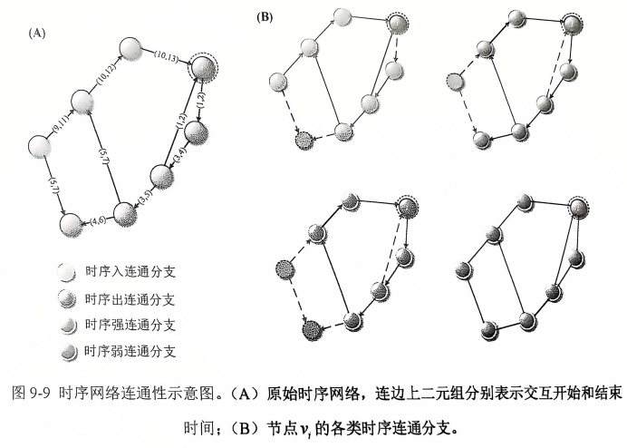 时序出入连通分支分别指从或到达特定节点的节点集合，而时序强弱连通分支（SCC和WCC)是这些集合的交集，其中强连通分支要求在有向网络中节点间相互可达，弱连通分支则在无向网络中忽略边的方向性。 |

# 2.时序网络中常见关键节点识别方法

## 2.1基于拓扑结构的方法

### 2.1.1基于时序网络指标的关键节点识别

通过计算2.1节中的指标，对网络节点进行重要性排序，从而识别关键节点。

## 2.1.2基于k-壳分解的关键节点识别

+ 定义

+ **k-壳（k-shell）**

	k-壳是一个节点的集合，这些节点在移除所有度数小于k的节点后，仍然保持在k-连通子图中。k-壳的值越高，表示节点在网络中的核心地位越重要。

+ **平均时序k-壳（TKD）**

	![img](data:image/png;base64,iVBORw0KGgoAAAANSUhEUgAAAQ8AAAA3CAIAAACdE1gdAAAAAXNSR0IArs4c6QAAAARnQU1BAACxjwv8YQUAAAAJcEhZcwAAFiUAABYlAUlSJPAAAAniSURBVHhe7Z19UFTXFcCvxfWl0y41ma7OFDHWjXzZJS4gRUihS6sU2maQjthiqBrTD+xoyYw4MWYmtA06uumktKNkAjGTAQxD1JpsREoSDDsRgywgSwEXIVCiM3xIIps4wG4Yet99F/br7fJ23V32wfn9sew57+57O+eec++57527LJuZmUEAAAjgG/QvAADzAdECAEKBaPE75hFd2a7HUsv6qAyIBogWv/J5W9muyLWbf3e2z0Q1gIiAaPEXk/21z2+J2PHOyvgohqoAkQHR4ie63sgvX3/6Zq/m1N/2x1EdIDIgWvxEVN47lc8oH6ESIEogWgBAKBAtACAUiBYAEApECwAIBaIFAIQC0QIAQoFoAQChQLQAgFAgWvyMeUSv1eG/Oq1+xMypALEA0eIvBqpyIiLWBK9YnVU+hcWp8qzV0lWPRUTkVA1wDYCAB/ZOAoBQFsXcMtlfeywrJkbdSmUHWtUxMVnHavsnqQw4Yh7RVR5MW7P3/F2qsOfu+b1r0g5W6pZyAonnFrcwlMTTTzqBKWigTWdmekuTqBaTVNrLaevzqYaQX89p7VoTGJk8fnvRhf8Om2gTRyY6S9OkjLLg8qcTVMPLxKeXjyRIpWnFrWNUIx58aHKKabiuQM6EZpc2u7A026y5NEculedpBl01W7y4Gy3jmlzcO6oSvZG1V/8ZFTa+6kw/OTamyWUQyqwaIhLHRPNfw9kOUhxvtXizqfU4UWLnte0e2jpc3c5KJuPgjQsFSnxORqXm9XKToVTFMKpSg2PnDVVl4jPZfBkXrQMZ35ocM1afH4pC8+t5LNxUKENIVthERRYXrRc97kYLa770itucYKrbjzuA+jaGHdcsEgc31s0NciwmQwnWhe7jGaG41vvrrA6YmgpDsS60sMm+NTnC5Gr4+o24GIovMVCZMla3X8Z3qkDGxya/XZXJIIW6nc8k7Wo2xGy6A0NOxmRW0a+0hHAzWvDIJjvaOGs8MvJYGZPtJjvT2vcuNzYx8oI6vjmfaz07cM5yuyIda5n8ettPELWiuJOKAiGuZONJAY5vTW5qPCpDzL6acSoLY7w+X4Zk+fXufUr8uL1usYJLCmzTAHtI71ocfaxVrZIqCxudTONkLLOd+Fm4xN3OxUnbuTFXOCTIHK8hDrxtcjIFWwWjUEiQzfM9FiEPcE/MfEt3BY9hSZGrqYKHPv37o9inE6IkWPj82l9+mlKT0fDBi1v49xAOd181IPSz2AgqzxK0nP341c5BTiTo68oMKDxVEULlOczv/2kZR+obfE8yQjY/GY9G39LqqSwmvG1yo7a6HBs8YSPb1oaeV3/IGfGhw1qqskYSl7IDoYuXmo1UsTR4gGhpa3wbv/7k8UhO5MPYrb1KeveRLzsqd25SNfz+k5pDTrfbmvXai3itkRgWTBW2xIdbRcZASw0OLL6LS7aeGruwE78Jz4hdx6lsCQtPRMhQ0+LqoeCVZzlfmYcn/PwzR942+Q1ttRODh/3xY+6+QHbyJk5ji2S9Eme01dobVF4aeB4tA50NeAzLTI52GJcs3Gypxa+GgsdXBEc/Vf0ZWv/omoe4I3x0t3+I04KMmDAqz3Gnh60V+d7D3+FElsHuRtzPikd5L75csgK/OnWqtRtxRzd2W89U9qheoXOvaz5+Rk4/4Be8bfKBPt0UQnHy71PZBknQcvzqdOySyzcjNKXrW1KFCB5Hi5CkoKe1Bvcuu2g3DV/IZdDU6//S3KHHHHGWh6GergbcqbaXmjZjlWR5EBVtIR7j2qnQlHmavvMFdO7xFHoWO7xu8ulp9lfNVpA81wHSHXxjlzWmaV9aMeDwOFrIROA6KRhu+891mhBJVm1/7qQCocsnznfRo/Y4zcO6ak/j08h+kxxNFfOh1741Oo9TYYwTX9F3PoDOPZ5Cz2KH103uCmPzJdwdPGOXDcb7S6o8wtNo4dYNrsdvQ8tlhJgn4zkvj/rV0UwGdbx09hp/5QTxBSYlym4sM187+1IHQknHnprngfYcZFCcu6xTgr/5bfqOh0Bct3jf5K4g87NK9QP+PGyW4G+5yKwXHx5Gi5CkQH/9XZwtWVaJIVmHD8nQ6Muvf8B3I4XzhfRY8sR5DrO++A9Fo0ihPr3bdoUQJGEQunvvPhWt4AZF+xNZM/31vM4TgOsW75scBQWx67ux+zwHyfwsS9nIe5+Exfz1EvxtWg+jRcDNmTsd9dj9rTMryZacFxROMmk+XzB/9l7eLwo6pGlnzv3ZfkBdG8ne2OofdvR7MijGpymdOpX5fx04W1FF865tAxevmxyhdfI4POYYbg9R2QK3htyRqKSyI/19OjyLJYb59TbHQuNJtJhHat88hdeSaOzeF85G6cm28hM4KUDjo0arzHZDTMbDOJM+Unbd7nNmXQP2BSY9lvjC5BdDNz/6567IDb+sWJGn6dTsDXNIPtbFZuDJ48P2bipbuH+P/Wrst9SV7fr1mVtEsIa79eZi2AxAfGBylk3J2Qhdb+xxmFy++pIzIlvefTjtuY8clnjGnkY85LiawRclNKcQDleBNQt/DQlXqUSxNLEU0zLK3f/uptqZoYYT29hSMCukIeHbDpRe6SGFhPyQR9Y8lx9vOpkgxVeQpRzhrUsm381Pz/Itdnigx97eN/kspPbUoaYI03suR47nHenGPbx1yab6fIdqziXAg969WUCIf7hdJ9ZZrHDmcL7ANFxNnpTaFT4GDKTiy/06sZp9DNSJiQtXNchOIBXufq1B5uYF+zLeAMJVDTI/pna1AmqQxYd7O1YWZH8LSRjtq6oDC/d2rMD+FhEz1loscO9kgZLx/95JUjQc8BXPpkFNnsC9k9mhDOydFDU4FIq2K5UnW6jsQMtJpXJ70TwB5Qu4vSa5GhEk+DgUKg5sC9lzbpQq7Bk9tydk24EK1wG1uFkU0RK4kDxsbgfnUMMRdt80RrrnPWdOCQQuHteJAQIgRcOWap7Vm7amBCNGWajtfe3n3+V0gIiAaPEhXIECfYRnHtG9nLmz+4XmwaYXf7TKRa0XELBAtPgQUjUQzm7MulX7fHKqeuXfb9YejHOIFLaE09/7ygBPgGjxHVyhKNmYFZZ+/JOVW1XO/0vrZvmSKrgSKRAtPoPLw8gSn/xyxtVLumF6yBa24PkV9tcpgAAHosVnWG3YCUnISkLoolbvrCISEAUQLb6Cy8PoXhN5YrYCobcb28ghC7O7zmDZIgogWnwEzcNm95pE/fi34Wj01LvXzJNdlZaNBGTXmU35MBDAQLT4CG4XjeVHIKKfLimQG4tUIYnqiUOnn95A1YCYgP/fsvD0lT2xG73p519bAjwA5hYAEApECwAIBTKxBeXKs8tS/0Hfk/9CBM9dAhmIFgAQBkL/B0cSRzkbQHSzAAAAAElFTkSuQmCC)

+ **平均静态k-壳（ASK）**

	![img](data:image/png;base64,iVBORw0KGgoAAAANSUhEUgAAASMAAABJCAIAAAD5WtfyAAAAAXNSR0IArs4c6QAAAARnQU1BAACxjwv8YQUAAAAJcEhZcwAAFiUAABYlAUlSJPAAAA75SURBVHhe7Z1/WFRVGscPW/NcelqozR1rozFtigkVC2FZkB5sKkF4NPFHaBYLhe4G1j7UOqRWG7aij+huYCXtA6KulD8iZMNAUZnAUEGBwJCGRPyFj0jwxJgPMJMPe+65Z345996ZO8zAneF8/oB7ztwZhnvu95z3vPd9z/EaGhoCBALBxfwG/yYQCK6EKI1AGAmI0tyE3sYt88Z7e/nOLmwHA2c/e2Wqr5eX96NrqrXwlXxU8g3fVKfFZxNEB1GaW3D5i/e+CMi7VJp649CJw9vTS/wyT/c0bJjYviF/Xcbfjz25sbHn+DveJ98r+g6fTxAdRGlugeyFT9bPGt/XexWAbcelGWueftBbcve99wBw8GbEv/4WMl4i0eu04IlHHsDnE0QHUZr7oD97shwEZq2acx8qXTxTB2I+XDMLldrbjg9SMyf708cEMUKU5j601pcPSheGTcalpqMg9Pk/+qFC1+mva0B85JOoQBAjRGluQ1drjQbMDn6cKV2oL9MYBzF9c3UJUCqn+qISQYwQpbkLlmrSfq9Wg5hgBSqASxebAAh46IHrh9OXFPzI1BHEBVGau0Bbi9KZUyYypR/qDwJFRMD9TGlCZHK0z9a5E+JPzd2S8BhTRxAXJBqLQBgJyJg2Mgx0HFwT7vumGhcJYw6iNJejv3x4Tfj4R2I2nLyBawhjEKI0V6K/fjr/pYDgf1ydHi7DVYQxClGaC9EeyVx5PkndeWLHJ6sW4jrCGIUozYX4xuR8s36WTIKLhLEMUZroaFg/wct5ECeMSCBKEx3TX9uZZpzVSVMreoaE0t95Ii+eTAzFBVGa+LhPmXUkN4I57t46N3lvJ3NsN94Phi3L25kmxUWCGCBKEyMS/+SCPCWFjgdLEhPy2/ToWAC+yhdXEKmJCKI0cSLxX7ZrZxzWmvr113YK11qoMol5P0EMEKWJFr/F28rxhG1Qvfy59XVCtebnH4KPCKMPUZqIuU/5ntE5cjljUbq6lzm2E/myb4eGPlTiEmF0IUoTNebOkcvZif8UqDWCeCBKGwkGGmuP0r+P1jYOoAr7MXeOXM6OSTtAtOam4EcwBJdQs06hkEstHBM+fgqFYl0NPsE+ruzBzhEAKGWeRoerR4YrhTFAWdCBSwQHIUpzD3oqjU+zR1ZruqZNgUCaUYuL7PSfL8+cHxSUVY/LVtRnBQXNzyw/34/LYxC3VpqtBu4uSvKLeqPwVNfIDgKuwUxrIHBTkxP+pco0/HFcQrpW8hfLATm1wvrP9rfkRftQQSobMoJttTrMxyc6p0F4zItH4ByloY4PgLRKXLYEXuTsxCg/H6a1KKlcEZX4cdU1/OrQuTw85aeJyDvH1BpvA4T1J9vXwLquU3lL5T7ylNJL7q82ncbgHAFApqrqw9XDoP/UB/RKJAmlnJ+lq0yjTI1ihU4D55B2D7LCzvYwnKI0wzSCzZrvqVTJKUqeUtzaS0tCp23Opef3cXuMSjM2OAjc0GCSja5hA6qE3aDVoMTTZLUZ0ts7aTQayNIq3b8zRf83fVEgTvmHmjbBaxyaq8FFa+gTOG1HXW2GDFAJpazf49qeOPgtLdoZ0lORKgWyjNqxpzUnKK2nNIGKSE0NNRuQjOiOvwNv/MCcFlym0VWk3n4mM6xZVDIduCyZZTDia2B061hZOejDqLg9V3DZjTFzjjgUfWwBUgOlqsJFa9AJbDYjDe0qua1tTfSVJsCvyCJi1Nbco6THMmyl0bc97KM09PWzvq5ohOGyKo3Q2gNAsakJl5lhiJKrKthmWLwNzEVfZZoUSNMqnWByjTYWzpGCYd2xVarbzQtLUMNwvY46tZhCwb0Xaj9bPhbPY7hKgz0UGl2YUclKUozSbDUHOotKq8Sy6mnYpPQJyjjO3mE72MDM6MpzV7kRznJEanKhIWLewd0On+2I2oHvzZzY/LMeyfCeXHfuXfk6+Ph9ZqF4NoJiVsB7ojx57tpj1znD9tqbD3dD8YRNppOTe0+sfW5mWWzVkffDWT+1uSJfAxTPBDKrZJvR9umfmNxH7/RqXGWOJGTmCwCUfH3KAzY+MoscGVQvf3Wb8OhjRFfjoToAnn0igCm27IpmUlC9p2Y3MVU/X78AtNf7BvTXT2+ZN8dizVZ6DWWzN5uhP7wCfYyX1zPbL+A6C/wVMwDQlNWzvui5YMU5Am2RGSa3HQV0fB3LkNFzPCMITSx8wjKrWd3tjEUP+zidtrkwXkYpc1u43YnM32GfOWAfCpcnDQ27fJMSiKXHkxMRTDMsnCOOeRiQ7WjmxUIXSBZfaLr8Ok3B87Sb32dKklktAr2Zy5fSU7wYfi3OYcuelvA4HFca7dk3m/ige5T9DtRdqlBhtUUXWNs6jIVphEou45lM8TYwMmi4PWnoK3pQtIPJOeKQ8pERZ7AN+88XJ8vlKcV2P1vmaW9D58nlSeGaang2DluP7YVpH8g/Wqm0Y9MFiWxWVu2PpckycOPQq4tymi1tnbaGMmg70gLQdRUnUGBw20el3EnGt/SD8APvvAMXLUBbREhjp/NubaS7dQsfuQBsNQkHv18Yfov/vXUm/E0pkyInMFUC0LYdh7bj7ODHB66ezH8pZOmJxerWrfMneeOXhwW9ljmIi5zGu1aRtv8XfDQmcFBpvQfWpqhvlCx5CN8p0CbPhtU1LZeY162QyObkHqAfb5/J2t+I6xDMZEERGzwRSMbPX5UFTynf+OVZ/KoQtKe+LkG3Di6zo70pNMZXALj7Eg5+vzB6D29eVQV19vGnif7C19/6rnof/Llr7j13+YUv//xcWMzTTlvEq7l6d7fZrgEc+N71W3w0JnBIafq6j1L3xVs+z0K2CC+SaVF/htZd9883cQVCU18Oe+XnQ6eh0uSF70CL6My6z08In+SjjtTm1ka+d/P12uo3ccfBz1P57fgNo0f79kVzt3ZTCUVFyxzQGWg7WwWtA9rAQ17Zwc+qLTpAm9whgZbrT5ZtiUG2hbFJWbj1q2MuHLfGAaXp27a9lXGvYWtKA3fcSTd3z02Da69u7Xir+3HgZi8cvvzG4SJNc91XsMFNe+z5LUhfKQXdm7cdYfcRcjcw6khNm7FYo/9Vh4+4UX6IOw5+vl0mx28YJfRt+ctT1IOytPJsbscvH4ztqAx5TAIkIc++RIHusoY2/JpdTAigHYgdXdaaYWwL445T1qDdTIFy2iRcHhsIV1pn8dtpNTFvL8RbU1py/hqcc9FcaKnqrqluNZeLvrn6y24QmBpr1td1nqnUABA6w984EEnCl74byD1Z42xg1JGCF2YE4bI1He2n4eg5w3+UReIE9M05i5ZDnakK1yod0hm2HZHNDi95cNTLFKg71NjFvGZCf/1YzoKpvmgc933o8SW7TY75icGxUEpHm1px2QSyLUKjgzhtR3p/Kt4+0SMRqrTeA6sTSwaB4kHL51kDZ8t21MDfp1suMRroaFbDSUDqW/t/vEFX0LPul+eo2pR5RSkmiQ407toIbUfQ1601mzw9Nj32d3CytjqfbeEMzgb+5QbW+EDHwfToVd9YzbaZXpynq3UXetXpc1RnQETukcxIRzcBZWxHw9Mw34i4eABKdh7phNJau2DVNz+hatC5Lyky8w+bz+mGhnRd++b1jvu9WatPi3xRCjQldVZ29M2fmZZAmxKwbJzYXleiAdIVMbZmG54GtofsQddUEIVjEyj5nP9+j6sND7kYZFH0C31Ne9YlRikUZgH8VukrjK8XY/IXmyZ8VFDi/lZcawI9FGBxL58rWiqHlqXPlKQ8tjQZFJTuATEiKER3uDlqjBfe7GLoNAXRsKl8/KJWV5gCTelLrdjQwPWHUANah8X11WaFwc+ipDNXsyVatOQEOvhYwr0ZbjTWKMDRwPz0lSVTHhD3eK6Aflw9YrHS54riZZySgfrki+Vnhw5HJ7H87oLwBkb5c24fy4/DQkY2/4fOtoWWDCVfzZYQJyzjTNjZHoY7Kk1ok3lGfhrOtnVOCqhAaIueK3qqpyHHzpxrVRBFcq7dD/samM65jpdR7p9zjcP3I3JHajyA81pZamknfXH7O0tTpbwWga1lJsg6Im6sNBpbDewx64g4xQ0ijI79y0PxIiKUNGh+NkcOE8Fe3FppIkR3qSJz/hTa9SZX0eYqPagm0WXgM2U1sl/7W758YyZ9C1PypXvsUs4Iu0EILoEozZl0H0yNou1ZJok8rUJTkJRU2KzV6S5sj4EVik3HKlVzMtTQJuuvTqdHKduZI6PiBiE4H6I0V4CeVz0coVxqNPeYxDc80NHYlzlicIM4pjO0CsgYfHQlShyM5SfwggKSLvomZxmCf7U3e+BPaUreu4bwqZ7ONgBCFVap4+aYokGyHIq6uvgDHbdDEAVEaS4ALddAJb8x16gjJL3Ad5cb0/lQVh5/Ll2v+p+J2ZcpZV5BsiPB+oZVIx55wCLRljBKEKU5H21rNRxL4uMijFGJjK4WhhlDPpmsPL546Pbti2KgzuJ27nIoKQbSebKYHtLG3e1ocCTBmRClOR8UJ2+en2BMb8ZlnFjCnZRsSorZtpjXvuRi4OrJzQnJdPQ2JWHNTyeMNERpTgel3FkYhkh65jmq/IklOCmG3sXpmXEoY0Uwd/mFq+hPACDE3yGpEpwNUZqzYRLlzBdZYKRnno9llliyZd6S3ZdRAYPdIAQPgyjNyeibq6FhGBEZYBzArKUHgue/P8WnLiVkUkKxf/aOFw3LpCKavsq2UN4weeJh4Yv5EFyA19CQY8vFEAgEAZAxjUAYCYjSCISRgChNtHR+Fsu1sr0t6CU8Xpk6WwRr5REMEKWJFH3z7o3lDiwgNdBxcM3TAdNjX9/RMqaWCBY9RGkipOt/f33UL1R1BnRnMPvnrDjMskwYK2eL8q4s2Nd6ZW8KriCIBKI0EXL/vP+07k0x21/6k1n2BmRNfnn9spDxjoVvEVwJUZo4aa0vH5TOmmaxCmx7/lNohGNBDMuXE3ghShMl6Gn37QHI8mXfMkOcNaO+fDnBFkRpYgQFmtjaFYngVhCliRF65Xrpk5NuC0Am1qM7Q5QmRtj3l7bbetTfOPP9KQBOVzdcdeFmcQRh4KYiiAme/aVtYb1TN1lIRBSQCGMCwfUA8H8TDyHQjHyT0wAAAABJRU5ErkJggg==)

+ **关键节点识别步骤**

	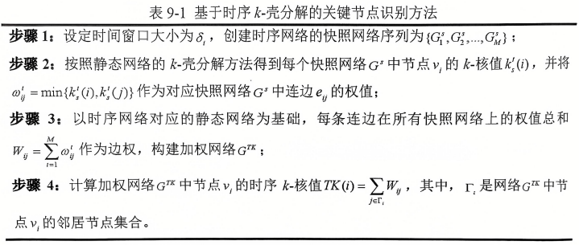

	

	​													图8 时序k-壳算法示例				

+ 分析与应用

	* 通过k-壳分解，可以识别出网络中的核心节点，这些节点在网络的稳定性和信息传播中起着关键作用。
	* 时序k-核值高的节点在网络的不同时间点上都保持了较高的核心性，这使得它们在网络的动态变化中具有更大的影响力。
	* 这种方法不仅考虑了节点的局部连接性，还考虑了它们在网络整体结构中的位置，从而提供了一种全面的节点重要性评估。
	* 基于k-壳分解的关键节点识别可以应用于多种网络分析场景，如社交网络分析、生物网络研究、交通网络优化等。
	* 通过识别关键节点，可以更好地理解网络的结构特性，预测网络的演化趋势，以及设计有效的干预策略。

## 2.1.3基于特征向量的关键点识别

+ 定义

	特征向量中心性，是一种衡量节点重要性的方法，它认为一个节点的重要性不仅取决于它直接连接的节点数量，还取决于它所连接的节点的重要性。这种方法特别适用于加权网络，通过将时序网络建模为多层网络，并用三维邻接张量A~N*N*T~={A^(t)^},t=1,2,…T表示，其中A^(t)^={A~ij~^(t)^}表示时序网络G^t^在t时刻的邻接矩阵，A~ij~^(t)^表示节点之间t时刻的连接强度，通过权重来表示。如图9：

	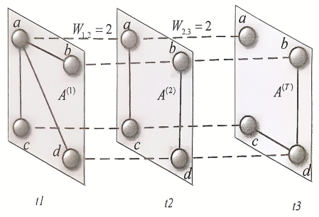

​												图9 基于特征向量的中心性指标

+ 局限性

	基于特征向量的识别方法与基于拓扑结构的识别方法不同，其获得的准准不是全局的节点重要性排序，而多用于获得对应时间快照上的节点重要性排序以及不同时间快照上的重要性排序，因此结果相对面言更微观且更真实，但难以实观全局上节点重要性的判断

## 2.2基于动力学的方法

### 2.2.1TempoRank

TempoRank是对静态网络中 PageRank[^②]概念的拓展，是指时序网络上随机游走的稳态密度,节点的 TempoRank 值越大,稳态时游走者到达该节点的概率越大,节点越重要。
假设时序网络的快照网络中孤立节点上游走者不移动的概率为1,非孤立节点上游走者不移动的概率为q，当时序网络的聚集网络(忽略时间信息得到的静态网络)是连通的且0<q<1时，时序网络上随机游走者的任意初始分布都将收敛到唯一的稳态密度。假设时序网络G'=(V,E,7)被分割为，个快照网络，即6,=T,则第7个快照网络中节点口到节点v,的转移概率表示为:

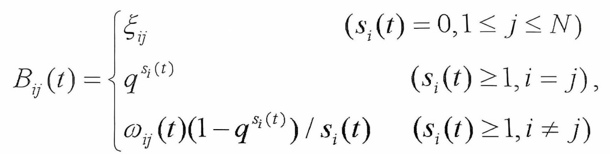

转移概率满足

| 符号                                                         | 概念                                                         | 公式                                                         |
| ------------------------------------------------------------ | ------------------------------------------------------------ | ------------------------------------------------------------ |
| ![img](data:image/png;base64,iVBORw0KGgoAAAANSUhEUgAAAJUAAAAeCAIAAACqt8sDAAAAAXNSR0IArs4c6QAAAARnQU1BAACxjwv8YQUAAAAJcEhZcwAAFiUAABYlAUlSJPAAAAS6SURBVGhD7ZtfTFNXHMd/TNmN2Woas8YHguKIEEaoKWgh1NBdnGP6oE5xJAuYGLaH4Z/5AEuYL5hpZ+iSpWZLiWXgA4nMbc4MJ11RljSxWhA2IKWUiWX8SSyuZDKXlnaEnd7+Wgr3WnvZuhXu/TzA+R5ILjnfe37nnO8pSfPz8yCyYnkOv4usTET/VjaifyubRPbP6zRqDubmantRs+jV5uYe1BidXtRChOxfEhGPzVAioRQ17Q882MOJ50F7bYFEUqLrdWOPwEhI/3wOA01RtMHhw46o8PvtVUYC+uez1qUCVdHGOaMeth4gReNA60PUQdymKhmk1lmF52Di+TfRsgcgR2dDuZjHbRXEPqXegTrMfYMKQGW4j1IwJJx/fdpMgD0tEyhjhrFdVmdFKRQSbf/Zb2p0QGZxTgrqmEnZsU8Jjy6b+1ELhOX75x/v+PDV0pZRlCFGW0v3f/LTNCq+jPbccADs2paFegF/x7GkIMXNS5/JkJFZCOC40cP5w1XLMv2bvnMmf2vlyHuasjTsCZG24w13zf7z5hnU/BizW8jylrM5GfUCybs/d18tI43MvXlLnxlkUzZZAi32MZTCYDn++YcbS+mPpZ/dbCnLYA90elG5clx7/NIgal7M+WeJVWvXoFzM2uTnyVeuybnArH8OW8KAv38z5tOvvWsp1BveQfNmrh8hVe3I9dCMYwrZwDXrv17IhnqM5OhQJGe/MxHMeJ5gSxDw9m/w0nHtuKz6XHk6dsDP5itk616UtR51EN9cxEQYbS5OSnrzSxfKEIzz+Q3DKJ9Bv/nyI8hUZW1Ezc36dS9iSxDw9W/EcmUA4LB6e3gS9Hd9Nwuy3fKwn64p1swLLGscIz861AWU+pUMlIQ1yRTAb7//iTISl/22A6h9SjlqFnN/+bElIPj6N2a7TSab4uWwfcywwuFCBWrwD95tJyexCEMBiuq980PVrJGXVw/Ne+uLUAXYlBXYRDpdbCdmur+/Rg6GeeR0yI3/14EuAFq+BbUw4OvfC1IZwL3hSZQwbfmWDOvm1JdChk7/0KyfBZWmXBnUww35zK7/WMciT0YadzLdS4pqWt5eYtCtPjvqBZjFT1mieGr1tPfdIq+NOpt7c7pqwXN8rDDhJFC03uYJpP9XK9Npna6SUl1g9OQdLU2BpKQpMktmtv10kxNlCJ+pihwGtH0oQ1jryAvCEYR1niJ/rFLv8Lm6DW+XfTGM3WGYAE14+Qv//Mw3ZqpVy8gyBZRMfeKbgG9uy7lgjyTl9RMt3a7FMbKzieYaWCaJrjKxImfGCHb++dhaXyBhnlnLdadk0+WI+WdcYCJntk++zlMU6x6BIer9AzfutgpKvH+ID4GCyK6eTE7Nrp5BxPu/mIm7fw69kqt6BooqV/UM4e7VxXj/XqOgBHz/zj9/4cmkowu2bJR6BxuOfnQ3HI34f7n3I9Dbtz41StmgOGmcsmukFw8VRvv8S+Ghi1KNfcp4UrEB+4QG+hg3Jr5+i2w7JAW1prGIyRYoqsLbLMaB/+fz14MX5Nkf7Or841M6apYp8kziXj/ZeJ1fnT87kHP26E7RvH/Mf+sfE1iv23bmyWnzzfej3yOIxIT4/ysrGYC/AVKlThh8gn3yAAAAAElFTkSuQmCC) | 第t个快照网络中节点v~i~与v~j~间的交互次数                    |                                                              |
| ![img](data:image/png;base64,iVBORw0KGgoAAAANSUhEUgAAAIoAAAAbCAIAAAAs34DVAAAAAXNSR0IArs4c6QAAAARnQU1BAACxjwv8YQUAAAAJcEhZcwAAFiUAABYlAUlSJPAAAAPySURBVGhD7ZprSJNRGMcfs/VKtQhjBK1VsNq6Kam5QqNalGVIaCldxCysyD7UipQuFAbZhyy0oIS2CrohZhdaqVkuCryVWgvMtsqFXUhNScPUd8k6bk86216dL7FGZ78vO//zbGdw/pxznvO8r4/FYgEvnsow/PTikXjt8Wi89ng0/8qeTlPhsdXBwRnVqJ3y9cbmict3Xq1sNGMHfZDUwN101KiXC5mglIK6DuzhhG14pt4gFUqTtfUsdlGF2+1hDWolwyjVBtenu1mnkoBEpWtGTRFutoetSJMAk6Ad4kyzhuxwYKJzPqKmBvfa8/FKJEDAqRqU/WFLD4pAlFaBsj+tOhUJqnStqCnBrfboM+QAkVecrwGrO5Cg5TDAFo7O+YKaDtyZub0s0hhAviRAjNqOzs/lJ1PSm0ARJhuDXX8gmLsoDuD2vWdt2EEHaNPQYOuL0mOCRIxtCKFYHpF4qaodg1yYLijJl3cUOeQEOpVtHHvkGXqM9vJWHQ7ApDxGSQV8Vk/L3aRpEVmj95c0kZnu+FR2WPa+KL/u50gMc1FfWwqgCJgsQN2LMpOcLdoE0urb2l7vDbQF+5BKQwG6Kt+9R00DfOzRF1/ugvjNcdOEZKb9JszftT8JVoRMxygn3eYuskcN90XZn9dVhcQ7zq2tD7a7G1s0wMceXwHZ1W7cefD7Mi9YdsZyKWrQiR0IY3V+E4hWBstQc9PW3oktGuBjz8J9BSrJh6yISTPiNc4KLo92+/gs0LxD5QoNz+8/BVdWIMCYUX7YogFemZu/MvNFtXrT1MZrW0MnzTtS1oL9doRKpdjqxbrovn5rR2mH+VV5ATmClLMHXIHmnyy2KAKPYl501GQryZRzXSX/gDNzs92HBh3FkK3wZm4D03Z3o1/qExTgN3P7oWSAphemBuwZiCkhK4kLxfpa1H00fzIAyMTjrMJs1MSnlf6wtu1pM5aSDTAyhIxBD0O0hyRYXafTTpR/7jmfzd/fXL94FZjodQvG28LWY6cHp0dP4ML1IjDcfuoQsm57xud1LdBpupW8Om/phlCHLN1cVZwLEL1u8e+/ogNcRa7RXpN3NDFCLhbafisUK2LSHR8LkPtjuPotin5Yb5aONTfWkLNpVs+YwlkxWU8anNWyW/OTGG/N7a/AbQ/virU+I4DKijWvzI0/AsWBh+qw3NhYjdH1J6Atj1KjUr6pCs6vdVKt+79xsz3EINmWvLLjI/YEzkstNA16wzQ3VmrWzonURmlLjiv9sZMi3G4PwT9oZ2Fj7bGx59aEDfauwbbggy9X3ayvPRslcSjV0cBffg2RZG5LsrANoNJZMnvuOl744n1L1IMB+AVa2sEolE6mswAAAABJRU5ErkJggg==) | 第t个快照网络中节点v~i~的所有连边数量之和                    | ![img](data:image/png;base64,iVBORw0KGgoAAAANSUhEUgAAAeIAAABOCAIAAABzIoLVAAAAAXNSR0IArs4c6QAAAARnQU1BAACxjwv8YQUAAAAJcEhZcwAAFiUAABYlAUlSJPAAACJoSURBVHhe7Z19QFRV+sev29K4bdS2Ne5uLL3smK+hUaYYho0ZhFkrVuDqEpjaBq0Ku5KilrgrksKuQCXWIK0JBYpKYRCoTJAgIiKQYBCIi+DyEriMW8BM/fydc+6ZmXtn7usMAwjn84fOuTNzuffcO9/7nOd5znPGXL9+nSIQCATCcOUn+H8CgUAgDEuITBMIBMKwhsi0DIpeHzsGMm7zKQPepA1HW8bM2lOPtxAIBMKAQnzTsqjfM2v+9v9c7vDO6Uj2vQ1uMZT//YE53+xq3us3zgl9hEAgEAYUYk3LwdBad2FJbIxv/963s1vxtqtt//b3f5JoNIFAcBBEpuVw4Wzuk4888cQyXyo37Qtapy9UnfD0mowMawKBQHAARKZl0FiWRXlO/pXL/KBFVO6OQ7X0pu6npqno9wkEAmHgITItnfbyz+r/4DWNon7l+8oKxVfbDpbBTcUvPuaOP0AgEAgDD5FpyRiqi7KwJN82f8U6Zee7n35ZXZq7yGsa8UsTCATHQWRaMudKDqpnPEBLstPspZvdOt+P3Jp7n+fkX6FNBAKB4BCITEuk78tD73aO/82vcZOa8swaz87i4kvPzZyGtxAIBIIjIDItiUsfLPDa2UlpfOcnN+JNKt8QX4ry93oIt0cdho7ytI2LHx43z9QlBALBEZDpLQQbMFw+ulb9QqryLwc+iHhi0h1j8WYCgeAAiEwTZNOtDX9oXtJ4TXXeygkkfEogOBoi0wSZdB996e5nD/hnX/lw4S/xJsKwwtDXR40dSx6gIwci0wR51CZOm7pWH1v19ToSO6UoXe7GkNbFu4JmmKsFlMU+m+WW+ObT98tzBbVmLFtW/FzitoBp9k5pNWjD7/xre6j3PbjNpK3wywff+2KdhBzSvo4O/bhx3MdiuPbNiZhV+6enpQW44E18fPvJX9Z2Br690t2eR7rh1PanYqktb29Ui/25kQqQaQJBMqejlBQ1MbYKN0c5+oIwheuKwxd7cRtQFTtR4bfnfLsetyXSlr6I8kysYezIVuAxKaNO4xYLcPEU7hEFLbhppvlY7HoWoQtVCteIwh78Pqa3u6nycHzQXKXC2WWmX+iOvCb8hgA92YEUZb0rWYDjVobmyu3SEQSRaYIcgAhRlCKiEDdHOVAR3RJqcAsBOki5qQQLir69KDp4d5UEeYEqvSi9DbeM6Jvz86V8m4m+ZJOSX6X5HrB6nc78hNDXadRKn+3ai5cyV0fkXqgsPKLZER7w+DOr1senFRa/F5dqrfMC1CXNpCh1igRF5wOqtPUZdVXklsg6kBsY4vRgUbH9nkc2XcYNuwkruL5LjV+PDC59MO/+l7XgN1ew/D68yTEYOsr3rX9l48fnOvsVSvcFYTsSIp5yHVJv66W8t/Zo/4sbmOb8+I9/WLh+wXjcpqirZSnvt8wOXzz5Zoq6VpO592hjP+WZVKd9VTjW2p7h9+vVPa+8PPMOvAEBd39uQmzVWSlOCozh1GaXxz71Yh6TEXBshQuOizqrurWvBxX57dsy+5fwqPYtrN3nP/7/cvzvLV1zbZfaSXc07sDkdStlVLFpTJ7nU/9G2U410+3RfS55/3981y6Q4sQo2zpu1iHLM7p27qPd+R2BoyRCQmSaDUpiiKeFWhma//W7T8m8CfqulKaG+686AHcx8mS66PWxc2P7HX5eOJUk6cwnK9ycOj+P9PCN71iU3nhE1BPqSPqudhpuVTqbBVOXu3Lc+mkV1Wum4A0UVR03af5/P2jdNluyrCKgHqYvaTsSwDuhFX5iSRawtwU+A4EqvfwXXFrM/44Jg8FANWVEFz+8YfmUscyjAq+wShu0cUl3rltjvY//VX60I73auFoGi++///6WW27BDQTS2MsKaSILVHohdbRjC7DJRy/IpiaY0dcleeK+oRSL0m0ZVvUUhCnh14GcjSz0+aGDcF509/mah9Y9OSsU4GKsyLHHvzngwKPy1DTgFgL6pcMKZLtQuT0eTJCDl5qZVIfbfECPB7dfg/8dE23p/soZMaeMzg94VIHZsMvBK3xa+pLYeE5/CnhL19Ghk33q4nB7PEYZRKatga45IAsIhVpTZ8O9B+4t8OURJ9MNGvgEs9CmgYaWJJYzk348DC+dbst6c3VqRRduIZryUg6j2KG++WKzwF2j17PebEn1tVTprnab4mXQV86v0iJqB/v9mb31RqnlUmlwX2/KFzkwi5Mzoy+JXppwRuy8LL7Ocdz69nZWr48GiNODk9YMP9WSrH74Egi1DdM4kHcgZKQ5PRqT54xfVQx+No4cgnI5VgblD4vwbfF7cdlNuCEE8klTG0qro2axhvpGoLP2k8kvTHXG7YacHUV3Mf3SbYW79920U9ShbQX0wiwoY/nKjVwtSzkyV9BzoDv60u0H/Hv2zm0//dmZnmkz/rdp2rFX4FJyrWkL3C+8gRw51XHhFwJ3CbtdtHFxd67j8KygdPus8a/sP/re7/njGgZtuMvGqy/PNdbOgb7+b5l+adi5p32y5Xsjb2xotSZY0lUQ5oq7iHKNOi1iA1iB7M4Rak079rw4LXbsbQkVM+UcChjWd7MS5rgdCdAMdYup4E2tg8azRXoIC+hMcdv8JTY78ZkDRJMlwBedZ+zm2rG+IHLu6iw4LOytSY1O5xofwr86M3BNYGgKMnihBU0PXsDhGlNXGjShom6X6wVhXKMtfVWsm4S0PNijgoOmmgQ3hd8+ZgLkqIBY07wwo4muYQWVu1ih6lEJtLie3Q/V8t2nOA092urFDQHYtjKL6rhJ0yPqwE/9JDOdQBs+Zl48FG/W1qEFWH7Oa+9nhRABMPAWra6x2GoGGKe/TVrMfx7QJI72qGG8331kyZ2LM8DzwCr8d/l43LvHv8UN6vuenp/efvvNuMUFnXtCWYwP+66UHnprQ/j7t7711ceBD6AYKThIVXkEjBkybOn2jIB//CZjpxf9LT7AlUr0sIx0wtFpxENFjVtmCo4PYJhT/V0G/Lt4iwW1idMebkrgf3/EQqs1gQtmNBEI9ajziFlTEAb7wqHOae4/MQh/WC4cSdMAaEsLHSa0pYXe5whM0s56zpEEw8Bvqa1l3KDQ6hQLZuqby9PgXBXl1ODY9d5MI9ZsQTNs6euFEWoJ/Q+ulGVePYwJu8WKJ4AjW1roqKWc1YiEFDIVwGnCihRjNPFyvG/Y0W70chRzp8tE8G99axfddAQ3ORnDt9bcfNNN+NXQYzj5adKElfMtbObW4/uyPIPVvBZ/6xdpuULv64oPpc6weP/rs59TFPciQU7OSro8YffRSPcpDy3/rAVtpmqPJ9eHPDdH2OZ0uqp9a9+4DaebzydMulL4x+c9jTPDaw/taNm8FCYVgsMtf+WZGWg/9bWF01W8B26kveMS1V/eeAk3AYayXUFn/pa5VjT321D+2fs6oaOWdFYjEuL0EMPuaOJIgk7fhRkAHy500GrqtN9kZlLd6Vcn4E0A2ukh4CsZbDiSpgFiHg14cuuuB7/6OF8UriFnR9sa9veRF4gSLKJiKNuqmrX3eZNjzjp929BRXtz6uycsKmsYDAYnJyfoyxqX9QcYLoQbddrw8bEzzuUsc4GHO7v1nzjwCC7Bp8+J9n/9nlkTQ+4253cbquMeC/tFmoSfDfQhzfvMh54axMXVspR90wU8IiMZ2qgedHov5kb7ubvvPIvbnHRmBrt4r04VTeJxMIxooo35eUOFvv1M6mpvl+DMTrzBEtk9XBgBbV3eUTuOMYoiEISkh/gWn2hKgeognjc8aKA4n5XHQ8yjAQbtzHxwK8C5KyyDgNCLIjw9H4bnWDcmnNH/wHPhuDwHJMjDGU3X4vTbwb9q9niAS2gMmYOX5mQ4eGnFY8co4mnuGH2dxscnRdxTAoA9ap5mzwE4K+eQPJEY5AhlKGS6t0bj46xwj8gVD9gCndEsVTmrQrKF8lAdDjPtQ4qTbTigb8+PUClc/TXCGiyzh2kddmhRD/pPsCUZPR1E8n4HE4YHuTwjYuv69fFpeXl5yStcBVW4s+ZUZbPQFJBeXXevxdv0U0tg8gsSaYVzYLZJglllRcQxJ3UAurIDXY1qTqt06cf70QNAmkzDCT7mOWENKf5h3I8GK641lZVfYCfSsNHrdDq+lOwRz6DLNJo7Is8oRSI5xCE8VjTRvnJfg4K8PpPxaTqWJ/57tQNokzJNMhRaYm0YaizjfL0XDwOFFh5sdTU347vmbCYzJa54fwqjVZWwgr0LNFGKfxgBrxy4cDXpi5yNf9sOle7KD3U33QW0SoOBjI8a2sPSZLrlXKnJ+GpIWRoh7QbUNzdjZW/LS2d8pSkrhdHqyY4YrXH8QZZp/ekoV0rBePJLA4mkjTO3Bwrm3MThnvbRAn56vGY/+uFbWqaSe5ieXyk0srcf/elolQJoXiwcCOjbiza5UQr3+OEziOHIxrjeVphOz0DkBNw8EaaxPxA8RiY+aDGvFBg3sC4ceiwCmUajnoC99XgzorcmSa30QSqP7k5nn4Qz7RU2q3RDio+P+RlRk+CmfP1A7q5NAe7oboEyLTLbnEVDSoTVM6u3JnX1O1ZzELoKoqILjIZPQRjzLgQthlg0pajla8eIYHBlGtlJfFYRspn4BraozoMyzHQ1hwSkfjR8fr7hAOpIZn4VC+i45ErvktjD8NcqOAgfGLoqoFMdzdNzdvGOlOAfGzygH0LOc0rfnh/mwZghBbvQ/H12CzWZP4Ke0zuhX1mhnGvRCUCjfaYyXVVdJVHu9O3p9+E3POU1zFOxz3+mOZKXl3dksyed4tZVkRAcaTY+2jL9FRSSfT14ULhGn6W9L6bb3qpAtSV/cHdjeccBsIY1ODpP8MxB+0DA0/BnWAfwsWQ22tkt1HT4rTccGVSZRgrB57yjR7Z0FQEO6LeH+hoxnNQKNBQchtC/JxkGFUZaD9My7VCnxzAHxvQkm5W9F3MjPZzZoy9gMDMeomB4ovDPNHU67F9R17++OXuNd3Cq1SIC+vbzhyPx043G2WUiRKUEouuxWnOs3vTzwo4adGj6upTIBFZ9Ev3pd6Lz0eCgKWsn/YcaND5T/UI3H7lAf8BySqZ8cFiE5SiCsWKzHQe7Gj4ijECZtqty9Y3KYMo0UmnuG7y39VSMdeCIBT1rllfGBwuWUFuN6oYBdMzJln6S1MPwlzI6LRpMW9abkYeZM0mEqNypUqiWsvX08sFtTEk8m8l6W9yh21K8NzFdOC4MV1kpzMtLi6fN2CDviRPX5FjvtKVCC06kpyZrf8EQROg7s5YqnD2ii1hnUvr2OsYAoSkvnfV2QSTt4hl12CbT+ub8aD938IRGgCe2d9CHZ7/Db/JBJ1VxTKZCv3wLONQc2XHDYOEQZjSRPYCTS1eFZuncLcUWHfdd8Za5dmS2oKQIzscdWkYDwteJEnpYcEBEIBAcgS0y3ZUdqKCUgQdQzUNgB8eqQZPHp8yAXz8AUmxAJOeCYx56RC6OnWN2VjRRflkmhL4u3d9V4R5VYm3kQC+xzS4V3ochRF8RAx3TvN0s1sPIf23rGRMIBNuwZbJ41Yn9/dSy5S+iKi1j7/ZYG7mCevqRSfhdXn409FOU00+5p/uiCbEzH5sgOrVN/+OP+BUHqpUn8XkJY+dUNqcJK/fvw9HEy8eqm9ELWXRrX5+/5NTzuce3zLau53TbnAUv9mtDYnJ1eIMcfvxRD/69+aecM7Wcbvop+Fekm3l6uO9KaaL/75Me1BzfKFw/h0AgDCy2yDSqunDo02MdeEkdp6fevW7n3OH6ipxOSrngYcb0YB503/XhV0OKS8A/d88F/yvUwV5cC+0L0vjBC77xVETqVmPNveq4SWPGTIqrpluU0+/cPan+VG0lbg8Y7ReK60S7mauHG5Pn/Mxl9tq+mMqcUT1ZnkAYCmyRaa8NuWGul+O975m8LLncqNUMtOFjxsxJbsQtKbSfyyujpFjkwNT8OSo1M9R0H4vbUAhE+p09QXJlS5cbE6Lt941Z62V8sl06m1NHKXwfmYzbNP0GplVb9PrYMeO2gl5igwT+tWOca9BZoTvzWZZ4N3P1MBimQO/WT/760ILkeml/jEAgDBA2Vcj7pXpXZYUmeHzHR6sevWfW1lMcheMeta6lhYzwb//7HW4yMNSW5lKUWv2goEVu+AEO5wUBRt8YKYRr8RdsBJjDz+7uVARmZsq3LQ1n81P7qZnPPWpaflV3XguOx9djimlXXa31+JWRS43l/RwCq2uurqPUMx4wH8RNN8HCNV3fcTlMkGdJoJsFe3js3R7rMrNXnF/1QgL3yqQEAsFBYG+tTcBZUEB6JYQPIfzBLZQ+ILoXlKgwLDI9UADR1pmI1onHVvOB6Y/YmPXGH6kV7WYJPQz3McTTQUcHvb12ZiUTRhAyrWnd0ZfGvl6EG9TYKa++EUJRnZVN7XiLEPc9sgDIxImqC7htpqu1jqImuNyJGob65GVRJd+j10x09SVgyO/7CExVGEIM1QkvrNL2uzI8y/K41RnOtq66ZKzIazhX8HEnRd3/q7uMG6qPJBZTyrA1vrgU5LHX0BBg1h62iQ19SwBLT8hDXv4UVVZSb2VOI8c09eJj7rhthZQenvaIL9WflX5SygW/QdDlbrR03pXFPrvx8ybZQZDWjGVPrMmotiXya0lj6vwJPq9t4OK1Zx9cKbnyOevkDNqNT6xJOyejarqho4P/031XSpOXPbG9TMLYqiJ+8cZjl+0chA1g995wYLmWCDT8FOrYU63wUa/X1R8IBG3WHHx6r9xzaZHZyPEWMgDRPFQ4NWoqZwo7XCtj2MxCtCtdmp5y7hoGJ3np28/EqlURu7e6KUNzYVtXD+eGKVSsKQ4oj47DykXWr1V2HZy6RXEsckHb6GA003sxN8J7vfYa3m5EWg/LHNP06oQqwg0H4Gm7rjjMnIgNhgwKvz38FTp4gB3vmWg1NdAW4LXivhJoYp5/SpW02UuoOmjgAfrk4DRT+jbj5tq5tM30fBgjQR7O1pmhel3HBa0m0m+qs0Kp8g5aLz5jAoBGYfbN2x3A7r3hkCfT39VkbgvynmicjersMtMv2rrcArjHeEoeIKWwrumhr0sPRussO0/1i2fPSjIC77chr+nRlR8KnjP2Tz7sqtDQ52s6YVMPKJTuHF0Kn2Mcv1r42ONwb6DsZo6aHg2ZS2FRBeepwVzFTSX2MC32Eic5XjsV465Uzl2t0aIc++EIx1JZQFLMc+317UXRwbsZtZB4gTJifZH0zfn5Ur7NAta+4VdpiZ0PgCdnnigGbhcRzyLroQpMEpUqJO18e8nOpZpzF0rz0t7ZvMr78YDwbZojpVlxibKqEaAZrnZ5LAewe288HLF6S2PynCBqH+cKFmiZiZgnsq98uFCOx8BQHffI9M2q9MYjAabA26DT+MG8qS9rwa0y6EcB1+84GMZezgQAlwLZ+NRpjlX9W+GKM43bqs6uE13ZCCO5h9FaIlYrygpguPZNccbbURvTv50T9vctwb7T7x6AVB1Dx5exB69HvOYlK4B7Ke+tPdr/4gamOT/+4x8Wrl8wHrfRIiHvt8ymFxGh13jth8Mn7avC0WK4sM3qnldennkH3oCAuz83IVbGlQDANWDC+yx3hWjI2XHLdqlL57DX1C3bOm4hdZRxtxgu1zT8fOpkzh+ioT45eKvzln8FTHCC3/v+o+oNc379zY5xf3E5BS98dWJcV8g6OcuoaMNv2zGtPHs5sxMNl4/FHr89YrmUPPwB7N4bkEGWaXT9fab9mXpHxmpVaInvQ+YlhIYCdNirtOOGYoVxeIcGPVDYZ7GmM1rmm+JZ7kpen8n4NL3aVSjv2uK89F2pyv3X1jfiT961ZHvU6gBPeglreejKPth+uO5aff7BnNplufKXW+q72mm4Vcn4wxxLZVkvUCUJeJHSl1iuqM2EXqAMGIQCn0FAlc4L5bqu/O9Q/6v8aEe6RQoOELHzwQyVnnXIi/E8ghL37ZrC8ztNiaE0BoPh2qn4vf1BYU+NA31gVnfwCqt0Y3LcBf91HEfBXuqcif7776lbbmEtn4U0tt9NksiKd+/IBtnUAwu/04OmqyJBzuot/q6KoV69Ba6QAfpqaNYDQONFjiEw9ITwzb0H6JuzQySu3iKjh+l0HTtm2+t19VrNarictV/04UoU45BOW/WJvLy8PTAgMiALTHMUjoZ+aRv2zT0kZ0KXQxC4YEagx4Pbr8H/DkCv62BXL2W7c8Q9HpjTUSpl4IFW3ILfw24T8Ar3VUtqLN+p9nb/x97CeVyId+/IZihkGnIDroVoX5kl20He4ND83vb8iFUfNeONdCxPzNkHNHiA10JEEURZ1ZZ56G2tPBztN9UGzzWUn4FR6basN1ensup3Xm/KS6Gr++ubLwo9t8yFmxEczuSudttuW3i5+VVaulaxVBpFDyWpNHhMTVx/wvT45FLptvRNog8bi/4x05L+aggrXsuJ47r3xmSAnR70kNgIsLmGy0LQttN97LVJ3rt1Q7eouKFs+2SvTS2/XfrOwbdXmpaGRkNoSnwEPcDQF1id0lSw/D68yS4MV+tOxPzBN7bBPSa/aIPHrXizANDh6kvZ4PEAfFv8Xlx2E24IgXzS1IbS6qhZt+BNLBqT5/l8MvkFOg4MaMjZUXQX03HaVrh73007RR3a1tQmTpu6jbUrE+CP/LhJ6gVnuXMMpza7LP/FcYG1yY1Ux03ypw58/ee7qrTHa25/8v5j7n+64wuwE7iHv09Gy43rjobvGrfLOiDChM8rQodA2ua+9XlO2MOcPYtwXPfeqNBqTeChIQVOZRl+EzpQXsYAGLUysdvngentvlCaFg/rIM/0i9R8LryQKwtoJNqw5gHGqpg9NDOti+bCMbZbTAWvzQetO+uEJTPw6rht/hLbe3Qdb4h4SfuaBDee5bMbUpYujIf1FPXtRfHxYlOr0BEwbWnWSerbLxoXZmQD/vwdz6wIDdxGOySBBU3vBO4Bl68FFyCMu/4igwaNmmu8A2trSkjLk9e9owFHhBBHDEMZNxTC0FH+j8WPRv1ObsKM/dB5HuAnL8Ews6bv6tdVuXlJ+94+2TnNP/RPAT6PTXGVGUiEtnTAz7WyI3w8sHMhjMCRSrS6xmKrGRjJS1rMn+sCLdlojxrG+91Hlty5OIOr39ihP31Pzw+3385vZgKgIVl6zZV1T1rHD5nRQ2gJP/aplzl6CHfx3ZvsyJ3h2jcn3l6/7q3ahVkFUfNQNg78XsR9MGbIsKWpsq0BNUEZImOpxuQ5s1v/aZGDBNO8vCpjRZOJ5HfvyIdWa4I1xrihbZPCoUHmCHMXzhOAK+OtPjQUif709CVZp6XXNVd+ron0c1epvIPi00oFV/kXA9pRttvSVrCjbEbgpRM6RWjsCb0PD9LifTp+yF0FvLfbGPrrqa9l+MM5dsOPeScQYVuaTVctvDowSBAZ88q9jN4wW9AMWxqOpySMpaCD3XLoALZJWnDWhu4d8RCZ5sHeuCEYLzpEpocUWm145IYFXOZJqjjre3sl9vGgqLSYTNgiI+huEAn/IbNA4bGrkp7UZ4casb7KfZJmwDXF6UDAAmB8EOzEmZ4ixVRpfX6olIOC58uOb7ekL3KVtMwzUWkOiNODE5RIHN9he9wQTj1ZVRzIk9V8o0KflVhouCT6t/5JU+dHBIX4+E6fdAfPbBbDtcu1JXkZ732Yo1cn7t3qJSEwBke7Qb8eMI8HR9I0QGzIDftg3fXgVx/nO+CGnB1ta9jfR74iSthVBKckBfWY5hPArPjdPi3Iz4Dpa/qi3OA5R/R+ZDkFuNw6hsvl538ywx3v2WAwODmBfYKD/OPNh40fhG6LS7Gwq+EeEj3+TYcuwWb+OREmDMdeu9n7YJR55lX30ZdmnlheJsF1aEv3jgJotSYwsT9uCE0CgN2htmEGyg0UXVZbqLib0QUyE8cO5SROQztqAG1puDv5tnRNgpvgWpDAOFXM2M3eK3KACSdPwuAa070Gxy23PxaMa2tAQhfCmf7s0Z11FQ7I827mM4C2NOX2PH4HgXZkXRWAZUv3gLEkvv3hHszjgIIwwd7BoGRRc7UCMDL1kDjlwJbuHQUQmbbEzjqlQKXo1SEBdtUwGI5Ik2kOTJkdchM7GCCVlpT7KwnG4Lk8I2Lr+vXxaXl5eckrXAVlorPmlPDR9+q6LV04tKtIyOWBMiAUM2JN1SngV4QOwwTbJw2BXzUpKfejiAtTUgcAul+MzwNapSuP7qd/DpJkGh6CecXMnsIIf6muQ1u6dzRAZJoNjhsODBLsjhsMOoQodZBgTrtD/mn7yi85TqURsDYjDEYIFdbqajamsZ3NTGd8qng/s6ZjVcIK9i6QY5p/+iG0C5zVmpqSKFejbSBZpa2xX6X1dUlqUycYbenCCBWyh6XJdH25qbxgT2HkUomlymzs3tEAkWkmOG44UIw8mUaKIyLTFuJsV2aHkd7WXHhlJv7tzADsDGKp0pC2wnR6BiInQE0jTBm/YFjBWGAdtNzMljCcxc9s0s82INNwXv7SgL31eDNC354fpsJla+Hdp1CFHL7YbrtKs7JUbFFpYPt6mAeScA++ibnpMaFzlWg8AM9FeoU+sLfoKMu4Iaw5GJlpeXa2d+9ogMg0E9pYHDAkZETcYCAvq9Djp3iLyt12vwYH2MvPRIZM8MGyOSUA1dTDLBzI+2P+PruFmky7v+f0Tg9nlEUZyS5jA/c61SfBPF1dX5fuT9sJ975ZyFccg3ceNoDlWYcnKazS4MEEPT2wSgr6lr45e00ww3Q9Gw1rn8PJ3eCcFP6ZbXQ+qNEhwu0aZxDq7cbyr0OCYF9QqLq8Cbu6dzRAZJogBzpt+0b3ucOnjWQPe+/F3EgPZ3asAlh0jBAZsEWRhmGgjoh3UVdFwvPe0dbV1XsvahOC3ZUouIFQKFUTIS7OQDIXRqed4zezoUqbhFnKSaJlKRTY09NVEB3JLsDVkhmtodPzi9+jD1VfEOEyN2j9npN0lRhr17hsHNS9Iwsi0wRZILeHDUHE4URb1puRh2stxuJ8VO5UKVRLU1mTiS4f3Mawga+fzWS93ZCylLX4jjU9NUcT3xMuEAnXSCnNyzui2YZs0FC/mRO9xVYnaPo4fLXmFFbxzpMfarTiNSiBBf/ll0CbW4r3Z7KrUA0OjujekQfJm+YHFXSuS7Iqxz+6gbWB1rZtKhmo7GUCgSCCzCVrRxWXvi6jFHOnyNVoQ0d58vIHn05uxO0RxpQ/bg9UdMbtPNyKNxAIBMdCrOmBpK/p878t//OHtS2tnTOkL0N1w4HmaCaNH7LSrgTC6IJY05w0Js8ZA/HLaMdbpFCbqWlZfOBCS0YI3jBC+aV65/H03zesmuG18fOvr/bhrQQCwTEQmeZEtVILiwRP9JwsqQY7Zsoft6+cAdePG/E4TQjIqL94YMmVXfPvnT9S3TsEwjCByDQP3d1XKOrJ6ZNx02RfczBndOrU2PufXvuvvBbdaKuCQyAMNkSmuTHUluZSi7zMddNVK0+i1BgOiE4RCAQHQmSamwtnc/tlujwIBALBERCZ5uTS2Zw6psuDOD0IBMJQQWSaC8M35VpKPeMBRjRQstPDcO2r82coqryo4grJgSAQCPZDZJqLcyUHKeXcqcLLcnKgDR8z5ubbpq0ppqj+/f4uPyOWNoFAsBsyvYUDOB/69ScLru1Sk8kbBAJhqCHWtCV9TQff2vaV27blc4hGEwiEYQCRaQa6oy+NGfOz6Vv/t6no+FpzLh6BQCAMIcTpQSAQCMMYivp/iz8rb4U3KJsAAAAASUVORK5CYII=) |
|  | 时序网络的单周期转移矩阵                                     |  |
|  | 节点v~i~的稳态密度                                           |                                                              |
|  | TempoRank值 |  |

[^②]:PageRank是一种由谷歌创始人开发的算法，用于衡量网页的重要性，其核心思想是网页的重要性可以通过指向它的其他网页的数量和质量来确定。该算法采用随机冲浪者模型，模拟用户在网页间的随机跳转行为，并通过迭代计算直至收敛来确定每个网页的PageRank值。PageRank算法中还引入了阻尼因子，以模拟用户可能随时开始新的搜索行为，确保算法的稳定性和公平性。除了在搜索引擎优化中的应用，PageRank还被广泛应用于社交网络分析、生物信息学等多个领域，以识别网络中的关键节点。

### 2.2.1传播动力学

传播动力学，通常解释为用于分析和理解信息在不同系统中传播的过程、机制和效果。这可以包括人与人之间的交流、组织内部的沟通、媒体平台上的信息扩散、以及病毒式营销等现象。学术中其相关重要性指标需要在时序网络上建立**传播动力学模型**，进而以节点的传播能力来识别重要节点，该方法并不常见，常为其他识别方法的比较基础。

例如，在社交媒体平台上，一条消息可能会迅速地被大量用户分享，形成所谓的“病毒式传播”。传播动力学可以帮助我们理解为什么某些内容比其他内容更容易广泛传播，哪些因素能够促进或阻碍信息的扩散，以及如何设计有效的策略来影响公众舆论或推广特定的信息。

# 3.常用时序网络配置模型

时序网络模型，为研究真实动态系统的演化规律而构造的网络模型。

## 3.1随机时序网络模型

| IET  | 事件间隔时间 | 连边激活的时间差 |
| ---- | ------------ | ---------------- |
| EWT  | 事件持续时间 |                  |

​											表2 随机时序网络模型流程图

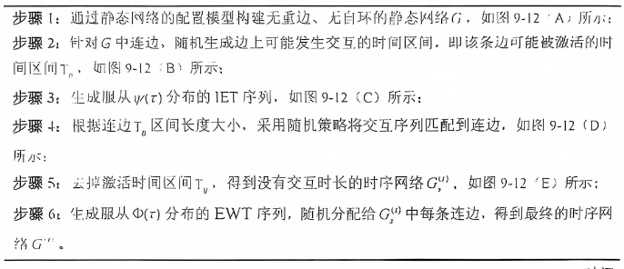

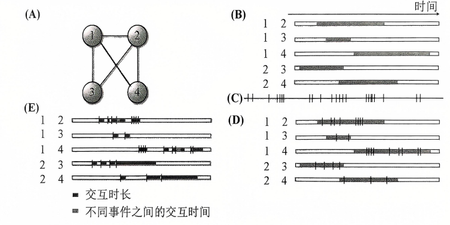

​											图10 随机时序网络模型流程图

## 3.2活动驱动模型

活动驱动模型，是一种用于描述网络中节点活动模式的动态模型。在该模型中，每个节点都有一个活跃潜力[^③]，表示该节点在单位时间内发起交互的概率。当节点活跃时，它会随机选择一定数量的邻居进行交互。

​												表3 活动驱动模型流程图

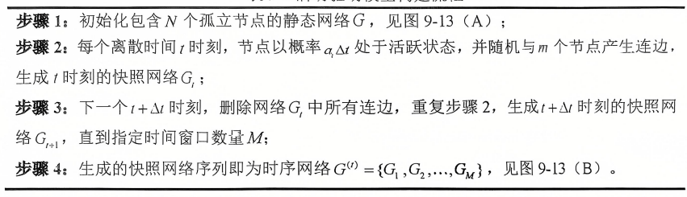

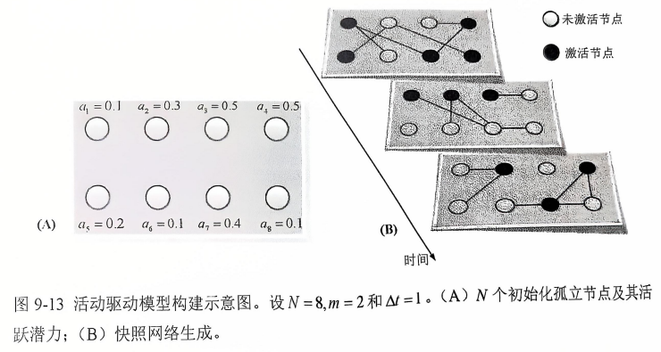

​												图11 活动驱动模型流程图

[^③]:活跃潜力，描述某节点与其他节点之间发生连接的可能性。

### 3.3邻居交换模型

邻居交换模型，模型的核心是**“交换”**过程，即两个节点可以**随机**交换它们的邻居。网络的拓扑结构会随之发生变化，导致网络变得更加集中或分散，影响节点之间的距离和连接路径；邻居交换会影响信息或资源在网络中的传播方式。例如，某些节点可能会因为获得了新的邻居而更快地接收到信息，或者某些信息可能会因为网络结构的变化而传播得更慢。

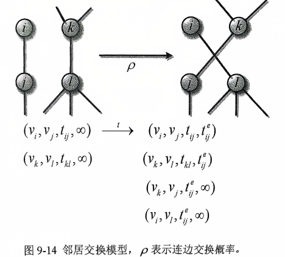

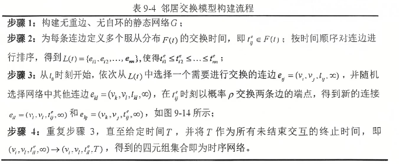

# 4.了解时序网络上的动力学过程

## 4.1时序网络上的随机游走过程

| 类型         | 随机时序网络模型上的随机游走                                 | 活动驱动模型上的随机游走                                     |
| ------------ | ------------------------------------------------------------ | ------------------------------------------------------------ |
| 定义         | 在随机时序网络模型基础上，随机游走者t时刻到达节点w~i~(t)后，初始化该节点下一时刻所有连边e~w(t+1),k~的事件间隔时间的游走过程 | 在活动驱动模型基础上,为每个节点赋予一定数游走者,通过节点内游走者数量的变化来刻画游走过程的方法. |
| 随机游走过程 | 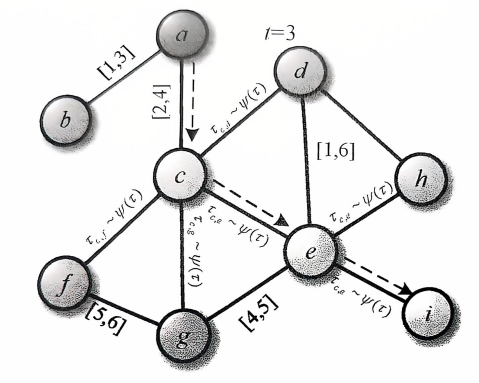 | 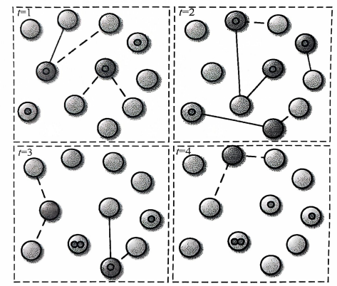 |
| 游走概率计算 |  |  |
| 稳定态分析   | 稳定态到达节点的概率: 平均复发时间: | t时刻活跃潜力为a的节点包含的游走者数量:  |

## 4.2时序网络上的疾病传播过程

| 类型         | 活动驱动模型上的SIS传播模型                                  | 邻居交换模型上的SIR传播模型                                  |
| ------------ | ------------------------------------------------------------ | ------------------------------------------------------------ |
| 定义         | 假设感染概率和恢复概率分别为λ,μ，节点的活跃潜力由分布F(a)给出，则活动驱动模型生成的时序网络上的SIS传播过程如下图。在t=1时刻处于活跃状态的初始感染节点(1)以概率入感染其邻居节点，并以概率μ恢复为易感状态(S);t=2时刻，所有处于活跃状态的感染节点以概率λ感染其邻居节点，并以概率μ恢复为易感状态;以此类推，形成SIS传播过程。  | 分别赋予连边特定的交换时间，给定节点特定的感染时间和恢复时间，按顺序遍历时间窗口T内的每个时刻，并按指定规则执行连边交换、节点感染和节点恢复过程,实现SIR传播. |
| 传播过程     | 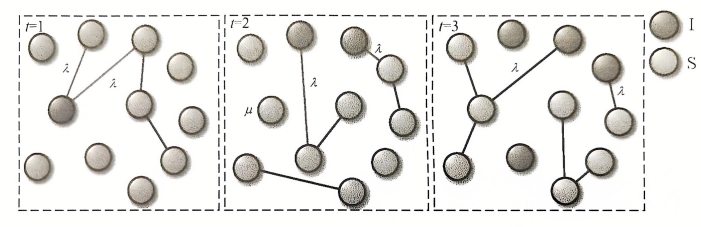 | 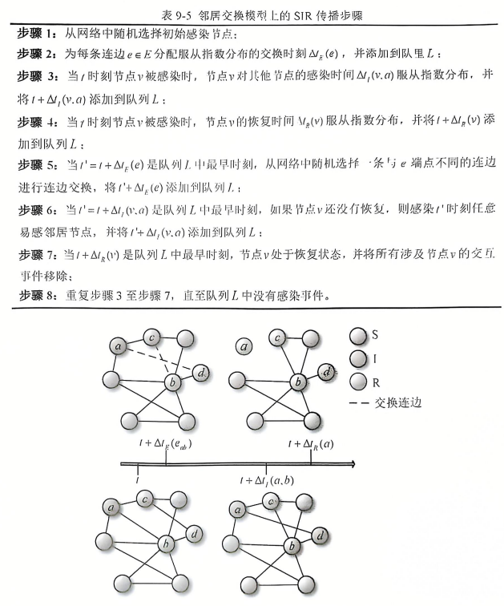 |
| 理论分析过程 | 基于平均场理论，t时刻活跃概率为a的感染节点数量为I~a~^t^，则t+Δt时刻活跃概率为a的感染节点数量可表示为: 网络中感染节点的数量: 令 两边乘以a并求和:  该方程雅可比矩阵: 疾病传播阈值要求最大特征值值＞0 基本再生数: | 交换概率ρ对规则网络上疾病传播的影响: (1)ρ=0的生成网络 没有邻居交换情况下,邻居交换模型生成静态网络: 动力学方程: : M~ss~表示两端都是易感节点的连边比率: 当v~j~被不同于v~i~的邻居感染时,M~ss~减少: 常量2说明角色可以交换,替换: |
| 图示分析     | 下图展示了活动驱动模型生成的时序网络和两个时间聚合网络上的SIS传播过程，聚合网络将所有连边视为可能的传播途径,忽略了连边在特定时间序列上活跃与否的事实，传播阈值较时序网络小且扩散范围较时序网络大。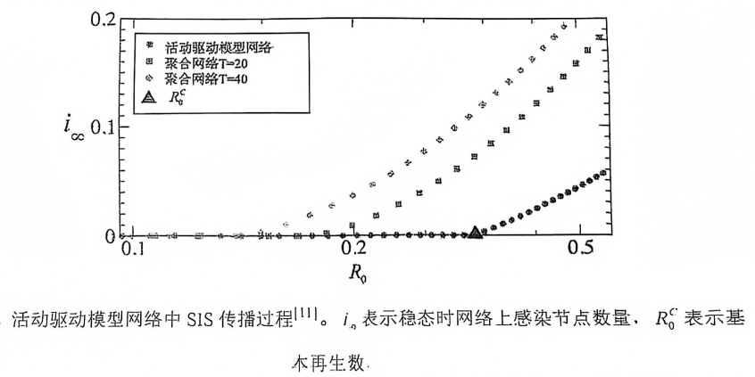 | (1)ρ>0的生成网络 假设节点v~i~是易感的非且有一个受感染的邻居v~j~.通过连边交换，v~i~切断到v~j~的连边，从而减小p~I~(t)，并且连接到随机选择连边的端点。新邻居被感染的概率等于I(t)。因此，如dp~I~(t)/dt 可修改为:  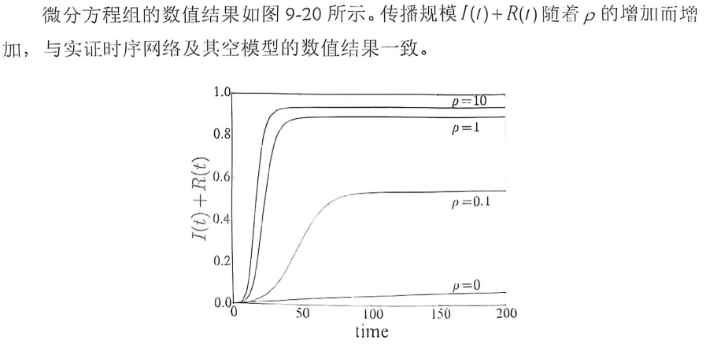 |

## 4.3实践案例:百度贴吧在线社交网络结构时序演化分析

### 4.3.1研究背景

部分人群在现实世界中缺乏可靠的交友渠道，社交网络的匿名性为这些隐私意识强烈的群体提供了安全感, 因此他们更加依赖社交网络来寻找朋友和伴侣。同时, 各种人群每天在社交平台上相互联系、建立新的互动，并有新成员不断加入社区。在这一互联网社区中，群体的社交特征和关系是挖掘其行为特征的重要组成部分，因此分析在线社交网络的时序特征，可以全面了解该群体在互联网社区中的社交行为特点，揭示其时序变迁规律及潜在的社交模式变化。

### 4.3.2数据描述

| 类型         |                           数据情况                           |
| :----------- | :----------------------------------------------------------: |
| 时间周期     |                     2005年1月~2018年6月                      |
| 用户数据     | 用户注册时填写的个人信息，以及百度贴吧收集的各种用户活动信息，包括用户姓名、性别、所在城市、经度、纬度喜欢的社区等。 |
| 用户活动数据 |        主贴, 评论和回复等数据,总计13,012,892条记录。         |
| 用户社交网络 | 根据贴吧中成员之间的交互行为，以用户为**节点**(含807.591个)、用户之间的交互关系为**边**( 12.537.280条, 每条表示为唯一的交互ID 和交互时间戳)。该网络中所有边都是有向边，**边的方向**表示评论或回复的对象。该数据刻画了该群体社交网络每天的演变情况。在第一天(2005年1月29日)的初始网络基础上，每天产生的新节点和连边加入到初始网络中,构成次日的社交网络结构,共形成4,885个累积的演化网络。 |

### 4.3.3结果分析

+ 节点和边的演化特征

	+ **用户增长**：

		* **初期阶段（2005年4月27日-2014年12月31日）**：网络中用户（节点,即图12-A）和连边数目(图12-B)分别达到 212,522 和 1,557,572。
		* **快速扩张期（2015年以后）**：平均每月新增 472 个节点和 8,707 条边。

	+ **网络平均度变化(图12-C)**：

		* **初期波动**：网络的平均度在初期经历了一段急剧上升后迅速下降，这主要是由于新用户的加入并未伴随大量的社交活动，导致边密度降低。
		* **持续增长**：经过短暂下跌后，平均度逐渐回升，并在 2015 年后急剧增大。到 2016 年下半年，平均度达到约 14，之后缓慢上升。

	+ **用户行为特征**：

		* **初期用户**：最初加入的用户可能出于好奇心，但并未积极参与社交活动，导致网络边密度较低。
		* **后期用户**：2015 年以后，随着更多用户的加入和活跃度增加，网络中的社交互动显著增强，推动了平均度的快速上升。

		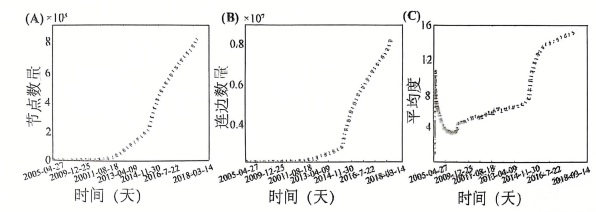

		​								图12 网络中节点数量,边数量及平均度的时序变化

	+ **用户好友数持续增长**：

		* **度增长率始终大于0**：如图13-A所示，在13年期间，大部分用户的度（好友数）每年都在增加。

	+ **节点数量与好友数的正相关性**：

		* **显著正相关**：如图13-B所示，网络中节点数量的增长率与用户度增长率的平均值之间存在显著的正相关关系（相关系数 r=0.939*r*=0.939），即网络扩张越快，用户的好友数增长也越快。

	+ **高换友率**：

		* **年度好友变化显著**：通过前后两年的不同好友比例（换友率）来衡量，如图13-C所示，大部分用户的换友率始终保持较高水平。这表明大多数用户在不同年份的交流对象并不稳定，难以维持长期的互动关系。

		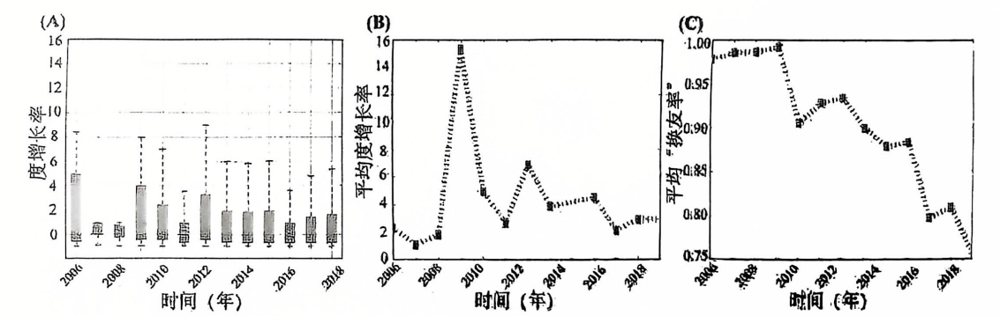

		​										图13 度增长率与平均“平均换友率”

+ 平均最短路长度、集聚系数、同配性的时序变化

	+ **平均最短路径长度**：

		* **初期急剧上升**：2006年1月之前，平均最短路径长度迅速增加，随后呈现阶梯式增长。
		* **峰值与下降**：2009年4月达到峰值6.73后逐渐减小至约4.20，并趋于稳定。这表明随着网络的扩展，用户之间的交互更加密集，节点间距离变得更近。
		* **后期稳定**：2015年后，新节点和连边的增加对连通性影响较小，平均最短路径长度保持在较低的稳定值。

	+ **集聚系数**：

		* **初期快速上升**：在网络演化初期，集聚系数从0迅速上升到最大值0.12。
		* **后期下降并稳定**：随着网络规模增大，集聚系数逐渐下降，最终稳定在0.01左右，表明三角形结构的比例基本稳定。
		* **传递性高于一般网络**：该群体网络的传递性（即实际形成的三角形比例）高于一般交友网络，说明其社交关系更为紧密。

	+ **同配性**：

		* **始终同配**：网络始终表现出同配性，即度大的节点倾向于与度同样大的节点连接。

		* **初期高同配性**：演化初期，同配性系数接近1，因为当时节点数量少且彼此高度连接。

		* **逐渐下降并稳定**：随着网络扩张，同配性系数逐渐下降，最终稳定在0.22左右。

		* **持续正同配性**：在任何时期，同配性系数始终大于0，表明成员更倾向于选择与其相似的用户建立联系。

			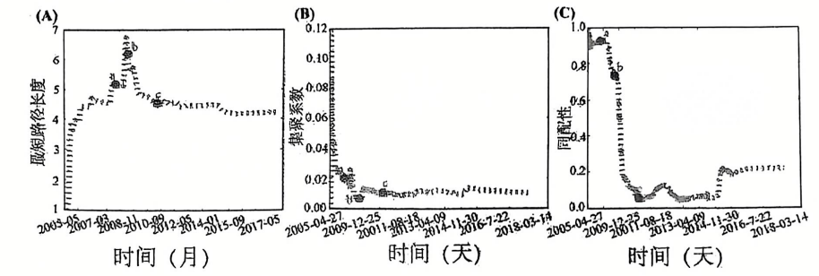
									图14 平均最短路长度、集聚系数、同配性的时序变化

+ 社区演化特点

	+ **社团数量增长**：

		* **持续上升**：在13年期间，网络中的社团数量始终保持上升趋势。
		* **2015年后加速**：2015年以后，社团数量的增长率显著提高，与节点和边数量的增长模式相似。

	+ **最大社团规模波动**：

		* **未持续增大**：尽管网络规模不断扩大，最大社团的规模并未持续增大。
		* **2015年后波动明显**：2015年之后，最大社团的规模波动较大，反映出社团的解体、整合和重组频繁发生。

	+ **社区动态变化**：

		* **频繁的节点流动**：如图15-C所示，Top-10 社区间的节点流向非常频繁，表明同一社团的成员总是在变化。

		* **用户社交圈不稳定**：大部分用户的社交圈并不稳定，反映了社区内部结构的高动态性和不稳定性。

			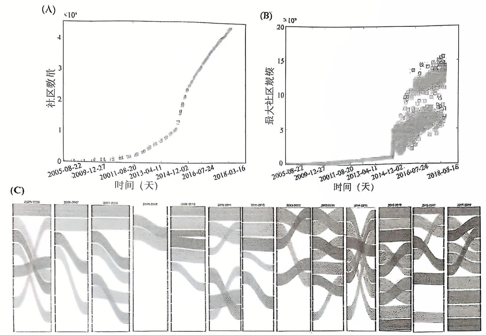
